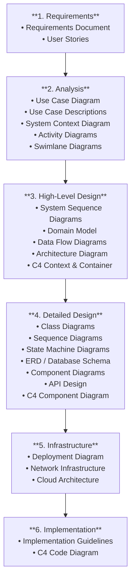

# Rental Management System Design Documentation

> Comprehensive system design documentation for a full-fledged, asset-agnostic rental management platform. The system supports any class of rentable asset — flats, cars, cameras, construction gear, boats, event equipment, and more — enabling owners and rental operators to manage assets, bookings, agreements, payments, maintenance, and damage assessments from a single platform.

## Documentation Structure

| Phase | Folder | Description |
|-------|--------|-------------|
| 1 | [requirements](./requirements/) | Functional & non-functional requirements, user stories |
| 2 | [analysis](./analysis/) | Use cases, system context, activity & swimlane diagrams |
| 3 | [high-level-design](./high-level-design/) | Sequence diagrams, domain model, DFD, architecture, C4 |
| 4 | [detailed-design](./detailed-design/) | Class, sequence, state diagrams, ERD, API design |
| 5 | [infrastructure](./infrastructure/) | Deployment, network, cloud architecture |
| 6 | [implementation](./implementation/) | Implementation guidelines, C4 code diagram |

## System Overview

### Actors
- **Owner / Operator** — Lists and manages assets, reviews bookings, sets pricing, handles agreements, tracks payments, oversees maintenance
- **Customer / Renter** — Searches assets, makes bookings, signs rental agreements, pays invoices, reports damage
- **Staff** — Handles asset preparation, condition assessments, maintenance, and returns
- **Admin** — Platform oversight, user verification, dispute resolution, configuration

### Supported Asset Types (non-exhaustive)
| Asset Class | Examples |
|-------------|----------|
| Real estate | Flats, houses, offices, storage units |
| Vehicles | Cars, motorcycles, vans, trucks, boats |
| Equipment | Cameras, drones, audio gear, tools |
| Construction | Scaffolding, excavators, compressors |
| Events | Tables, chairs, AV equipment, tents |
| Sports | Bicycles, surfboards, skiing gear |

### Key Features
- Multi-category asset listing and availability management
- Flexible pricing engine (hourly, daily, weekly, monthly; peak pricing; discounts)
- Booking and reservation management with availability calendar
- Digital rental agreement creation and e-signature
- Security deposit collection, hold, and release
- Pre- and post-rental condition assessment with photo evidence
- Invoice generation, online payment collection, and late/damage fee handling
- Maintenance and servicing lifecycle for assets
- Financial reporting and analytics for owners
- Real-time notifications (email / SMS / in-app)

## Diagram Generation

All diagrams are written in Mermaid code. To generate images:

1. **VS Code**: Install "Mermaid Preview" extension
2. **Online**: Use [mermaid.live](https://mermaid.live)
3. **CLI**: Use `mmdc` (Mermaid CLI)
   ```bash
   npm install -g @mermaid-js/mermaid-cli
   mmdc -i input.md -o output.png
   ```

## Phase Workflow


