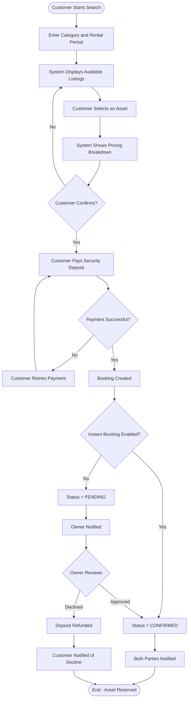
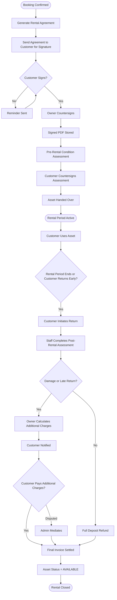
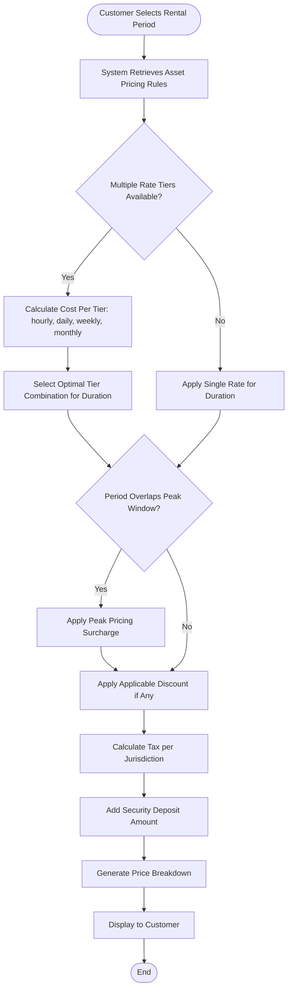
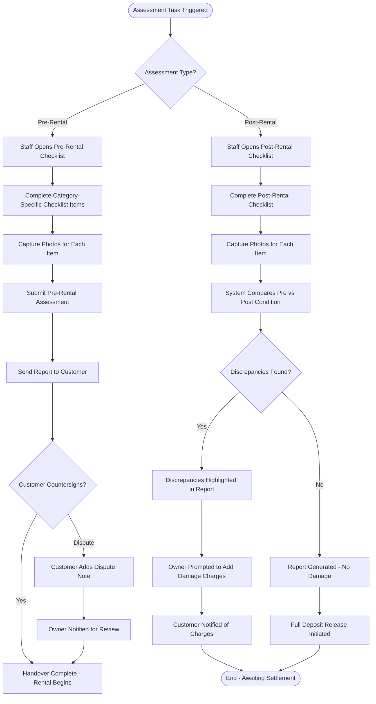
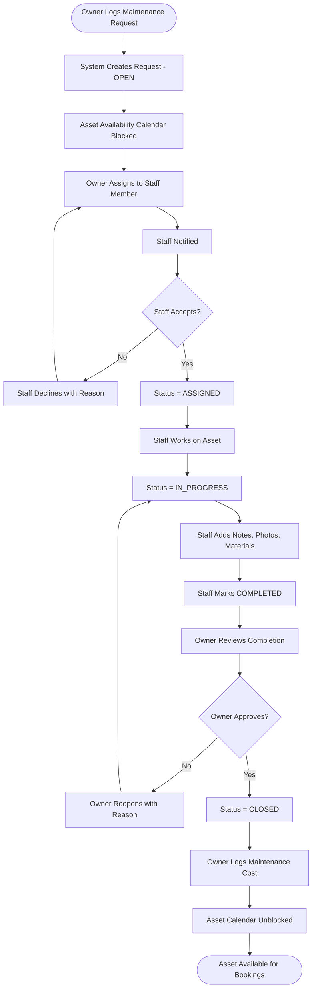
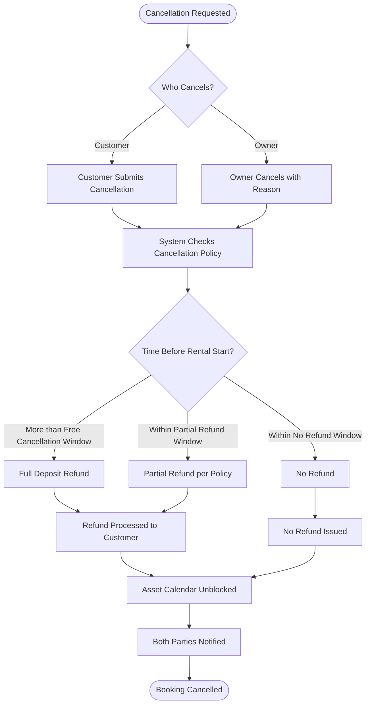

# Activity Diagrams

## Overview
Activity diagrams for key business processes in the rental management system. These flows apply regardless of the asset type being rented (car, flat, gear, equipment, etc.).

---

## Asset Booking Flow

---

## Rental Lifecycle Flow

---

## Pricing Calculation Flow

---

## Condition Assessment Flow

---

## Maintenance Request Flow

---

## Cancellation and Refund Flow

