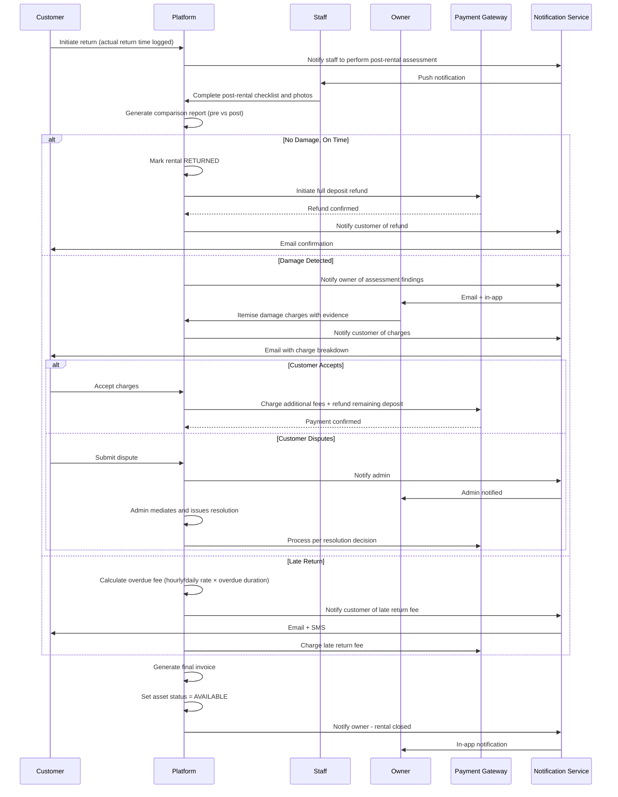
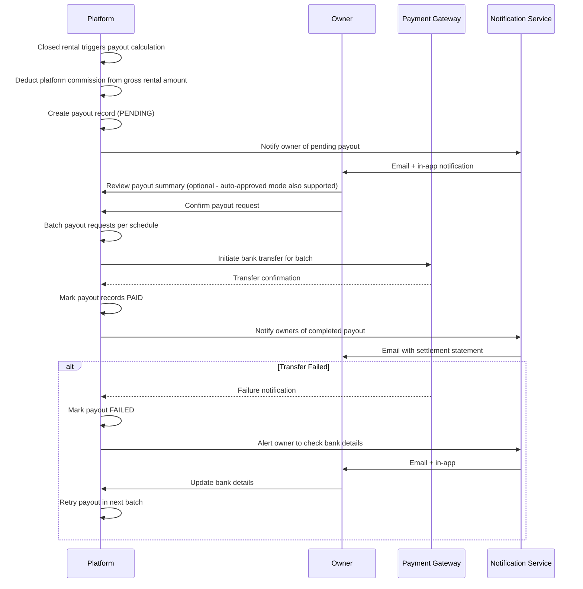

# Swimlane Diagrams

## Overview
BPMN-style swimlane diagrams illustrating cross-actor workflows in the rental management system, applicable to any asset type.

---

## Booking Confirmation Swimlane

```mermaid
sequenceDiagram
    participant C as Customer
    participant P as Platform
    participant PG as Payment Gateway
    participant O as Owner
    participant N as Notification Service

    C->>P: Search assets by category and rental period
    P-->>C: Available listings with pricing preview

    C->>P: Select asset and confirm rental period
    P-->>C: Price breakdown + deposit amount

    C->>P: Submit booking request
    P->>PG: Charge / hold security deposit
    PG-->>P: Deposit confirmed

    P->>P: Create booking (PENDING or CONFIRMED)
    P->>N: Notify owner of new booking
    N->>O: Email + push notification

    alt Manual Confirmation
        O->>P: Review customer profile and booking
        O->>P: Approve booking
        P->>P: Status = CONFIRMED; block asset calendar
        P->>N: Notify customer of confirmation
        N->>C: Email + push notification
    else Instant Booking
        P->>P: Status = CONFIRMED immediately; block asset calendar
        P->>N: Notify customer of confirmation
        N->>C: Email + push notification
    end
```

---

## Rental Agreement Signing Swimlane

```mermaid
sequenceDiagram
    participant O as Owner
    participant P as Platform
    participant ES as E-Signature Provider
    participant C as Customer
    participant N as Notification Service

    O->>P: Generate rental agreement from template
    P->>P: Pre-fill agreement with booking details
    O->>P: Review and send for customer signature
    P->>ES: Send document to customer for signing
    ES->>N: Dispatch signature request email
    N->>C: Email with agreement link

    C->>ES: Open, review, and sign agreement
    ES->>P: Webhook: customer signed (timestamp, IP)
    P->>N: Notify owner to countersign
    N->>O: Email + in-app notification

    O->>ES: Countersign agreement
    ES->>P: Final signed document delivered
    P->>P: Store signed PDF; link to booking
    P->>N: Send signed copy to both parties
    N->>C: Email with PDF attachment
    N->>O: Email with PDF attachment
```

---

## Pre-Rental Condition Assessment Swimlane

```mermaid
sequenceDiagram
    participant S as Staff
    participant P as Platform
    participant C as Customer
    participant O as Owner
    participant N as Notification Service

    P->>S: Assign pre-rental assessment task
    N->>S: Push notification

    S->>P: Open assessment task
    P-->>S: Category-specific checklist

    S->>P: Complete checklist items (condition per item)
    S->>P: Upload timestamped photos for each item
    S->>P: Submit assessment

    P->>P: Generate assessment report
    P->>N: Send report to customer for countersignature
    N->>C: Email + push with assessment link

    C->>P: Review report and photos
    alt Customer Agrees
        C->>P: Countersign assessment
        P->>P: Handover recorded; rental period begins
        P->>N: Notify owner - handover complete
        N->>O: In-app notification
    else Customer Disputes
        C->>P: Add dispute note on specific item
        P->>N: Notify owner of dispute
        N->>O: Email + in-app
        O->>P: Resolve dispute (accept or override)
        P->>P: Record resolution; finalize handover
    end
```

---

## Post-Rental Return and Settlement Swimlane



---

## Maintenance Request Swimlane

```mermaid
sequenceDiagram
    participant O as Owner
    participant P as Platform
    participant S as Staff
    participant N as Notification Service

    O->>P: Log maintenance request (description, priority, photos)
    P->>P: Create request (OPEN); block asset calendar
    P->>N: Notify relevant staff of new task
    N->>S: Email + push notification

    alt Staff Accepts
        S->>P: Accept task (status: ASSIGNED)
        S->>P: Begin work; update to IN_PROGRESS
        S->>P: Add work notes, photos, materials used
        S->>P: Mark task COMPLETED

        P->>N: Notify owner of completion
        N->>O: Push + email notification

        alt Owner Approves
            O->>P: Approve completion (status: CLOSED)
            O->>P: Log maintenance cost
            P->>P: Unblock asset calendar
            P->>N: Asset now available for bookings
        else Owner Reopens
            O->>P: Reopen with reason
            P->>N: Notify staff to revisit
            N->>S: Push notification
        end

    else Staff Declines
        S->>P: Decline with reason
        P->>N: Notify owner - reassignment needed
        N->>O: Push notification
        O->>P: Reassign to another staff member
    end
```

---

## Payout Processing Swimlane


