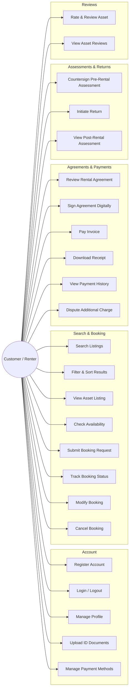
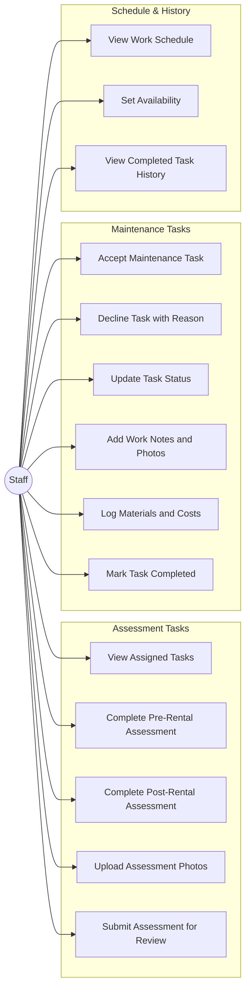
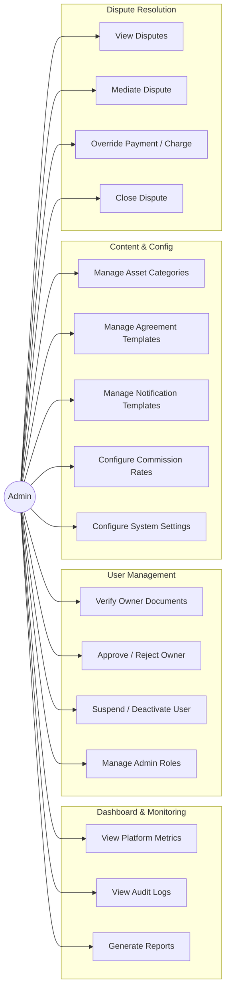

# Use Case Diagram

## Overview
Use case diagrams for all major actors in the rental management system, applicable to any asset type (cars, gear, flats, equipment, etc.).

---

## Complete System Use Case Diagram

```mermaid
graph TB
    subgraph Actors
        Owner((Owner / Operator))
        Customer((Customer / Renter))
        Staff((Staff))
        Admin((Admin))
        PaymentGW((Payment Gateway))
        ESign((E-Signature Provider))
        SMSSvc((SMS Provider))
    end

    subgraph "Rental Management Platform"
        UC1[Manage Assets & Listings]
        UC2[Manage Availability]
        UC3[Review Bookings]
        UC4[Manage Agreements]
        UC5[Manage Payments & Invoices]
        UC6[Manage Condition Assessments]
        UC7[Manage Maintenance]
        UC8[View Reports & Analytics]

        UC10[Search & Browse Listings]
        UC11[Make Booking]
        UC12[Sign Rental Agreement]
        UC13[Pay Invoice]
        UC14[Countersign Assessment]
        UC15[Return Asset]
        UC16[Rate & Review]

        UC20[Perform Assessments]
        UC21[Update Maintenance Tasks]

        UC30[Manage Users]
        UC31[Verify Documents]
        UC32[Resolve Disputes]
        UC33[Configure Platform]
    end

    Owner --> UC1
    Owner --> UC2
    Owner --> UC3
    Owner --> UC4
    Owner --> UC5
    Owner --> UC6
    Owner --> UC7
    Owner --> UC8

    Customer --> UC10
    Customer --> UC11
    Customer --> UC12
    Customer --> UC13
    Customer --> UC14
    Customer --> UC15
    Customer --> UC16

    Staff --> UC20
    Staff --> UC21

    Admin --> UC30
    Admin --> UC31
    Admin --> UC32
    Admin --> UC33

    UC13 --> PaymentGW
    UC12 --> ESign
    UC5 --> SMSSvc
```

---

## Owner Use Cases

```mermaid
graph LR
    Owner((Owner / Operator))

    subgraph "Account & Portfolio"
        UC1[Register Account]
        UC2[Login / Logout]
        UC3[Manage Profile]
        UC4[Create Asset Category]
        UC5[Add Asset]
        UC6[Configure Pricing Rules]
        UC7[Manage Availability Calendar]
        UC8[Publish / Unpublish Listing]
    end

    subgraph "Booking Management"
        UC9[View Booking Requests]
        UC10[Approve / Decline Booking]
        UC11[View Active Bookings]
        UC12[Cancel Booking]
    end

    subgraph "Agreements & Deposits"
        UC13[Generate Rental Agreement]
        UC14[Countersign Agreement]
        UC15[Configure Security Deposit]
        UC16[Process Deposit Refund or Deduction]
    end

    subgraph "Payments"
        UC17[View Invoices]
        UC18[Add Additional Charges]
        UC19[View Payout History]
        UC20[Request Payout]
    end

    subgraph "Assessments & Maintenance"
        UC21[Review Pre-Rental Assessment]
        UC22[Review Post-Rental Assessment]
        UC23[Log Maintenance Request]
        UC24[Assign Maintenance to Staff]
        UC25[Approve Completed Maintenance]
        UC26[Schedule Preventive Servicing]
    end

    subgraph "Reports"
        UC27[View Financial Dashboard]
        UC28[Generate Revenue Report]
        UC29[Generate Utilisation Report]
        UC30[Generate Tax Report]
    end

    Owner --> UC1
    Owner --> UC2
    Owner --> UC3
    Owner --> UC4
    Owner --> UC5
    Owner --> UC6
    Owner --> UC7
    Owner --> UC8
    Owner --> UC9
    Owner --> UC10
    Owner --> UC11
    Owner --> UC12
    Owner --> UC13
    Owner --> UC14
    Owner --> UC15
    Owner --> UC16
    Owner --> UC17
    Owner --> UC18
    Owner --> UC19
    Owner --> UC20
    Owner --> UC21
    Owner --> UC22
    Owner --> UC23
    Owner --> UC24
    Owner --> UC25
    Owner --> UC26
    Owner --> UC27
    Owner --> UC28
    Owner --> UC29
    Owner --> UC30
```

---

## Customer Use Cases

---

## Staff Use Cases

---

## Admin Use Cases

---

## Use Case Relationships

```mermaid
graph TB
    subgraph "Include Relationships"
        MakeBooking[Make Booking] -->|includes| CheckAvailability[Check Asset Availability]
        MakeBooking -->|includes| CalculatePrice[Calculate Rental Price]
        MakeBooking -->|includes| HoldDeposit[Collect Security Deposit]

        SignAgreement[Sign Agreement] -->|includes| VerifyIdentity[Verify Customer Identity]
        SignAgreement -->|includes| SendToESign[Send to E-Sign Provider]
        SignAgreement -->|includes| StorePDF[Store Signed PDF]

        CloseRental[Close Rental] -->|includes| PostAssessment[Complete Post-Rental Assessment]
        CloseRental -->|includes| ReleaseDeposit[Process Deposit Refund]
        CloseRental -->|includes| GenerateFinalInvoice[Generate Final Invoice]
    end

    subgraph "Extend Relationships"
        SearchListings[Search Listings] -.->|extends| ApplyFilters[Apply Category / Date / Price Filters]
        SearchListings -.->|extends| ViewOnMap[View on Map]

        ViewInvoice[View Invoice] -.->|extends| DownloadReceipt[Download Receipt]
        ViewInvoice -.->|extends| DisputeCharge[Dispute Charge]

        PostAssessment[Post-Rental Assessment] -.->|extends| RaiseDamageCharge[Raise Damage Charge]
        PostAssessment -.->|extends| DetectLateReturn[Detect Late Return Fee]
    end
```

