# ERD / Database Schema

## Overview
The database schema for the rental management system. The schema uses PostgreSQL with JSONB for flexible per-category asset attributes, enabling the system to support any asset type without schema migrations when new categories are added.

---

## Core ERD

```mermaid
erDiagram
    users {
        int id PK
        varchar email
        varchar phone
        varchar full_name
        varchar hashed_password
        varchar role
        varchar status
        boolean email_verified
        boolean phone_verified
        boolean otp_enabled
        datetime created_at
        datetime updated_at
    }

    owner_profiles {
        int id PK
        int user_id FK
        varchar business_name
        varchar trading_name
        varchar verification_status
        decimal commission_rate
        datetime verified_at
    }

    customer_profiles {
        int id PK
        int user_id FK
        varchar id_verification_status
        varchar driving_licence_number
        varchar passport_number
        datetime created_at
    }

    staff_profiles {
        int id PK
        int user_id FK
        int owner_user_id FK
        varchar specialisation
        boolean is_available
        datetime created_at
    }

    asset_categories {
        int id PK
        int parent_category_id FK
        varchar name
        varchar slug
        varchar description
        varchar icon_url
        boolean is_active
        int display_order
    }

    category_attributes {
        int id PK
        int category_id FK
        varchar name
        varchar slug
        varchar attribute_type
        boolean is_required
        boolean is_filterable
        jsonb options_json
        int display_order
    }

    assets {
        int id PK
        int owner_user_id FK
        int category_id FK
        varchar name
        text description
        varchar status
        boolean is_published
        varchar location_address
        decimal location_lat
        decimal location_lng
        decimal deposit_amount
        int min_rental_duration_hours
        int max_rental_duration_days
        int booking_lead_time_hours
        boolean instant_booking_enabled
        decimal average_rating
        int review_count
        datetime created_at
        datetime updated_at
    }

    asset_attribute_values {
        int id PK
        int asset_id FK
        int attribute_id FK
        varchar value
    }

    asset_photos {
        int id PK
        int asset_id FK
        varchar url
        varchar thumbnail_url
        int position
        boolean is_cover
        varchar caption
    }

    pricing_rules {
        int id PK
        int asset_id FK
        varchar rate_type
        decimal rate_amount
        varchar currency
        boolean is_peak_rate
        date peak_start_date
        date peak_end_date
        jsonb peak_days_of_week_json
        decimal discount_percentage
        int min_units_for_discount
        datetime created_at
    }

    availability_blocks {
        int id PK
        int asset_id FK
        varchar block_type
        datetime start_at
        datetime end_at
        varchar reason
        int booking_id FK
        int maintenance_request_id FK
    }

    bookings {
        int id PK
        varchar booking_number
        int asset_id FK
        int customer_user_id FK
        int owner_user_id FK
        varchar status
        datetime rental_start_at
        datetime rental_end_at
        datetime actual_return_at
        decimal base_fee
        decimal peak_surcharge
        decimal tax_amount
        decimal total_fee
        decimal deposit_amount
        varchar cancellation_reason
        datetime cancelled_at
        datetime created_at
        datetime updated_at
    }

    booking_events {
        int id PK
        int booking_id FK
        varchar event_type
        text message
        int actor_user_id FK
        jsonb metadata_json
        datetime created_at
    }

    cancellation_policies {
        int id PK
        int asset_id FK
        varchar name
        int free_cancellation_hours
        int partial_refund_hours
        decimal partial_refund_percent
    }

    rental_agreements {
        int id PK
        int booking_id FK
        int template_id FK
        varchar status
        text rendered_content
        varchar esign_request_id
        varchar signed_document_url
        datetime sent_at
        datetime customer_signed_at
        varchar customer_signature_ip
        datetime owner_signed_at
        varchar owner_signature_ip
        int version
        datetime created_at
    }

    agreement_amendments {
        int id PK
        int agreement_id FK
        int amendment_number
        varchar reason
        varchar signed_document_url
        varchar status
        datetime created_at
        datetime signed_at
    }

    agreement_templates {
        int id PK
        int created_by_admin_id FK
        int category_id FK
        varchar name
        text template_content
        boolean is_active
        int version
        datetime created_at
    }

    security_deposits {
        int id PK
        int booking_id FK
        decimal amount
        varchar status
        varchar gateway_ref
        decimal deduction_total
        decimal refund_amount
        datetime collected_at
        datetime settled_at
    }

    deposit_deductions {
        int id PK
        int deposit_id FK
        varchar reason
        decimal amount
        varchar evidence_url
        int created_by_user_id FK
        datetime created_at
    }

    invoices {
        int id PK
        varchar invoice_number
        int booking_id FK
        int customer_user_id FK
        int owner_user_id FK
        varchar invoice_type
        decimal subtotal
        decimal tax_amount
        decimal total_amount
        decimal paid_amount
        varchar status
        date due_date
        datetime created_at
        datetime paid_at
    }

    invoice_line_items {
        int id PK
        int invoice_id FK
        varchar line_item_type
        varchar description
        decimal amount
        decimal tax_rate
        decimal tax_amount
    }

    additional_charges {
        int id PK
        int booking_id FK
        varchar charge_type
        varchar description
        decimal amount
        varchar evidence_url
        varchar status
        varchar dispute_reason
        datetime created_at
        datetime resolved_at
    }

    payments {
        int id PK
        varchar reference_type
        int reference_id
        int payer_user_id FK
        varchar payment_method
        varchar status
        decimal amount
        varchar currency
        varchar gateway_ref
        jsonb gateway_response_json
        boolean is_offline
        datetime created_at
        datetime confirmed_at
    }

    refunds {
        int id PK
        int payment_id FK
        varchar gateway_ref
        decimal amount
        varchar status
        varchar reason
        datetime initiated_at
        datetime completed_at
    }

    owner_payouts {
        int id PK
        int owner_user_id FK
        decimal gross_amount
        decimal commission_amount
        decimal net_amount
        varchar status
        varchar bank_ref
        varchar batch_id
        datetime period_start
        datetime period_end
        datetime processed_at
    }

    condition_assessments {
        int id PK
        int booking_id FK
        int asset_id FK
        int conducted_by_user_id FK
        varchar assessment_type
        varchar status
        text overall_notes
        varchar report_url
        datetime scheduled_at
        datetime conducted_at
        datetime customer_signed_at
        varchar customer_signature_ip
    }

    assessment_items {
        int id PK
        int assessment_id FK
        varchar area
        varchar description
        varchar condition
        boolean has_damage
        text damage_description
        decimal estimated_repair_cost
    }

    assessment_photos {
        int id PK
        int assessment_id FK
        int assessment_item_id FK
        varchar url
        varchar caption
        datetime uploaded_at
    }

    maintenance_requests {
        int id PK
        varchar request_number
        int asset_id FK
        int owner_user_id FK
        int assigned_to_user_id FK
        varchar priority
        varchar status
        varchar title
        text description
        text resolution_notes
        datetime created_at
        datetime assigned_at
        datetime started_at
        datetime completed_at
        datetime closed_at
    }

    maintenance_costs {
        int id PK
        int request_id FK
        varchar category
        varchar description
        decimal amount
        int recorded_by_user_id FK
        datetime recorded_at
    }

    preventive_services {
        int id PK
        int asset_id FK
        int created_by_user_id FK
        int assigned_to_user_id FK
        varchar title
        text description
        varchar recurrence
        int interval_days
        date next_due_date
        varchar status
        datetime last_completed_at
    }

    reviews {
        int id PK
        int booking_id FK
        int asset_id FK
        int customer_user_id FK
        int rating
        text comment
        boolean is_visible
        datetime created_at
    }

    notifications {
        int id PK
        int user_id FK
        varchar event_type
        varchar title
        text body
        boolean is_read
        jsonb payload_json
        datetime created_at
    }

    audit_logs {
        int id PK
        int user_id FK
        varchar action
        varchar resource_type
        int resource_id
        jsonb changes_json
        varchar ip_address
        datetime created_at
    }

    users ||--o{ owner_profiles : has
    users ||--o{ customer_profiles : has
    users ||--o{ staff_profiles : has

    asset_categories ||--o{ asset_categories : parentOf
    asset_categories ||--o{ category_attributes : defines
    asset_categories ||--o{ assets : classifies
    asset_categories ||--o{ agreement_templates : scoped_to

    assets ||--o{ asset_attribute_values : has
    assets ||--o{ asset_photos : has
    assets ||--o{ pricing_rules : has
    assets ||--o{ availability_blocks : has
    assets ||--o{ bookings : receives
    assets ||--o{ maintenance_requests : subject_of
    assets ||--o{ reviews : receives
    assets ||--o{ preventive_services : has

    bookings ||--o{ booking_events : logs
    bookings ||--|| security_deposits : has
    bookings ||--o{ rental_agreements : has
    bookings ||--o{ invoices : generates
    bookings ||--o{ additional_charges : incurs
    bookings ||--o{ condition_assessments : has
    bookings ||--o{ reviews : generates
    bookings ||--o{ availability_blocks : blocks

    rental_agreements ||--o{ agreement_amendments : has

    security_deposits ||--o{ deposit_deductions : has

    invoices ||--o{ invoice_line_items : contains
    invoices ||--o{ payments : paid_by

    payments ||--o{ refunds : generates

    condition_assessments ||--o{ assessment_items : contains
    condition_assessments ||--o{ assessment_photos : has

    maintenance_requests ||--o{ maintenance_costs : has

    users ||--o{ notifications : receives
    users ||--o{ audit_logs : generates
```

---

## Schema Design Notes

| Area | Design Decision |
|------|----------------|
| Asset attributes | JSONB `asset_attribute_values` with category-defined schema — no migrations for new asset types |
| Pricing rules | Separate table supports multiple rate tiers, peak windows, and per-quantity discounts per asset |
| Availability | `availability_blocks` are written on booking and maintenance; calendar queries use date overlap checks |
| Payments | `reference_type` + `reference_id` polymorphic pattern covers invoices, deposits, and additional charges |
| Assessments | Pre/post comparison done at application layer using two `condition_assessments` records per booking |
| Notifications | Persisted in DB for WebSocket fanout and in-app notification inbox |
| Audit logs | Immutable append-only log for all user actions on financial and agreement entities |
