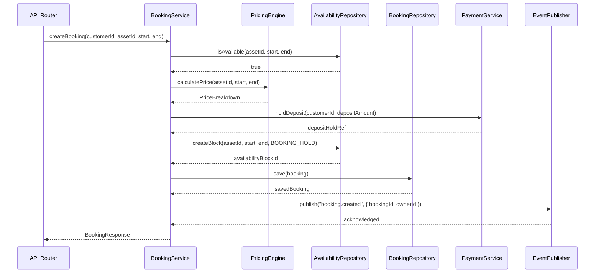
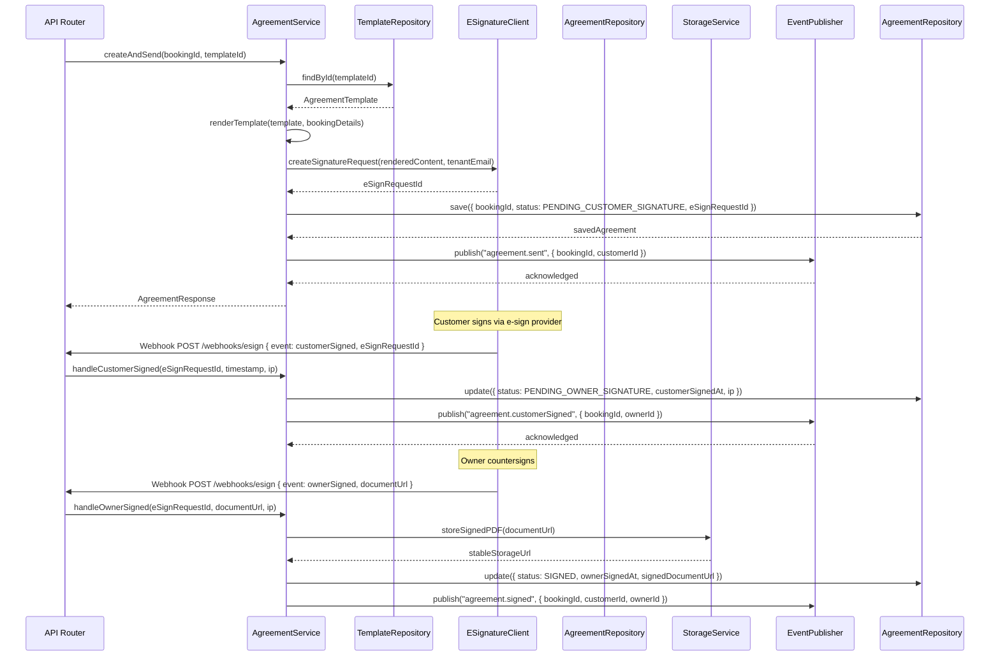
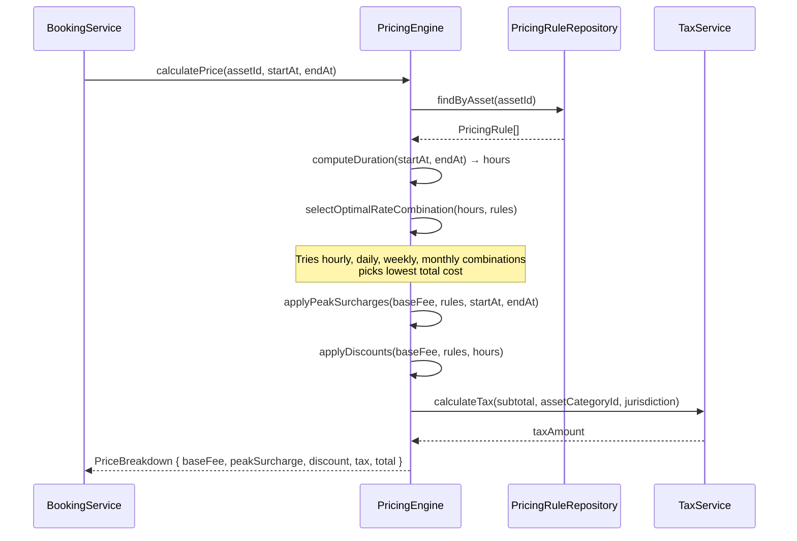
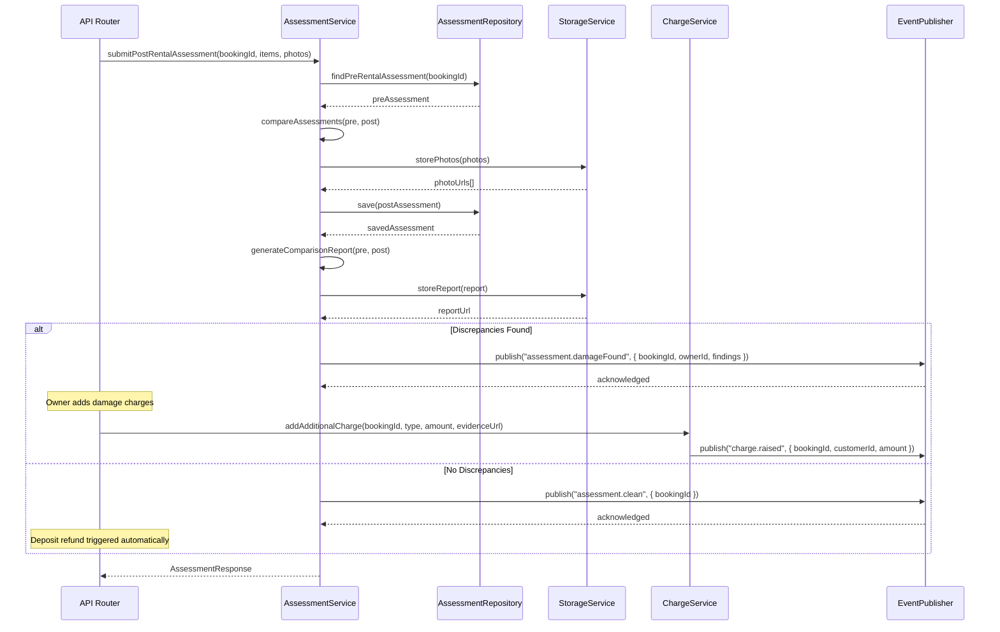
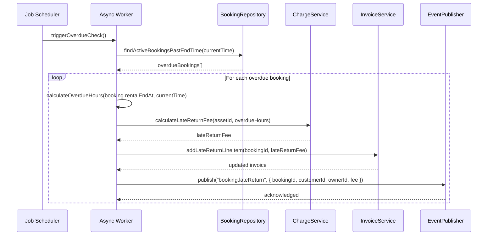

# Sequence Diagrams

## Overview
Internal sequence diagrams showing object-level interactions within the rental management system for key operations.

---

## Booking Creation with Availability Lock

---

## Rental Agreement E-Signature Flow

---

## Price Calculation Engine

---

## Post-Rental Assessment and Damage Charge

---

## Overdue Return Detection (Async Worker)

