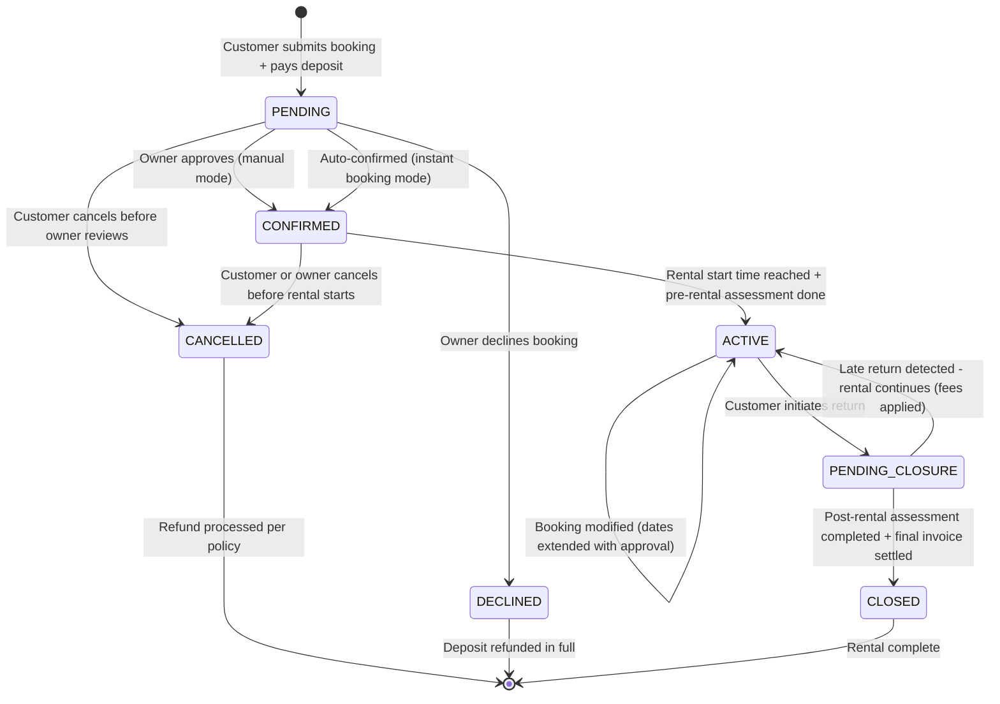
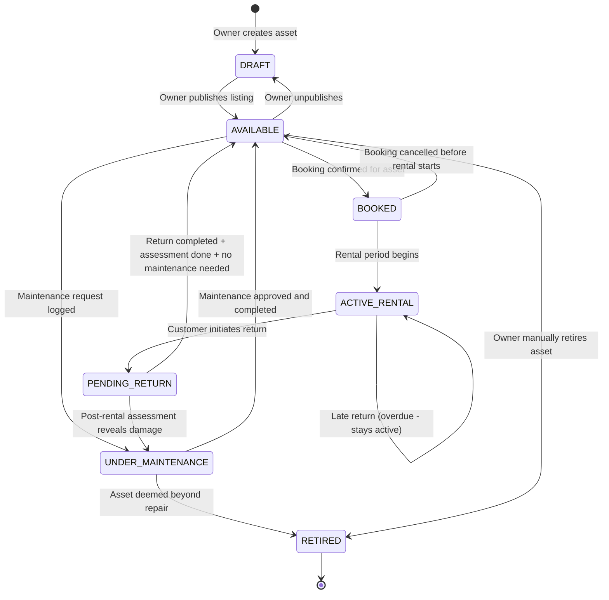
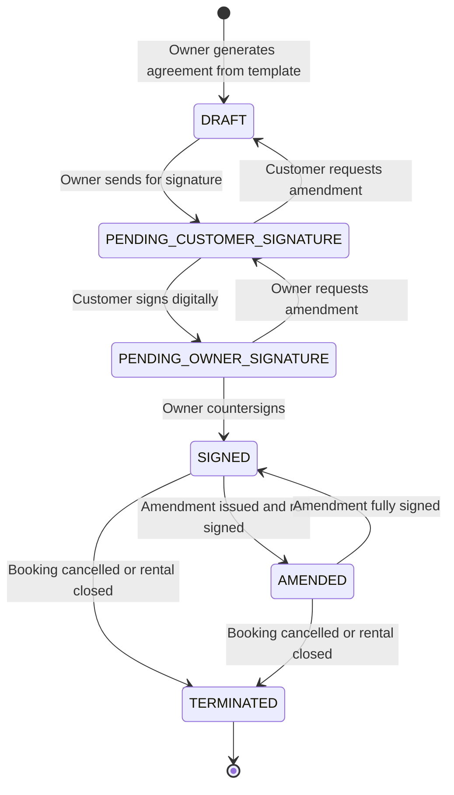
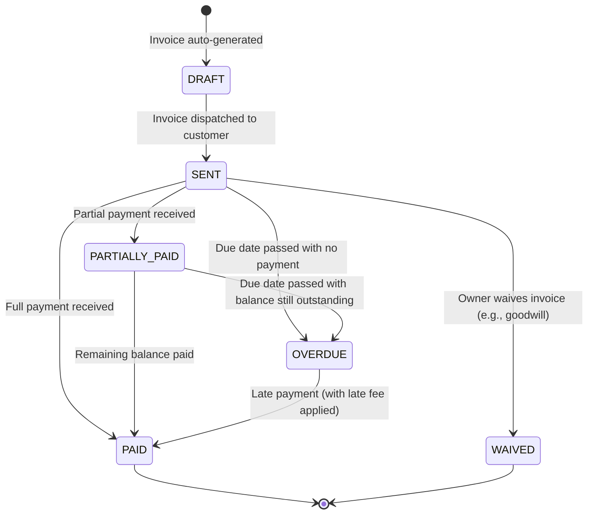

# State Machine Diagrams

## Overview
State machine diagrams for the key stateful entities in the rental management system.

---

## Booking State Machine

---

## Asset State Machine

---

## Rental Agreement State Machine

---

## Security Deposit State Machine

```mermaid
stateDiagram-v2
    [*] --> HELD : Deposit collected on booking confirmation

    HELD --> FULLY_REFUNDED : No damage, on-time return
    HELD --> PARTIALLY_REFUNDED : Damage deductions applied; remainder refunded
    HELD --> FULLY_DEDUCTED : Deductions equal or exceed deposit amount
    HELD --> DISPUTED : Customer disputes proposed deductions

    DISPUTED --> PARTIALLY_REFUNDED : Dispute resolved; partial refund agreed
    DISPUTED --> FULLY_REFUNDED : Dispute upheld; all charges waived
    DISPUTED --> FULLY_DEDUCTED : Dispute rejected; full deduction upheld

    FULLY_REFUNDED --> [*]
    PARTIALLY_REFUNDED --> [*]
    FULLY_DEDUCTED --> [*]
```

---

## Maintenance Request State Machine

```mermaid
stateDiagram-v2
    [*] --> OPEN : Owner or system logs maintenance request
    note right of OPEN : Asset calendar blocked

    OPEN --> ASSIGNED : Owner assigns to staff member

    ASSIGNED --> IN_PROGRESS : Staff accepts and starts work
    ASSIGNED --> OPEN : Staff declines - reassignment needed

    IN_PROGRESS --> COMPLETED : Staff marks task complete

    COMPLETED --> CLOSED : Owner approves completion
    COMPLETED --> IN_PROGRESS : Owner reopens with reason (rework needed)

    CLOSED --> [*]
    note right of CLOSED : Asset calendar unblocked; cost logged
```

---

## Additional Charge State Machine

```mermaid
stateDiagram-v2
    [*] --> RAISED : Owner raises additional charge post-rental

    RAISED --> ACCEPTED : Customer accepts charge
    RAISED --> DISPUTED : Customer disputes charge
    RAISED --> WAIVED : Owner waives the charge

    DISPUTED --> ACCEPTED : Dispute rejected by owner or admin; charge stands
    DISPUTED --> WAIVED : Dispute upheld; charge removed
    DISPUTED --> PARTIALLY_ACCEPTED : Admin mediates; partial charge agreed

    ACCEPTED --> PAID : Customer pays the charge
    PARTIALLY_ACCEPTED --> PAID : Customer pays the agreed partial amount

    PAID --> [*]
    WAIVED --> [*]
```

---

## Invoice State Machine

