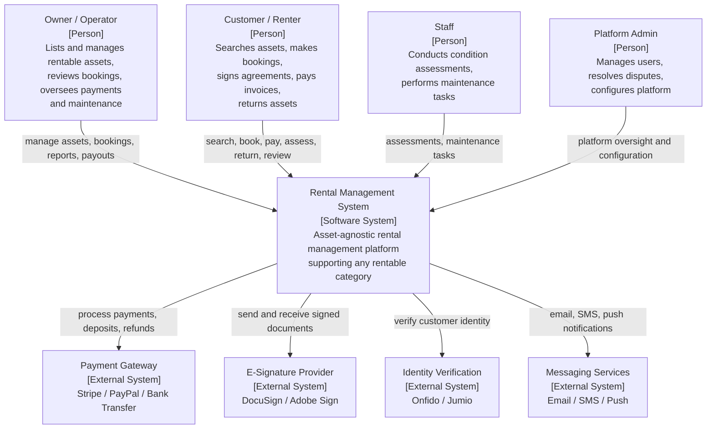
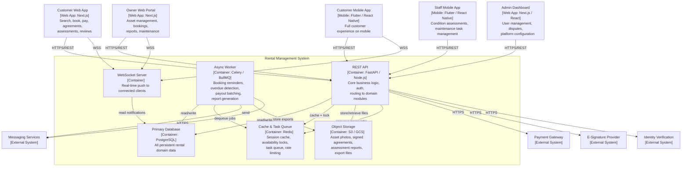

# C4 Diagrams

## Overview
C4 model diagrams for the rental management system: Context (Level 1) and Container (Level 2). The platform is asset-agnostic, supporting cars, flats, gear, equipment, and more.

---

## Level 1 – System Context Diagram

---

## Level 2 – Container Diagram

---

## Level 2 – Container Responsibilities

| Container | Technology | Role |
|-----------|------------|------|
| REST API | FastAPI / Node.js | Core request handler; all domain modules exposed as REST endpoints |
| Async Worker | Celery / BullMQ | Booking reminders, overdue return detection, payout batching, report generation |
| WebSocket Server | FastAPI WS / Socket.io | Real-time notifications to browser and mobile app clients |
| Primary Database | PostgreSQL | Source of truth for all rental entities; JSONB for flexible asset attributes |
| Cache & Queue | Redis | JWT block list, availability locks, rate-limit counters, task queue |
| Object Storage | AWS S3 / GCS | Asset photos, signed agreement PDFs, assessment reports, financial export files |
