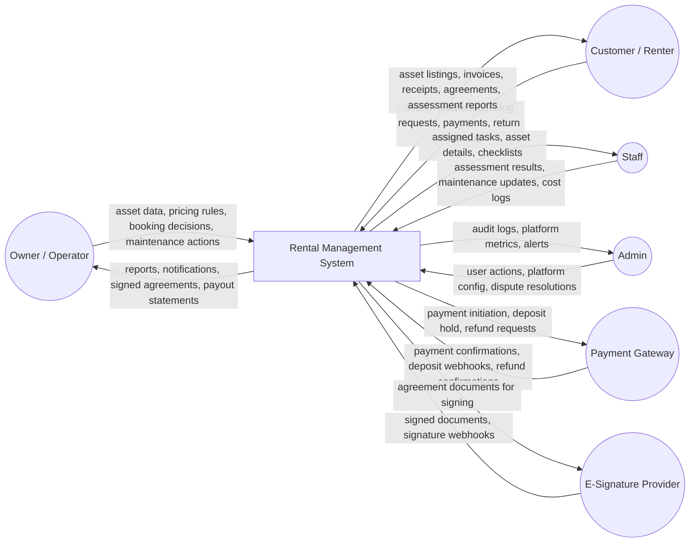
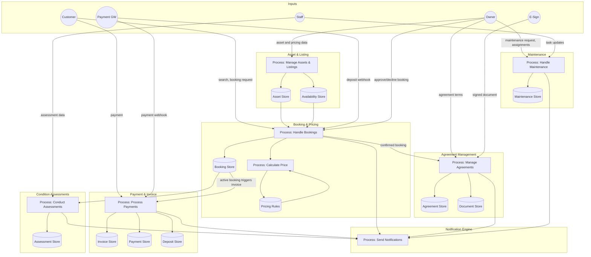
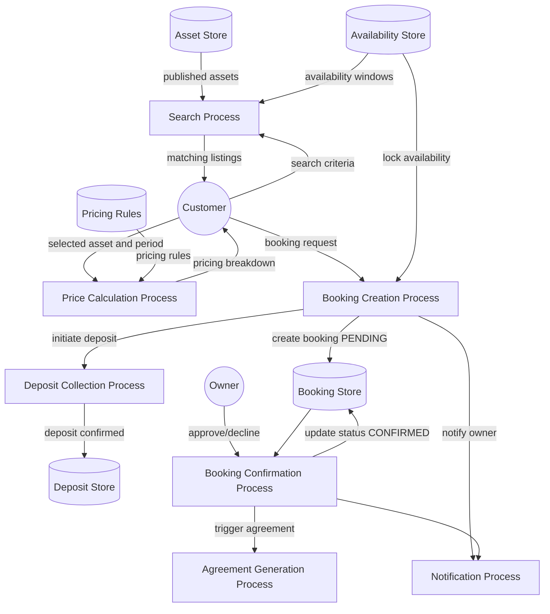
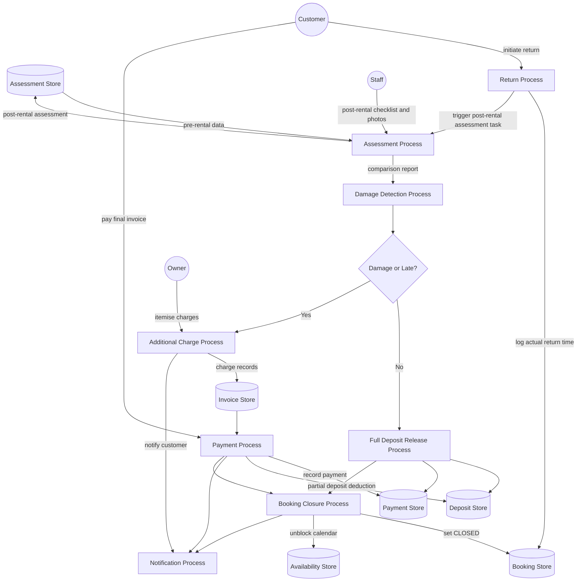

# Data Flow Diagrams

## Overview
Data flow diagrams (DFDs) showing how data moves through the rental management system for any asset type.

---

## Level 0 DFD – Context Diagram

---

## Level 1 DFD – Key Subsystems

---

## Level 2 DFD – Booking and Pricing Process

---

## Level 2 DFD – Return and Settlement Process

