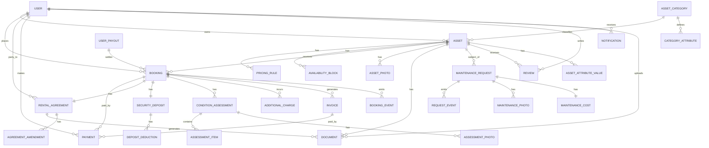
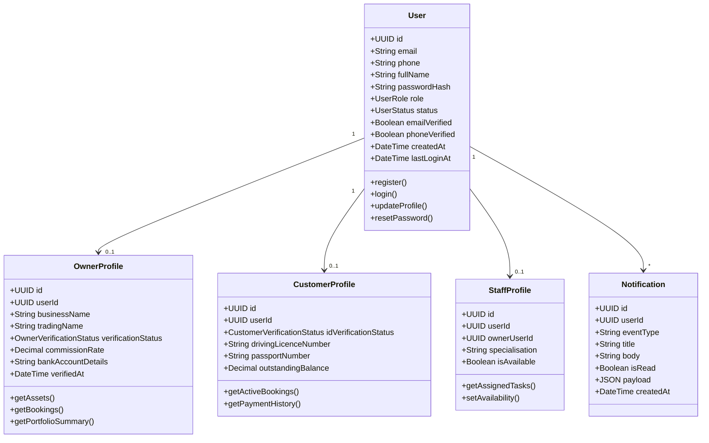
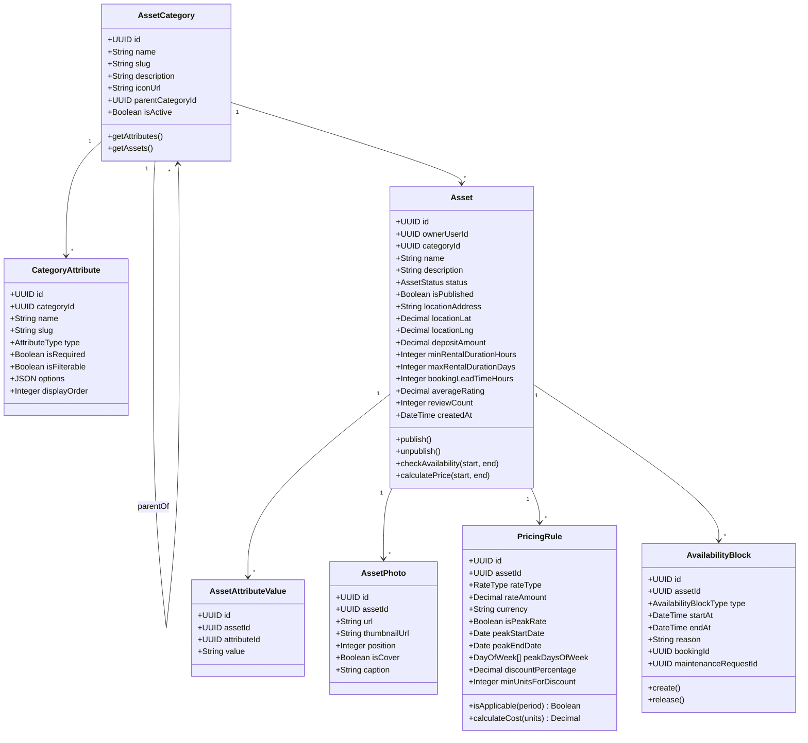
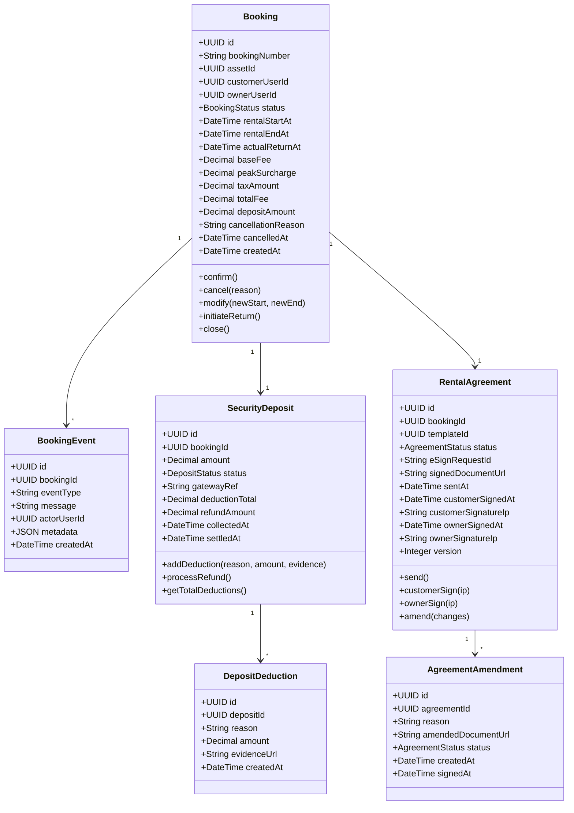
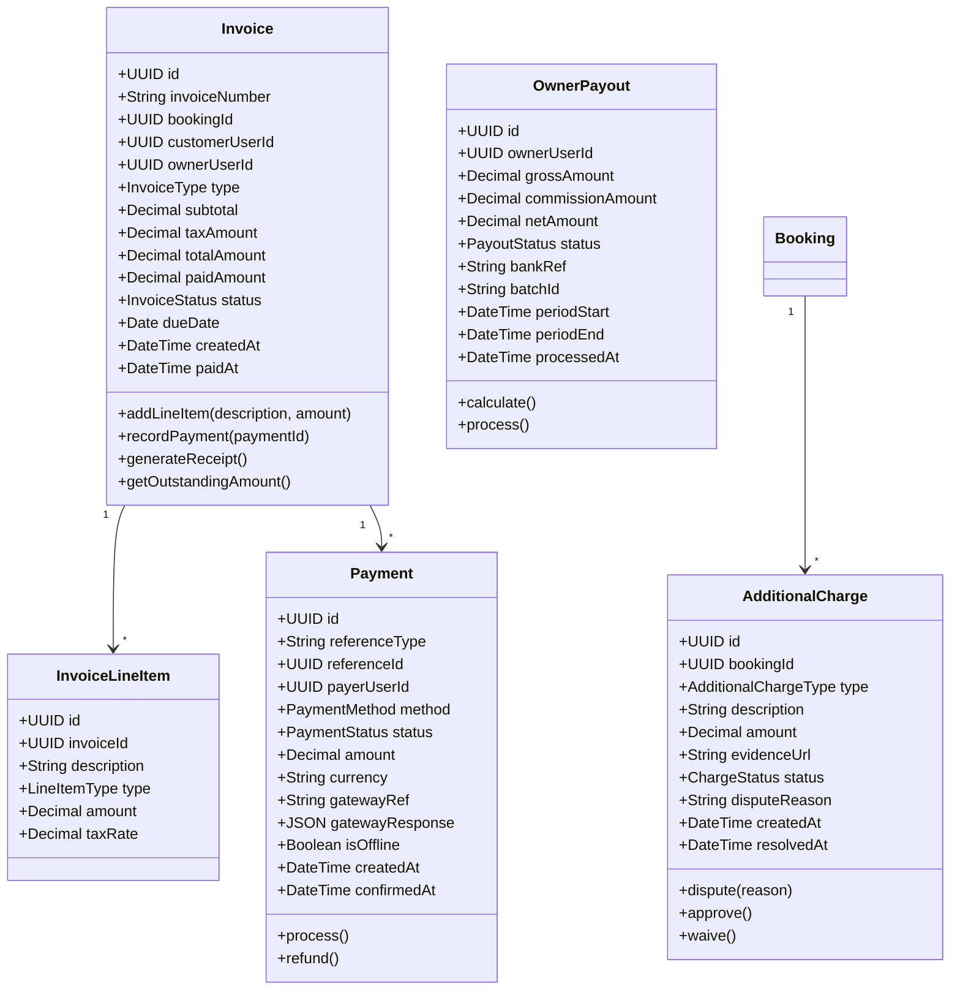
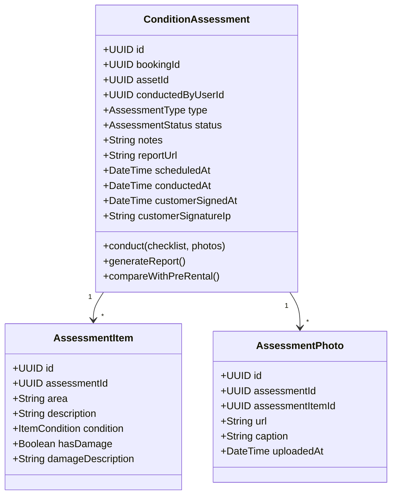
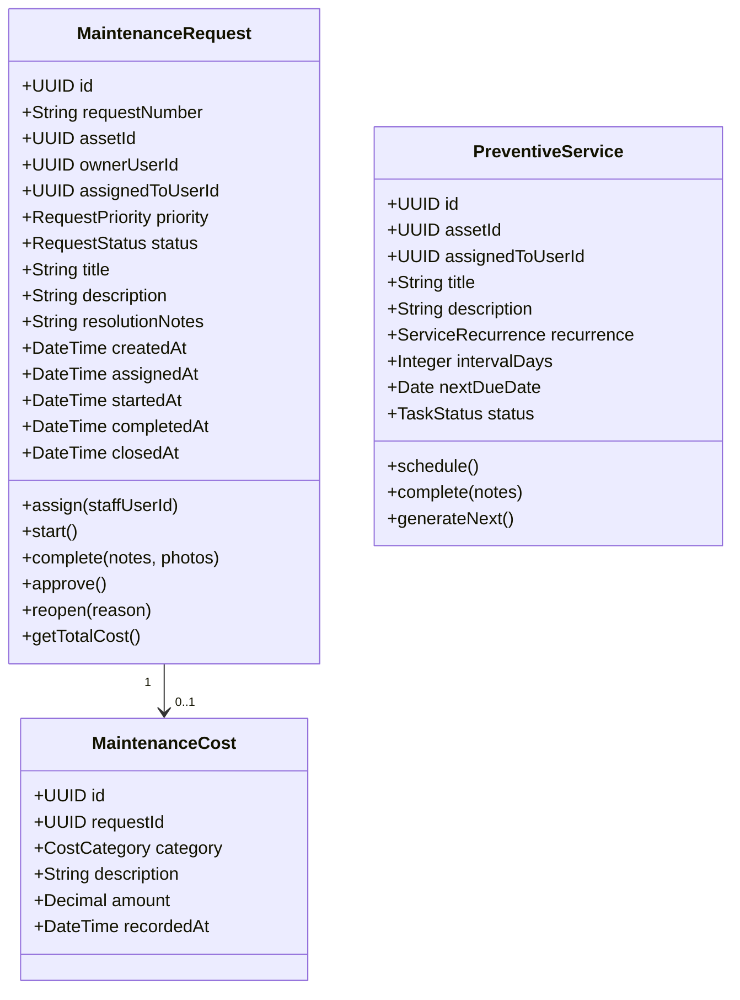

# Domain Model

## Overview
The domain model shows the key business entities and their relationships in the rental management system. The model is asset-agnostic — it applies equally to car rentals, flat rentals, gear rentals, equipment rentals, and any other rentable category.

---

## Complete Domain Model

---

## User Domain

---

## Asset Domain

---

## Booking Domain

---

## Invoice & Payment Domain

---

## Condition Assessment Domain

---

## Maintenance Domain

---

## Enumeration Types

```mermaid
classDiagram
    class UserRole {
        <<enumeration>>
        OWNER
        CUSTOMER
        STAFF
        ADMIN
    }

    class AssetStatus {
        <<enumeration>>
        DRAFT
        AVAILABLE
        BOOKED
        UNDER_MAINTENANCE
        RETIRED
    }

    class BookingStatus {
        <<enumeration>>
        PENDING
        CONFIRMED
        ACTIVE
        PENDING_CLOSURE
        CLOSED
        CANCELLED
        DECLINED
    }

    class AgreementStatus {
        <<enumeration>>
        DRAFT
        PENDING_CUSTOMER_SIGNATURE
        PENDING_OWNER_SIGNATURE
        SIGNED
        AMENDED
        TERMINATED
    }

    class InvoiceStatus {
        <<enumeration>>
        DRAFT
        SENT
        PARTIALLY_PAID
        PAID
        OVERDUE
        WAIVED
    }

    class RequestStatus {
        <<enumeration>>
        OPEN
        ASSIGNED
        IN_PROGRESS
        COMPLETED
        CLOSED
        REOPENED
        CANCELLED
    }

    class RateType {
        <<enumeration>>
        HOURLY
        DAILY
        WEEKLY
        MONTHLY
    }

    class AssessmentType {
        <<enumeration>>
        PRE_RENTAL
        POST_RENTAL
        ROUTINE
    }

    class AdditionalChargeType {
        <<enumeration>>
        DAMAGE
        LATE_RETURN
        CLEANING
        FUEL
        EXCESS_MILEAGE
        OTHER
    }
```

