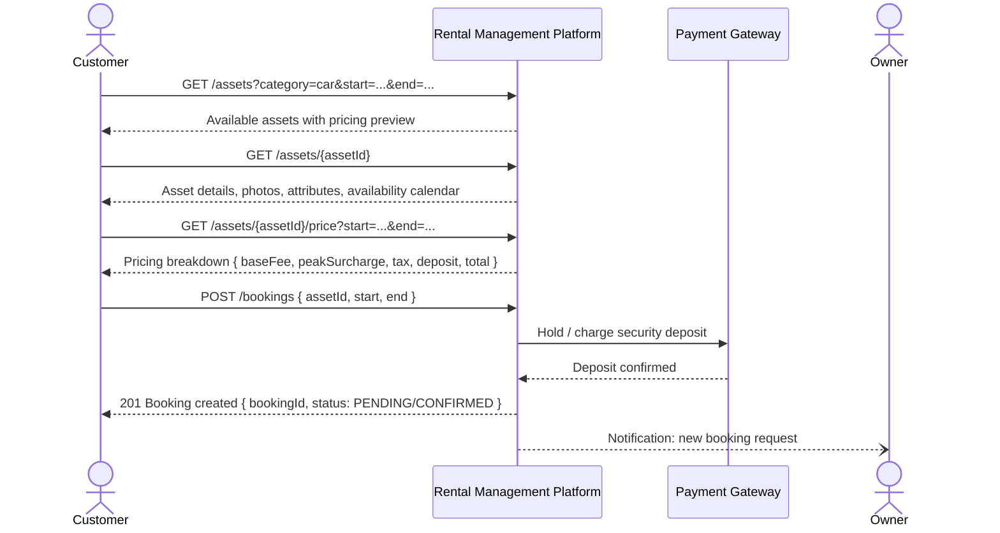
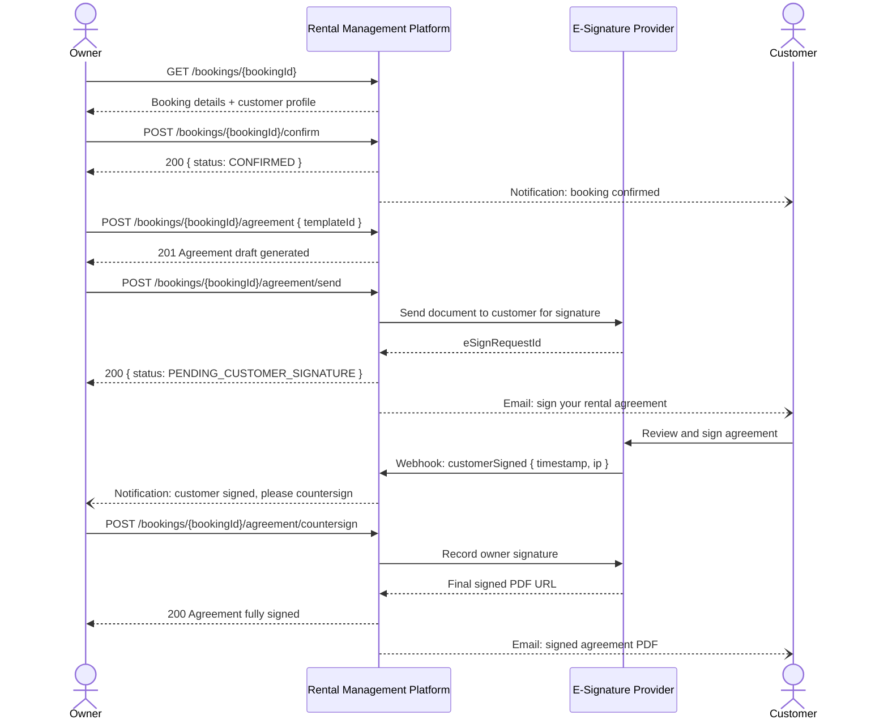
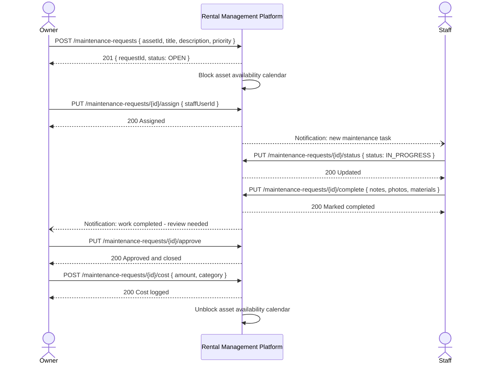

# System Sequence Diagrams

## Overview
Black-box system sequence diagrams showing interactions between actors and the platform for the primary use cases of the rental management system.

---

## Customer Searches and Books an Asset



---

## Owner Confirms Booking and Sends Rental Agreement



---

## Pre-Rental Condition Assessment

```mermaid
sequenceDiagram
    actor Staff
    participant Platform as Rental Management Platform
    actor Customer

    Platform--)Staff: Task assigned: pre-rental assessment for booking {bookingId}

    Staff->>Platform: GET /assessments/{assessmentId}
    Platform-->>Staff: Assessment task with category-specific checklist

    Staff->>Platform: POST /assessments/{assessmentId}/items { items[] }
    Platform-->>Staff: 200 Items saved

    Staff->>Platform: POST /assessments/{assessmentId}/photos { photos[] }
    Platform-->>Staff: 200 Photos uploaded

    Staff->>Platform: POST /assessments/{assessmentId}/submit
    Platform-->>Staff: 200 Assessment submitted
    Platform--)Customer: Notification: review and sign pre-rental assessment

    Customer->>Platform: GET /assessments/{assessmentId}
    Platform-->>Customer: Assessment report with photos

    Customer->>Platform: POST /assessments/{assessmentId}/countersign
    Platform-->>Customer: 200 Countersigned; handover complete
    Platform--)Staff: Notification: handover confirmed
```

---

## Customer Pays Invoice

```mermaid
sequenceDiagram
    actor Customer
    participant Platform as Rental Management Platform
    participant PG as Payment Gateway
    actor Owner

    Platform--)Customer: Notification: invoice due { amount, dueDate }

    Customer->>Platform: GET /invoices/{invoiceId}
    Platform-->>Customer: Invoice details { lineItems, total, dueDate }

    Customer->>Platform: POST /invoices/{invoiceId}/pay { paymentMethod }
    Platform->>PG: Initiate payment { amount, method }
    PG-->>Platform: Payment session / redirect URL
    Platform-->>Customer: 200 { paymentUrl }

    Customer->>PG: Complete payment
    PG->>Platform: Webhook: paymentConfirmed { gatewayRef, amount }
    Platform-->>Platform: Mark invoice PAID; update ledger
    Platform--)Customer: Email: payment receipt
    Platform--)Owner: Notification: payment received
```

---

## Post-Rental Return and Settlement

```mermaid
sequenceDiagram
    actor Customer
    participant Platform as Rental Management Platform
    actor Staff
    participant PG as Payment Gateway
    actor Owner

    Customer->>Platform: POST /bookings/{bookingId}/return { actualReturnAt }
    Platform-->>Customer: 200 Return initiated
    Platform--)Staff: Notification: perform post-rental assessment

    Staff->>Platform: POST /assessments { bookingId, type: POST_RENTAL }
    Staff->>Platform: PUT /assessments/{id}/submit { items[], photos[] }
    Platform-->>Staff: 200 Assessment submitted

    Platform->>Platform: Compare pre vs post assessment

    alt No Damage, On Time
        Platform->>PG: Initiate full deposit refund
        PG-->>Platform: Refund confirmed
        Platform--)Customer: Notification: deposit refunded
    else Damage or Late Return
        Platform--)Owner: Notification: review post-rental assessment
        Owner->>Platform: POST /bookings/{bookingId}/additional-charges { charges[] }
        Platform-->>Owner: 200 Charges recorded
        Platform--)Customer: Notification: additional charges applied
        Customer->>Platform: POST /invoices/{finalInvoiceId}/pay
        Platform->>PG: Charge additional fees
        PG-->>Platform: Confirmed
    end

    Platform->>Platform: Close booking; unblock asset calendar
    Platform--)Owner: Notification: rental closed
```

---

## Maintenance Request Lifecycle


