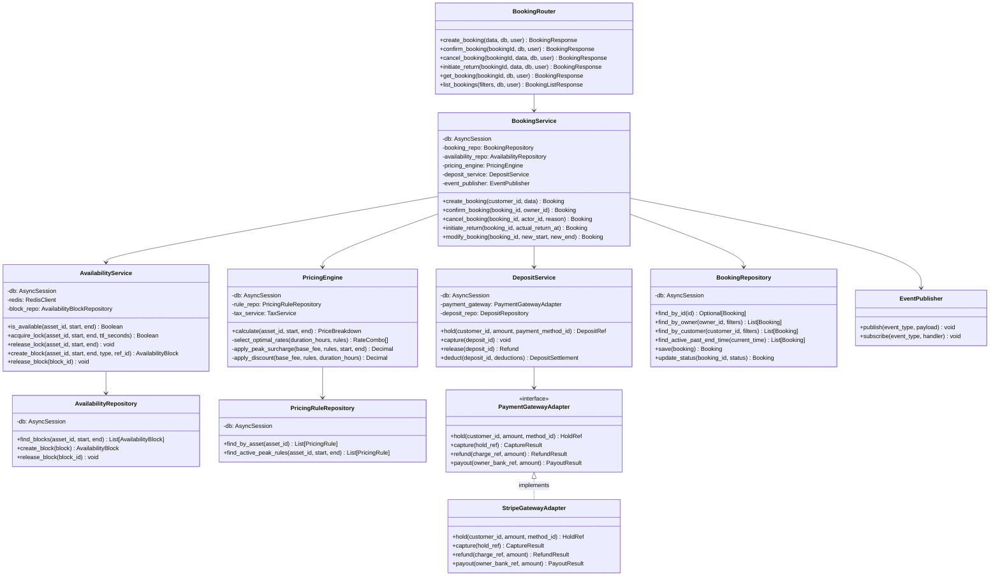
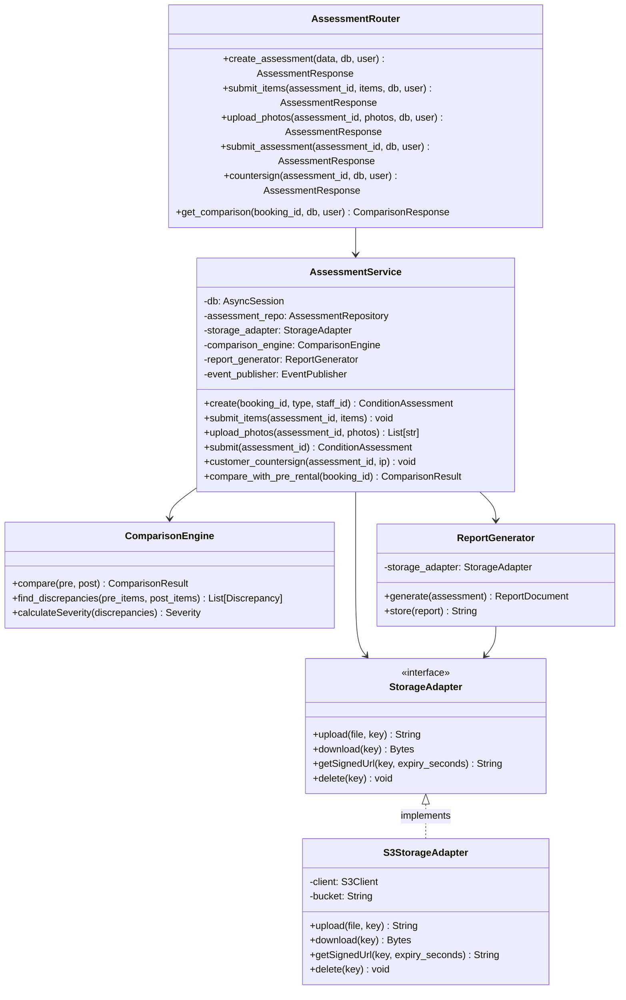
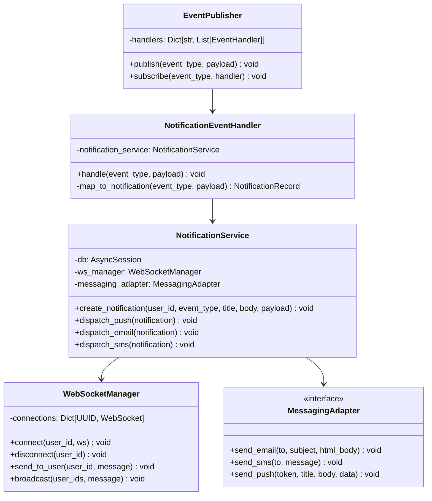

# C4 Code Diagram

## Overview
C4 Level 4 — Code-level diagram showing key class relationships inside the Booking component of the rental management system.

---

## Booking Component — Code Level

---

## Assessment Component — Code Level

---

## Event Publisher — Code Level

