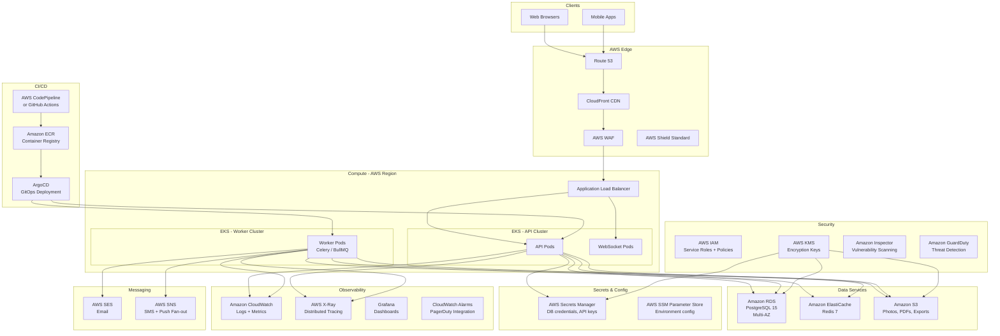
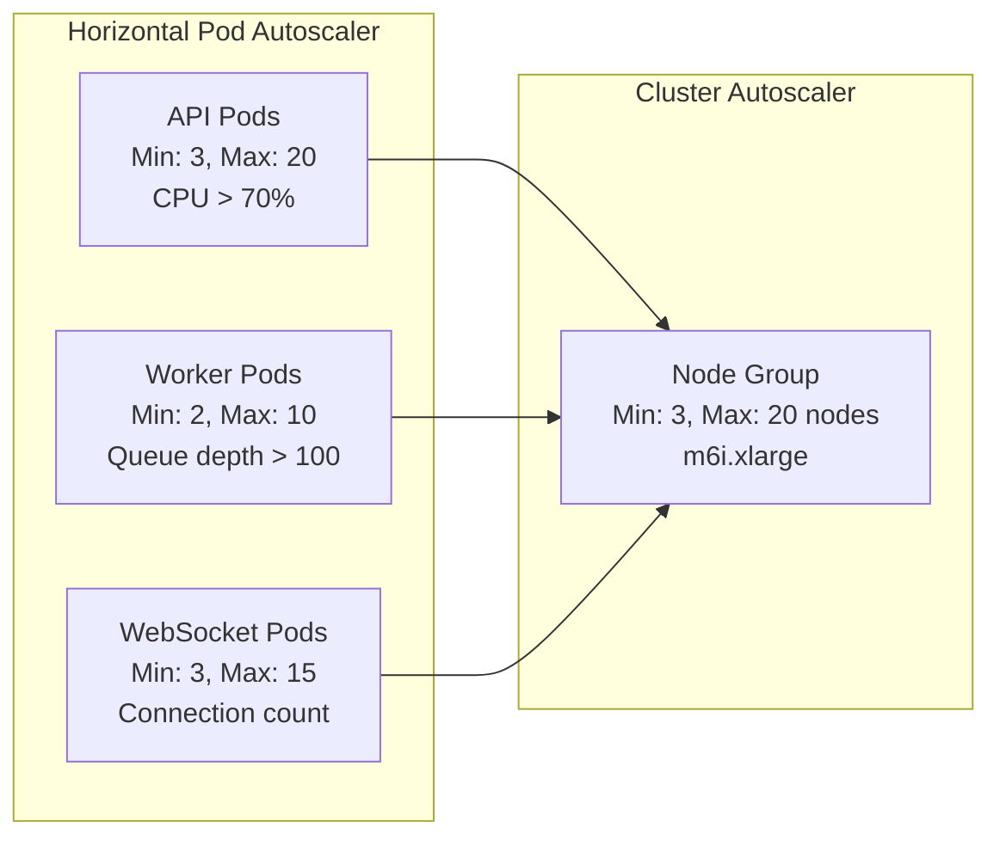

# Cloud Architecture

## Overview
Cloud architecture diagram and service selection for the rental management system on AWS.

---

## Full AWS Cloud Architecture

---

## AWS Service Selection

| Category | Service | Justification |
|----------|---------|---------------|
| Compute | Amazon EKS | Managed Kubernetes for container orchestration; auto-scaling |
| Load Balancing | AWS ALB | Layer 7 load balancing; path-based routing; WebSocket support |
| Database | Amazon RDS PostgreSQL | Managed relational DB; Multi-AZ for HA; point-in-time recovery |
| Caching | Amazon ElastiCache Redis | Low-latency cache; availability locks; task queue |
| Object Storage | Amazon S3 | Durable, scalable storage for photos, PDFs, reports |
| CDN | Amazon CloudFront | Edge caching for static assets; low-latency global delivery |
| DNS | Amazon Route 53 | Reliable DNS; health-check-based failover |
| Security | AWS WAF + Shield | Edge protection against OWASP Top 10, DDoS |
| Secrets | AWS Secrets Manager | Encrypted secret storage with automatic rotation |
| Email | Amazon SES | High-deliverability transactional email |
| SMS / Push | Amazon SNS | Scalable SMS and push notification fan-out |
| Logging | Amazon CloudWatch | Centralized log aggregation and metric dashboards |
| Tracing | AWS X-Ray | Distributed tracing across services |
| Container Registry | Amazon ECR | Private container image registry |
| CI/CD | GitHub Actions + ArgoCD | GitOps-based deployment pipeline |
| Encryption | AWS KMS | Key management for RDS, S3, and Secrets Manager |
| Threat Detection | Amazon GuardDuty | Automated threat detection for AWS accounts |

---

## Auto-Scaling Configuration

---

## Backup and Disaster Recovery

| Resource | Backup Strategy | RPO | RTO |
|----------|-----------------|-----|-----|
| RDS PostgreSQL | Automated daily snapshots + PITR | 5 minutes | 30 minutes |
| RDS Cross-Region | Async replication to DR region | 15 minutes | 1 hour |
| S3 | Cross-region replication | Real-time | Immediate |
| ElastiCache | Automatic daily snapshot | 1 hour | 15 minutes |
| Secrets Manager | Multi-region replication | Real-time | Immediate |

---

## Cost Optimisation

| Strategy | Implementation |
|----------|---------------|
| Reserved Instances | 1-year RDS and ElastiCache reservations for baseline capacity |
| Spot Instances | Worker pods on spot node groups (fault-tolerant batch jobs) |
| S3 Lifecycle Policies | Move reports > 90 days to S3-IA; > 1 year to Glacier |
| CloudFront Caching | Cache asset photos and static files to reduce origin requests |
| RDS Read Replicas | Route reporting queries to read replicas, reducing primary load |
