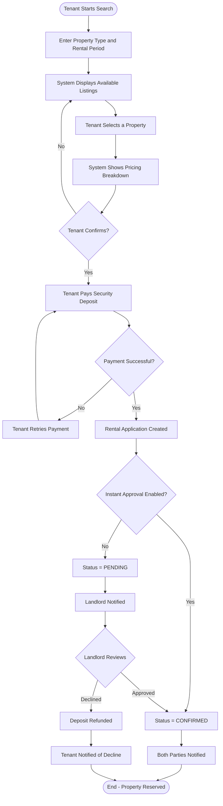
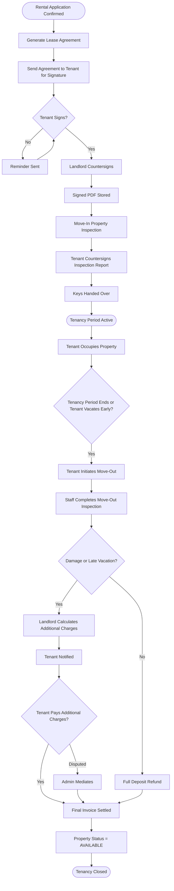
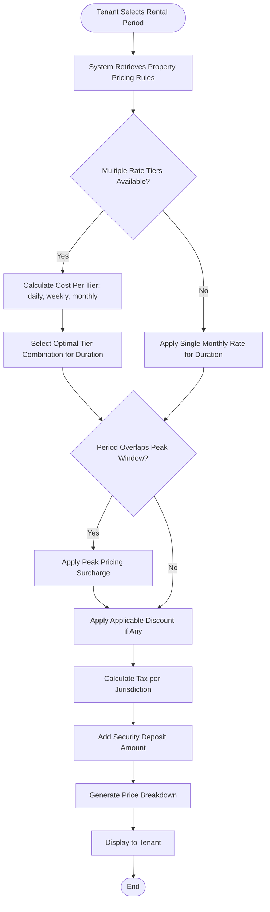
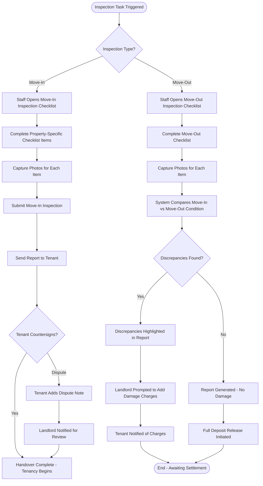
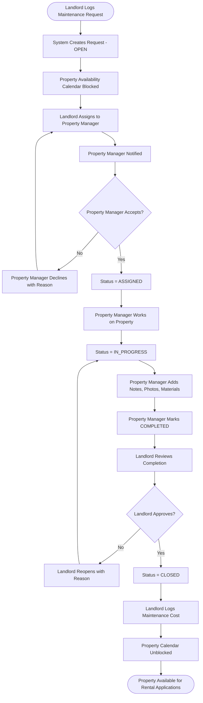
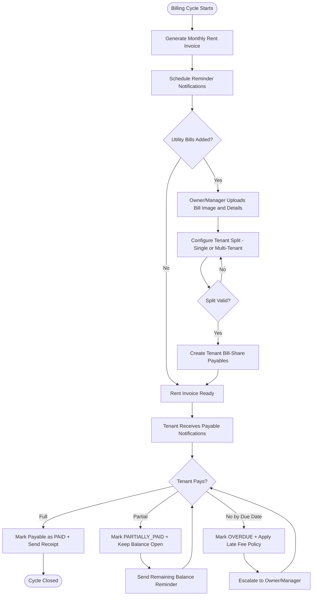
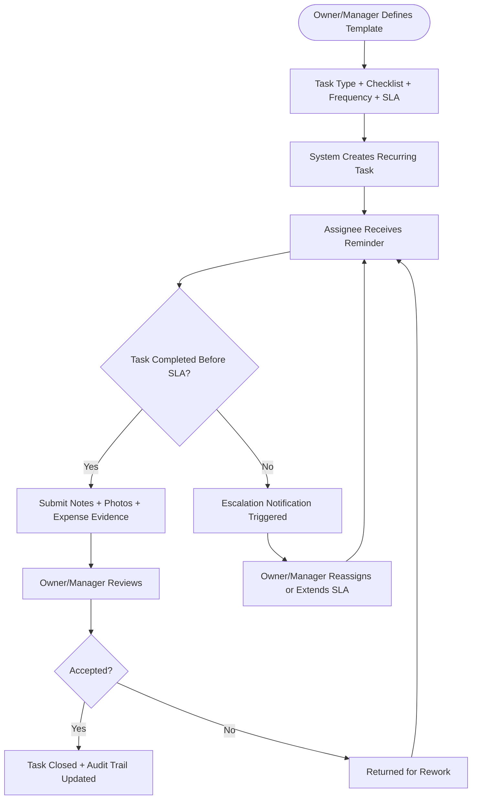
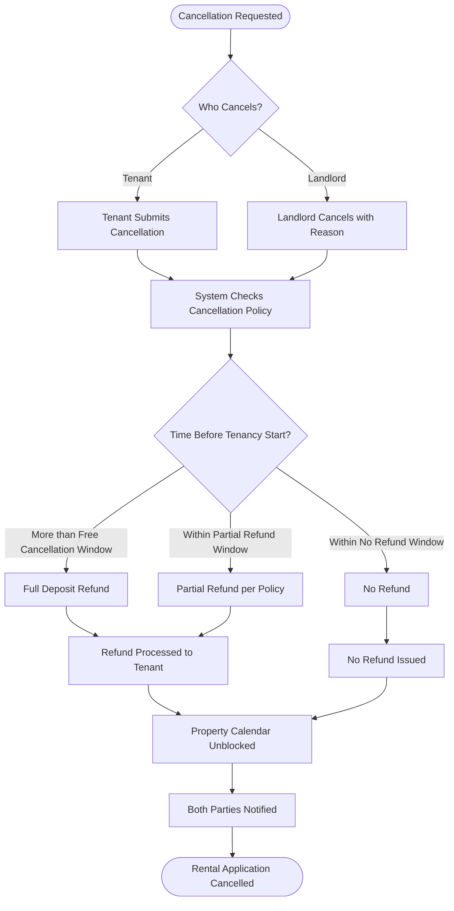

# Activity Diagrams

## Overview
Activity diagrams for key business processes in MeroGhar. These flows are specific to house, flat, and apartment rentals.

---

## Rental Application Flow

---

## Rental Lifecycle Flow

---

## Pricing Calculation Flow

---

## Property Inspection Flow

---

## Maintenance Request Flow

---

## Monthly Rent and Utility Billing Flow

---

## Preventive Operations Workflow

---

## Cancellation and Refund Flow

