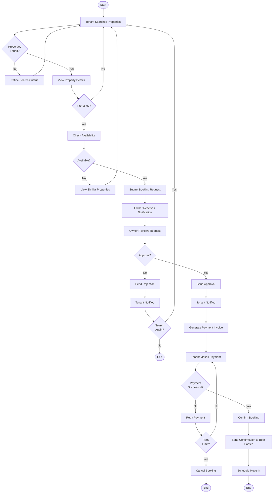
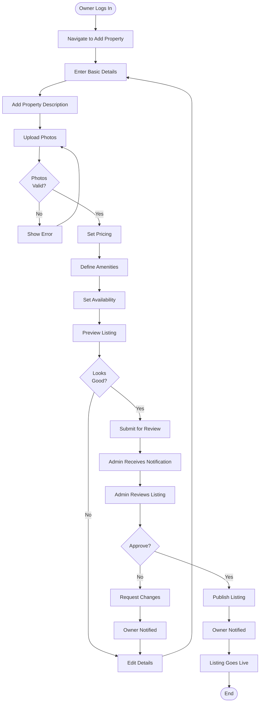
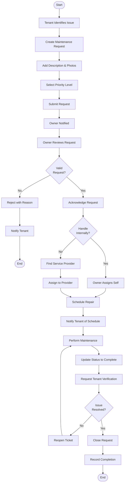

# Activity Diagram - Business Process

## Property Booking Process

```mermaid
flowchart TD
    Start([Start]) --> A[Tenant Searches Properties]
    A --> B{Properties<br/>Found?}
    B -->|No| C[Refine Search Criteria]
    C --> A
    B -->|Yes| D[View Property Details]
    D --> E{Interested?}
    E -->|No| A
    E -->|Yes| F[Check Availability]
    F --> G{Available?}
    G -->|No| H[View Similar Properties]
    H --> A
    G -->|Yes| I[Submit Booking Request]
    I --> J[Owner Receives Notification]
    J --> K[Owner Reviews Request]
    K --> L{Approve?}
    L -->|No| M[Send Rejection]
    M --> N[Tenant Notified]
    N --> O{Search<br/>Again?}
    O -->|Yes| A
    O -->|No| End1([End])
    L -->|Yes| P[Send Approval]
    P --> Q[Tenant Notified]
    Q --> R[Generate Payment Invoice]
    R --> S[Tenant Makes Payment]
    S --> T{Payment<br/>Successful?}
    T -->|No| U[Retry Payment]
    U --> V{Retry<br/>Limit?}
    V -->|No| S
    V -->|Yes| W[Cancel Booking]
    W --> End2([End])
    T -->|Yes| X[Confirm Booking]
    X --> Y[Send Confirmation to Both Parties]
    Y --> Z[Schedule Move-in]
    Z --> End3([End])
```

## Property Listing Process

```mermaid
flowchart TD
    Start([Owner Logs In]) --> A[Navigate to Add Property]
    A --> B[Enter Basic Details]
    B --> C[Add Property Description]
    C --> D[Upload Photos]
    D --> E{Photos<br/>Valid?}
    E -->|No| F[Show Error]
    F --> D
    E -->|Yes| G[Set Pricing]
    G --> H[Define Amenities]
    H --> I[Set Availability]
    I --> J[Preview Listing]
    J --> K{Looks<br/>Good?}
    K -->|No| L[Edit Details]
    L --> B
    K -->|Yes| M[Submit for Review]
    M --> N[Admin Receives Notification]
    N --> O[Admin Reviews Listing]
    O --> P{Approve?}
    P -->|No| Q[Request Changes]
    Q --> R[Owner Notified]
    R --> L
    P -->|Yes| S[Publish Listing]
    S --> T[Owner Notified]
    T --> U[Listing Goes Live]
    U --> End([End])
```

## Maintenance Request Process

```mermaid
flowchart TD
    Start([Start]) --> A[Tenant Identifies Issue]
    A --> B[Create Maintenance Request]
    B --> C[Add Description & Photos]
    C --> D[Select Priority Level]
    D --> E[Submit Request]
    E --> F[Owner Notified]
    F --> G[Owner Reviews Request]
    G --> H{Valid<br/>Request?}
    H -->|No| I[Reject with Reason]
    I --> J[Notify Tenant]
    J --> End1([End])
    H -->|Yes| K[Acknowledge Request]
    K --> L{Handle<br/>Internally?}
    L -->|Yes| M[Owner Assigns Self]
    L -->|No| N[Find Service Provider]
    N --> O[Assign to Provider]
    M --> P[Schedule Repair]
    O --> P
    P --> Q[Notify Tenant of Schedule]
    Q --> R[Perform Maintenance]
    R --> S[Update Status to Complete]
    S --> T[Request Tenant Verification]
    T --> U{Issue<br/>Resolved?}
    U -->|No| V[Reopen Ticket]
    V --> R
    U -->|Yes| W[Close Request]
    W --> X[Record Completion]
    X --> End2([End])
```
