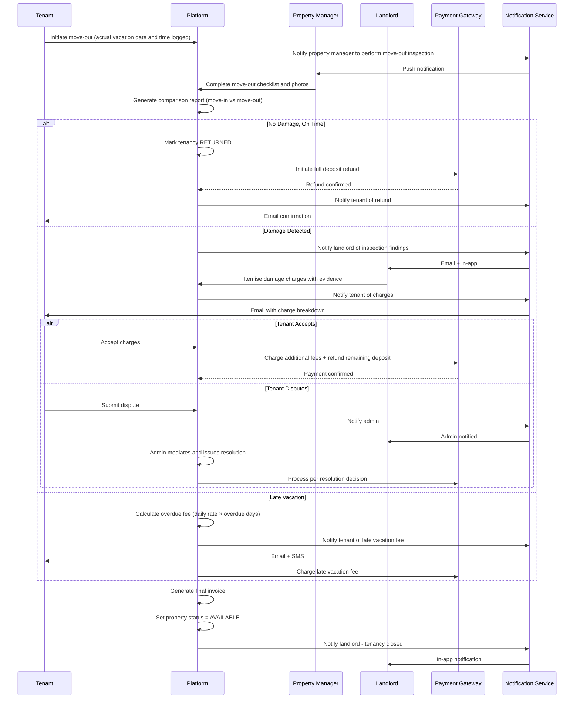
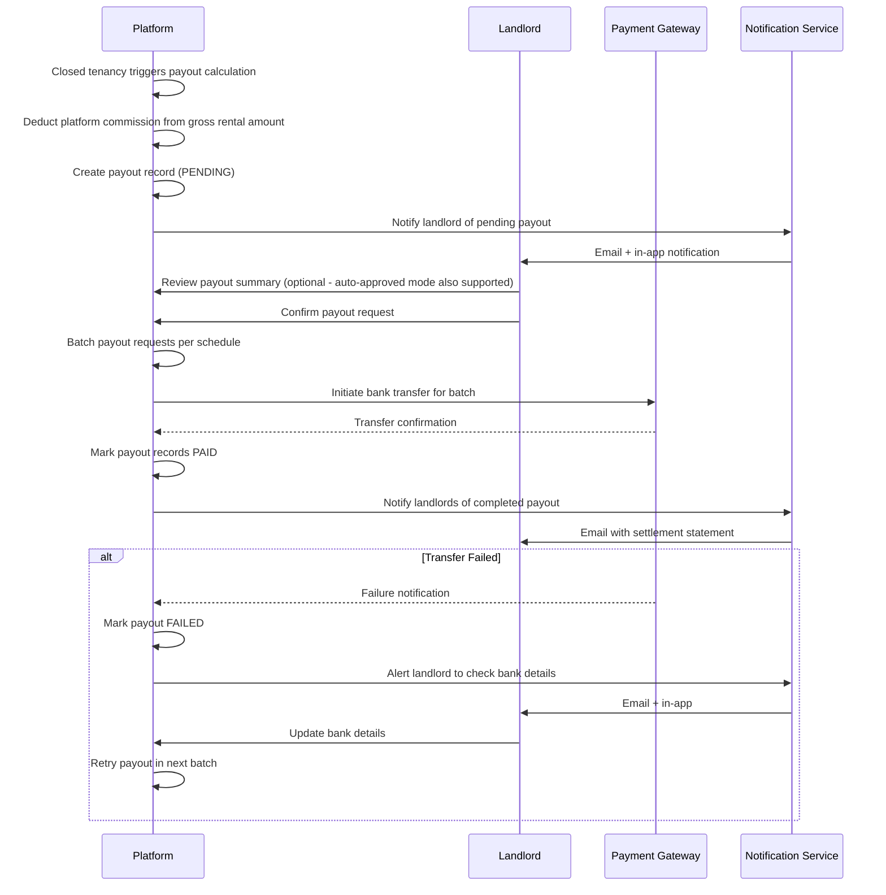

# Swimlane Diagrams

## Overview
BPMN-style swimlane diagrams illustrating cross-actor workflows in MeroGhar, specific to house, flat, and apartment rentals.

---

## Rental Application Confirmation Swimlane

```mermaid
sequenceDiagram
    participant T as Tenant
    participant P as Platform
    participant PG as Payment Gateway
    participant L as Landlord
    participant N as Notification Service

    T->>P: Search properties by type and rental period
    P-->>T: Available listings with pricing preview

    T->>P: Select property and confirm rental period
    P-->>T: Price breakdown + deposit amount

    T->>P: Submit rental application
    P->>PG: Charge / hold security deposit
    PG-->>P: Deposit confirmed

    P->>P: Create rental application (PENDING or CONFIRMED)
    P->>N: Notify landlord of new application
    N->>L: Email + push notification

    alt Manual Confirmation
        L->>P: Review tenant profile and application
        L->>P: Approve rental application
        P->>P: Status = CONFIRMED; block property calendar
        P->>N: Notify tenant of confirmation
        N->>T: Email + push notification
    else Instant Approval
        P->>P: Status = CONFIRMED immediately; block property calendar
        P->>N: Notify tenant of confirmation
        N->>T: Email + push notification
    end
```

---

## Lease Agreement Signing Swimlane

```mermaid
sequenceDiagram
    participant L as Landlord
    participant P as Platform
    participant ES as E-Signature Provider
    participant T as Tenant
    participant N as Notification Service

    L->>P: Generate lease agreement from template
    P->>P: Pre-fill agreement with tenancy details
    L->>P: Review and send for tenant signature
    P->>ES: Send document to tenant for signing
    ES->>N: Dispatch signature request email
    N->>T: Email with agreement link

    T->>ES: Open, review, and sign lease agreement
    ES->>P: Webhook: tenant signed (timestamp, IP)
    P->>N: Notify landlord to countersign
    N->>L: Email + in-app notification

    L->>ES: Countersign lease agreement
    ES->>P: Final signed document delivered
    P->>P: Store signed PDF; link to tenancy
    P->>N: Send signed copy to both parties
    N->>T: Email with PDF attachment
    N->>L: Email with PDF attachment
```

---

## Move-In Property Inspection Swimlane

```mermaid
sequenceDiagram
    participant PM as Property Manager
    participant P as Platform
    participant T as Tenant
    participant L as Landlord
    participant N as Notification Service

    P->>PM: Assign move-in inspection task
    N->>PM: Push notification

    PM->>P: Open inspection task
    P-->>PM: Property inspection checklist

    PM->>P: Complete checklist items (condition per item: bedrooms, bathrooms, appliances, fixtures, walls, flooring)
    PM->>P: Upload timestamped photos for each item
    PM->>P: Submit inspection report

    P->>P: Generate inspection report
    P->>N: Send report to tenant for countersignature
    N->>T: Email + push with inspection report link

    T->>P: Review report and photos
    alt Tenant Agrees
        T->>P: Countersign inspection report
        P->>P: Key handover recorded; tenancy begins
        P->>N: Notify landlord - handover complete
        N->>L: In-app notification
    else Tenant Disputes
        T->>P: Add dispute note on specific item
        P->>N: Notify landlord of dispute
        N->>L: Email + in-app
        L->>P: Resolve dispute (accept or override)
        P->>P: Record resolution; finalise handover
    end
```

---

## Move-Out Return and Settlement Swimlane



---

## Maintenance Request Swimlane

```mermaid
sequenceDiagram
    participant L as Landlord
    participant P as Platform
    participant PM as Property Manager
    participant N as Notification Service

    L->>P: Log maintenance request (description, priority, photos)
    P->>P: Create request (OPEN); block property calendar
    P->>N: Notify property manager of new task
    N->>PM: Email + push notification

    alt Property Manager Accepts
        PM->>P: Accept task (status: ASSIGNED)
        PM->>P: Begin work; update to IN_PROGRESS
        PM->>P: Add work notes, photos, materials used
        PM->>P: Mark task COMPLETED

        P->>N: Notify landlord of completion
        N->>L: Push + email notification

        alt Landlord Approves
            L->>P: Approve completion (status: CLOSED)
            L->>P: Log maintenance cost
            P->>P: Unblock property calendar
            P->>N: Property now available for rental applications
        else Landlord Reopens
            L->>P: Reopen with reason
            P->>N: Notify property manager to revisit
            N->>PM: Push notification
        end

    else Property Manager Declines
        PM->>P: Decline with reason
        P->>N: Notify landlord - reassignment needed
        N->>L: Push notification
        L->>P: Reassign to another property manager
    end
```

---

## Payout Processing Swimlane


