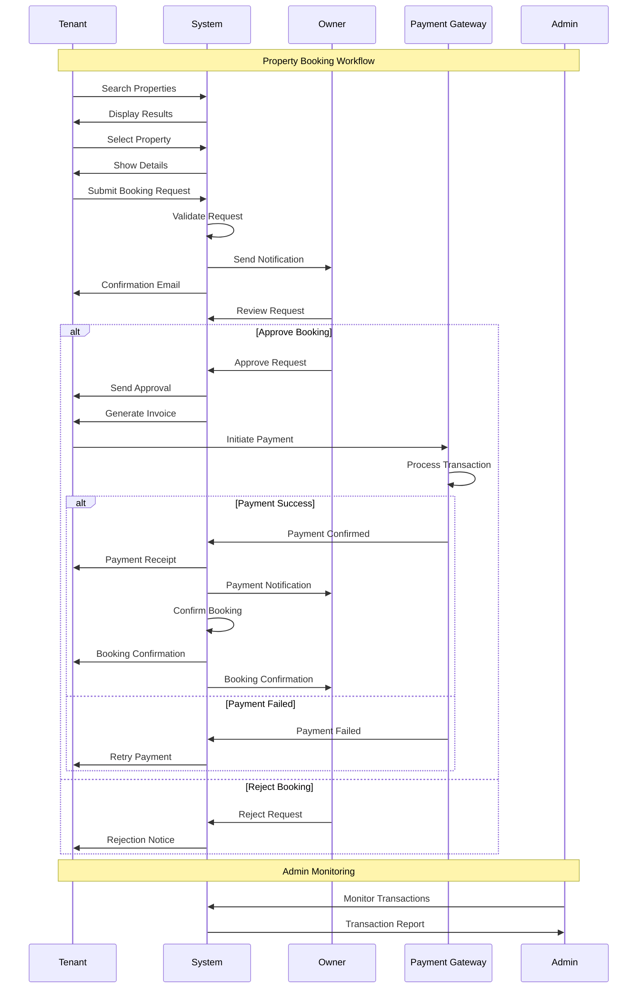
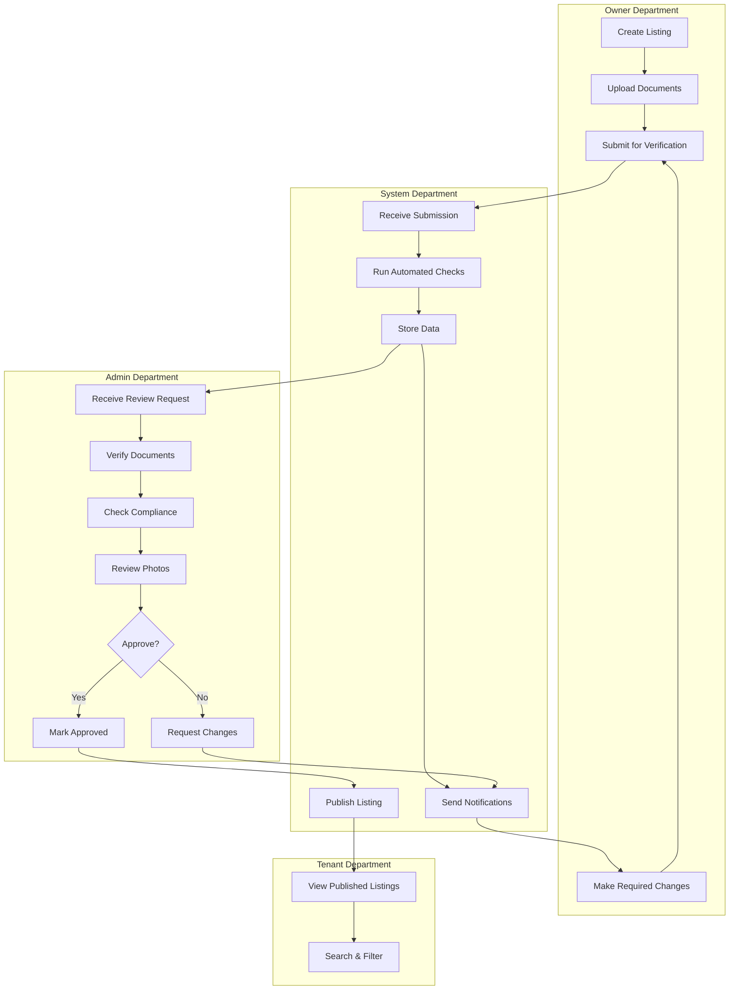
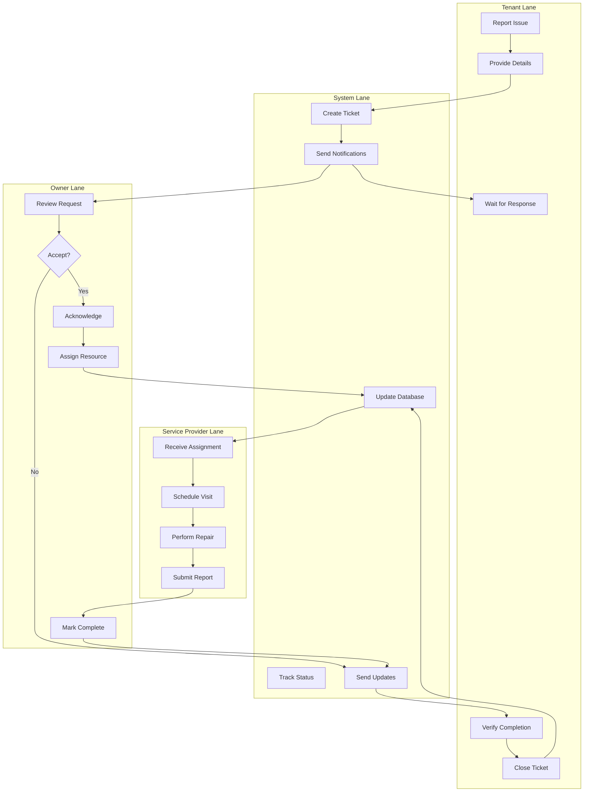

# BPMN / Swimlane Diagram

## Cross-Department Booking Workflow

```mermaid
sequenceDiagram
    participant T as Tenant
    participant S as System
    participant O as Owner
    participant P as Payment Gateway
    participant A as Admin
    
    Note over T,A: Property Booking Workflow
    
    T->>S: Search Properties
    S->>T: Display Results
    T->>S: Select Property
    S->>T: Show Details
    T->>S: Submit Booking Request
    
    S->>S: Validate Request
    S->>O: Send Notification
    S->>T: Confirmation Email
    
    O->>S: Review Request
    alt Approve Booking
        O->>S: Approve Request
        S->>T: Send Approval
        S->>T: Generate Invoice
        
        T->>P: Initiate Payment
        P->>P: Process Transaction
        alt Payment Success
            P->>S: Payment Confirmed
            S->>T: Payment Receipt
            S->>O: Payment Notification
            S->>S: Confirm Booking
            S->>T: Booking Confirmation
            S->>O: Booking Confirmation
        else Payment Failed
            P->>S: Payment Failed
            S->>T: Retry Payment
        end
    else Reject Booking
        O->>S: Reject Request
        S->>T: Rejection Notice
    end
    
    Note over T,A: Admin Monitoring
    A->>S: Monitor Transactions
    S->>A: Transaction Report
```

## Property Verification Workflow

```mermaid
graph TB
    subgraph "Owner Department"
        O1[Create Listing]
        O2[Upload Documents]
        O3[Submit for Verification]
        O8[Make Required Changes]
    end
    
    subgraph "System Department"
        S1[Receive Submission]
        S2[Run Automated Checks]
        S3[Store Data]
        S4[Send Notifications]
        S7[Publish Listing]
    end
    
    subgraph "Admin Department"
        A1[Receive Review Request]
        A2[Verify Documents]
        A3[Check Compliance]
        A4[Review Photos]
        A5{Approve?}
        A6[Request Changes]
        A9[Mark Approved]
    end
    
    subgraph "Tenant Department"
        T1[View Published Listings]
        T2[Search & Filter]
    end
    
    O1 --> O2
    O2 --> O3
    O3 --> S1
    S1 --> S2
    S2 --> S3
    S3 --> A1
    S3 --> S4
    A1 --> A2
    A2 --> A3
    A3 --> A4
    A4 --> A5
    A5 -->|No| A6
    A6 --> S4
    S4 --> O8
    O8 --> O3
    A5 -->|Yes| A9
    A9 --> S7
    S7 --> T1
    T1 --> T2
```

## Maintenance Request Swimlane

```mermaid
graph TB
    subgraph "Tenant Lane"
        T1[Report Issue]
        T2[Provide Details]
        T3[Wait for Response]
        T8[Verify Completion]
        T9[Close Ticket]
    end
    
    subgraph "System Lane"
        S1[Create Ticket]
        S2[Send Notifications]
        S3[Track Status]
        S4[Update Database]
        S5[Send Updates]
    end
    
    subgraph "Owner Lane"
        O1[Review Request]
        O2{Accept?}
        O3[Acknowledge]
        O4[Assign Resource]
        O7[Mark Complete]
    end
    
    subgraph "Service Provider Lane"
        V1[Receive Assignment]
        V2[Schedule Visit]
        V3[Perform Repair]
        V4[Submit Report]
    end
    
    T1 --> T2
    T2 --> S1
    S1 --> S2
    S2 --> O1
    S2 --> T3
    O1 --> O2
    O2 -->|Yes| O3
    O2 -->|No| S5
    O3 --> O4
    O4 --> S4
    S4 --> V1
    V1 --> V2
    V2 --> V3
    V3 --> V4
    V4 --> O7
    O7 --> S5
    S5 --> T8
    T8 --> T9
    T9 --> S4
```
