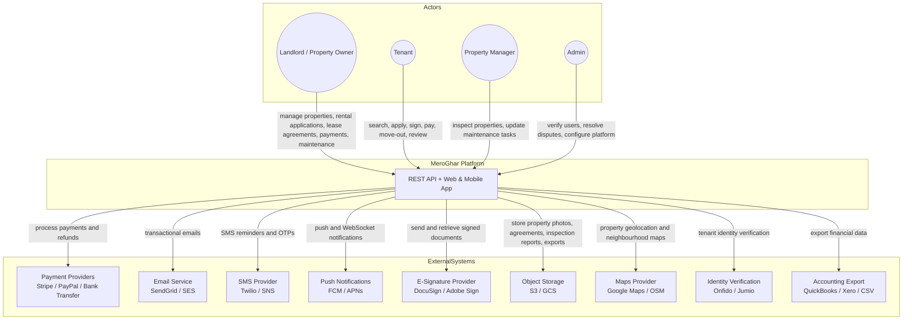
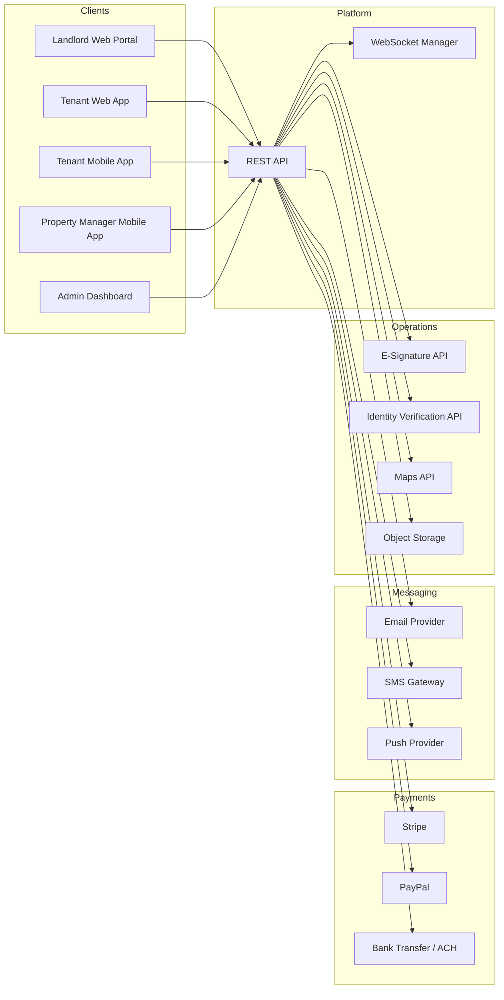
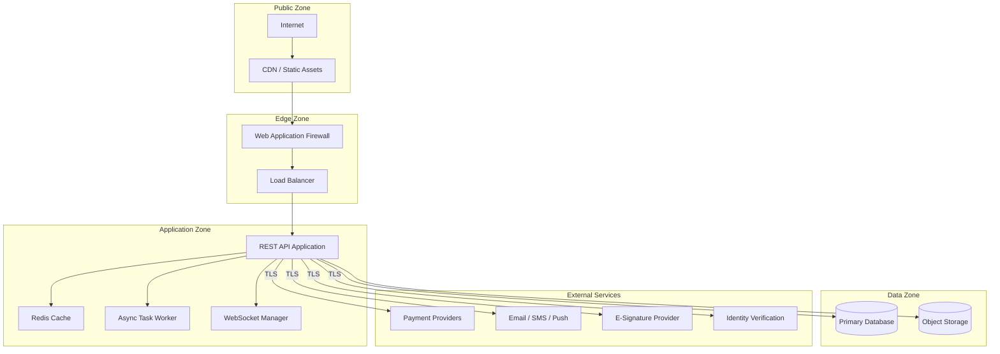

# System Context Diagram

## Overview
System context diagrams defining the boundaries of the MeroGhar platform and its interactions with external actors and services, specific to house, flat, and apartment rentals.

---

## Main System Context Diagram

---

## Detailed Context With Data Flows

---

## Security Boundaries

---

## External Dependency Notes

| System | Purpose | Priority |
|--------|---------|----------|
| Payment providers | Rental application payment, deposit hold, refunds, additional charges | Core |
| Email provider | Transactional emails, lease agreement documents | Core |
| SMS gateway | Tenancy reminders, OTP, overdue alerts | Core |
| E-signature provider | Digital lease agreement signing | Core |
| Object storage | Property photos, signed PDFs, inspection reports, exports | Core |
| Push notifications | Real-time in-app alerts for all actors | Core |
| Identity verification | Tenant ID check (national ID, passport) | High |
| Maps provider | Property geolocation, neighbourhood and transit display | Optional |
| Accounting export | Financial data export to accounting tools | Optional |
