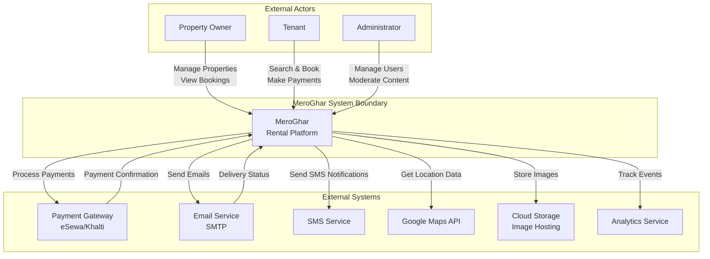
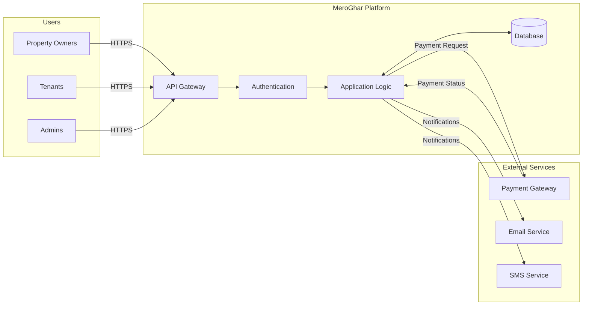

# System Context Diagram

## C4 Context Level

## System Boundaries

### Internal (Within System Boundary)
- User Management
- Property Management
- Booking System
- Payment Processing Logic
- Notification Orchestration
- Analytics Dashboard
- Content Moderation

### External (Outside System Boundary)
- Bank Payment Gateways (eSewa, Khalti, etc.)
- Email Service Providers
- SMS Gateway Providers
- Google Maps API
- Cloud Storage (AWS S3, Google Cloud Storage)
- Third-party Analytics Tools

## Data Flows

