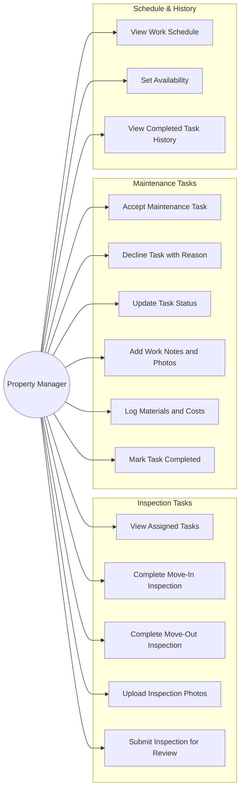
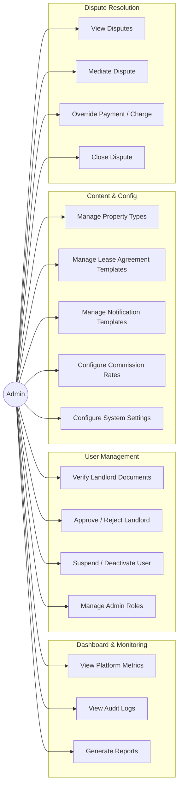

# Use Case Diagram

## Overview
Use case diagrams for all major actors in MeroGhar, specific to house, flat, and apartment rentals.

---

## Complete System Use Case Diagram

```mermaid
graph TB
    subgraph Actors
        Owner((Landlord / Property Owner))
        Customer((Tenant))
        Staff((Property Manager))
        Admin((Admin))
        PaymentGW((Payment Gateway))
        ESign((E-Signature Provider))
        SMSSvc((SMS Provider))
    end

    subgraph "MeroGhar Platform"
        UC1[Manage Properties & Listings]
        UC2[Manage Availability]
        UC3[Review Rental Applications]
        UC4[Manage Lease Agreements]
        UC5[Manage Payments & Invoices]
        UC6[Manage Property Inspections]
        UC7[Manage Maintenance]
        UC8[View Reports & Analytics]

        UC10[Search & Browse Listings]
        UC11[Submit Rental Application]
        UC12[Sign Lease Agreement]
        UC13[Pay Invoice]
        UC14[Countersign Inspection Report]
        UC15[Initiate Move-Out]
        UC16[Rate & Review]

        UC20[Perform Property Inspections]
        UC21[Update Maintenance Tasks]

        UC30[Manage Users]
        UC31[Verify Documents]
        UC32[Resolve Disputes]
        UC33[Configure Platform]
    end

    Owner --> UC1
    Owner --> UC2
    Owner --> UC3
    Owner --> UC4
    Owner --> UC5
    Owner --> UC6
    Owner --> UC7
    Owner --> UC8

    Customer --> UC10
    Customer --> UC11
    Customer --> UC12
    Customer --> UC13
    Customer --> UC14
    Customer --> UC15
    Customer --> UC16

    Staff --> UC20
    Staff --> UC21

    Admin --> UC30
    Admin --> UC31
    Admin --> UC32
    Admin --> UC33

    UC13 --> PaymentGW
    UC12 --> ESign
    UC5 --> SMSSvc
```

---

## Landlord Use Cases

```mermaid
graph LR
    Owner((Landlord / Property Owner))

    subgraph "Account & Portfolio"
        UC1[Register Account]
        UC2[Login / Logout]
        UC3[Manage Profile]
        UC4[Create Property Type]
        UC5[Add Property Listing]
        UC6[Configure Pricing Rules]
        UC7[Manage Availability Calendar]
        UC8[Publish / Unpublish Listing]
    end

    subgraph "Rental Application Management"
        UC9[View Rental Applications]
        UC10[Approve / Decline Application]
        UC11[View Active Tenancies]
        UC12[Cancel Tenancy]
    end

    subgraph "Lease Agreements & Deposits"
        UC13[Generate Lease Agreement]
        UC14[Countersign Lease Agreement]
        UC15[Configure Security Deposit]
        UC16[Process Deposit Refund or Deduction]
    end

    subgraph "Payments"
        UC17[View Invoices]
        UC18[Add Additional Charges]
        UC19[View Payout History]
        UC20[Request Payout]
    end

    subgraph "Inspections & Maintenance"
        UC21[Review Move-In Inspection]
        UC22[Review Move-Out Inspection]
        UC23[Log Maintenance Request]
        UC24[Assign Maintenance to Property Manager]
        UC25[Approve Completed Maintenance]
        UC26[Schedule Preventive Servicing]
    end

    subgraph "Reports"
        UC27[View Financial Dashboard]
        UC28[Generate Revenue Report]
        UC29[Generate Occupancy Report]
        UC30[Generate Tax Report]
    end

    Owner --> UC1
    Owner --> UC2
    Owner --> UC3
    Owner --> UC4
    Owner --> UC5
    Owner --> UC6
    Owner --> UC7
    Owner --> UC8
    Owner --> UC9
    Owner --> UC10
    Owner --> UC11
    Owner --> UC12
    Owner --> UC13
    Owner --> UC14
    Owner --> UC15
    Owner --> UC16
    Owner --> UC17
    Owner --> UC18
    Owner --> UC19
    Owner --> UC20
    Owner --> UC21
    Owner --> UC22
    Owner --> UC23
    Owner --> UC24
    Owner --> UC25
    Owner --> UC26
    Owner --> UC27
    Owner --> UC28
    Owner --> UC29
    Owner --> UC30
```

---

## Tenant Use Cases

```mermaid
graph LR
    Customer((Tenant))

    subgraph "Account"
        UC1[Register Account]
        UC2[Login / Logout]
        UC3[Manage Profile]
        UC4[Upload ID Documents]
        UC5[Manage Payment Methods]
    end

    subgraph "Search & Rental Application"
        UC6[Search Listings]
        UC7[Filter & Sort Results]
        UC8[View Property Listing]
        UC9[Check Availability]
        UC10[Submit Rental Application]
        UC11[Track Application Status]
        UC12[Modify Application]
        UC13[Cancel Application]
    end

    subgraph "Lease Agreements & Payments"
        UC14[Review Lease Agreement]
        UC15[Sign Lease Agreement Digitally]
        UC16[Pay Invoice]
        UC17[Download Receipt]
        UC18[View Payment History]
        UC19[Dispute Additional Charge]
    end

    subgraph "Inspections & Move-Out"
        UC20[Countersign Move-In Inspection]
        UC21[Initiate Move-Out]
        UC22[View Move-Out Inspection]
    end

    subgraph "Reviews"
        UC23[Rate & Review Property]
        UC24[View Property Reviews]
    end

    Customer --> UC1
    Customer --> UC2
    Customer --> UC3
    Customer --> UC4
    Customer --> UC5
    Customer --> UC6
    Customer --> UC7
    Customer --> UC8
    Customer --> UC9
    Customer --> UC10
    Customer --> UC11
    Customer --> UC12
    Customer --> UC13
    Customer --> UC14
    Customer --> UC15
    Customer --> UC16
    Customer --> UC17
    Customer --> UC18
    Customer --> UC19
    Customer --> UC20
    Customer --> UC21
    Customer --> UC22
    Customer --> UC23
    Customer --> UC24
```

---

## Property Manager Use Cases

---

## Admin Use Cases

---

## Use Case Relationships

```mermaid
graph TB
    subgraph "Include Relationships"
        SubmitApplication[Submit Rental Application] -->|includes| CheckAvailability[Check Property Availability]
        SubmitApplication -->|includes| CalculatePrice[Calculate Rental Price]
        SubmitApplication -->|includes| HoldDeposit[Collect Security Deposit]

        SignAgreement[Sign Lease Agreement] -->|includes| VerifyIdentity[Verify Tenant Identity]
        SignAgreement -->|includes| SendToESign[Send to E-Sign Provider]
        SignAgreement -->|includes| StorePDF[Store Signed PDF]

        CloseTenancy[Close Tenancy] -->|includes| MoveOutInspection[Complete Move-Out Inspection]
        CloseTenancy -->|includes| ReleaseDeposit[Process Deposit Refund]
        CloseTenancy -->|includes| GenerateFinalInvoice[Generate Final Invoice]
    end

    subgraph "Extend Relationships"
        SearchListings[Search Listings] -.->|extends| ApplyFilters[Apply Property Type / Date / Price / Amenity Filters]
        SearchListings -.->|extends| ViewOnMap[View on Map]

        ViewInvoice[View Invoice] -.->|extends| DownloadReceipt[Download Receipt]
        ViewInvoice -.->|extends| DisputeCharge[Dispute Charge]

        MoveOutInspection[Move-Out Inspection] -.->|extends| RaiseDamageCharge[Raise Damage Charge]
        MoveOutInspection -.->|extends| DetectLateVacation[Detect Late Vacation Fee]
    end
```

