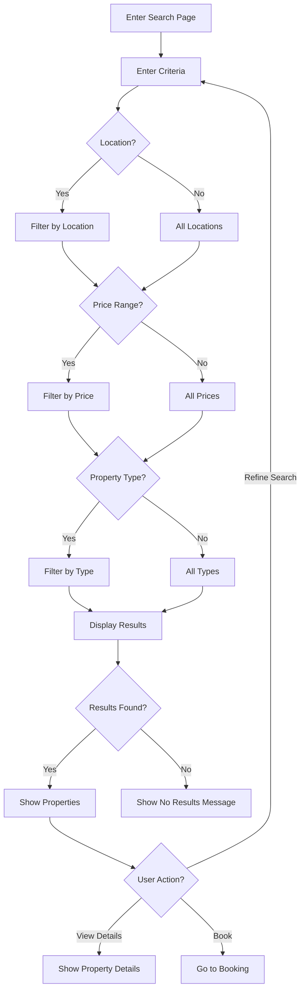
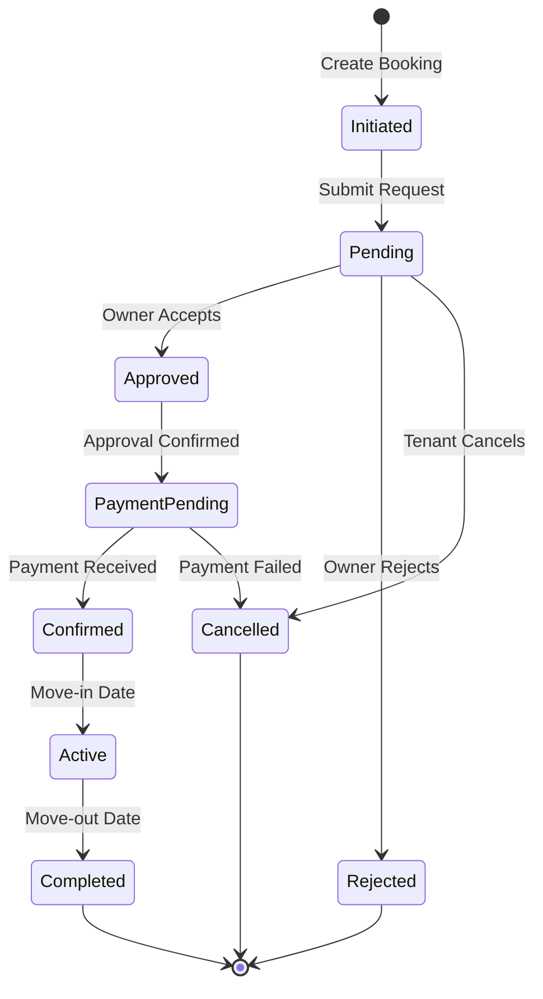
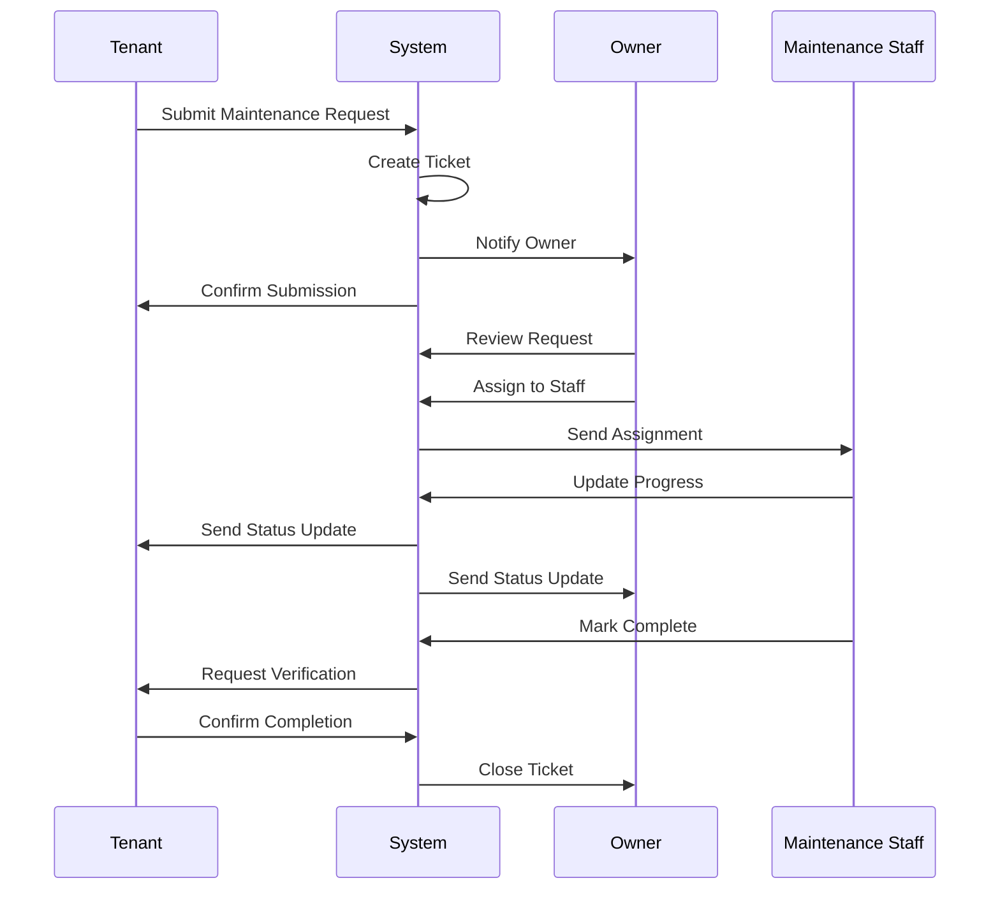

# Use Case Descriptions

## UC-001: Manage Properties

**Actor**: Property Owner  
**Preconditions**: User is authenticated as property owner  
**Postconditions**: Property listing is created/updated/deleted

### Main Flow
1. Owner navigates to property management section
2. System displays list of owner's properties
3. Owner selects action (Create/Edit/Delete)
4. System presents appropriate form
5. Owner enters/modifies property details
6. System validates input
7. System saves changes
8. System confirms success

### Alternative Flows
- **3a**: Owner creates new property
  - System presents blank property form
- **3b**: Owner edits existing property
  - System populates form with current data
- **3c**: Owner deletes property
  - System confirms deletion
  - System checks for active bookings

---

## UC-002: Search Properties

**Actor**: Tenant  
**Preconditions**: None (public access)  
**Postconditions**: Matching properties are displayed

### Main Flow
1. User accesses search page
2. System displays search interface with filters
3. User enters search criteria (location, price, type)
4. System queries database
5. System displays matching properties
6. User views property details

### Search Flow Diagram

---

## UC-003: Book Property

**Actor**: Tenant  
**Preconditions**: User is authenticated, property is available  
**Postconditions**: Booking request is created

### Main Flow
1. Tenant views property details
2. Tenant clicks "Book Now"
3. System displays booking form
4. Tenant selects dates and enters details
5. System validates availability
6. System calculates total cost
7. Tenant confirms booking
8. System creates booking request
9. System notifies property owner

### Booking State Diagram

---

## UC-004: Process Payments

**Actor**: Tenant, System  
**Preconditions**: Booking is approved  
**Postconditions**: Payment is processed and recorded

### Main Flow
1. System sends payment reminder
2. Tenant initiates payment
3. System displays payment options
4. Tenant selects payment method
5. System processes payment via payment gateway
6. Payment gateway confirms transaction
7. System updates booking status
8. System sends receipt to tenant
9. System notifies owner

---

## UC-005: Submit Maintenance Request

**Actor**: Tenant, Property Owner  
**Preconditions**: Active tenancy exists  
**Postconditions**: Maintenance request is recorded

### Main Flow
1. User navigates to maintenance section
2. System displays request form
3. User describes issue and uploads photos
4. System creates maintenance ticket
5. System notifies relevant parties
6. Owner/Admin reviews request
7. Owner/Admin assigns resolution
8. System updates ticket status
9. User receives status updates

### Maintenance Request Flow

