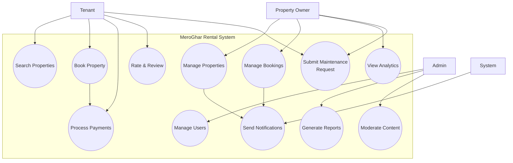

# Use Case Diagram

## System Use Cases

## Actor Descriptions

### Property Owner
- **Role**: Lists and manages rental properties
- **Goals**: Maximize occupancy, manage tenants efficiently
- **Responsibilities**: Maintain property information, respond to bookings

### Tenant
- **Role**: Searches for and rents properties
- **Goals**: Find suitable accommodation, manage rental payments
- **Responsibilities**: Pay rent on time, maintain property

### Admin
- **Role**: System administrator
- **Goals**: Ensure platform integrity, support users
- **Responsibilities**: Moderate content, manage users, resolve disputes

### System
- **Role**: Automated system processes
- **Goals**: Execute scheduled tasks, send notifications
- **Responsibilities**: Send reminders, process automated payments
