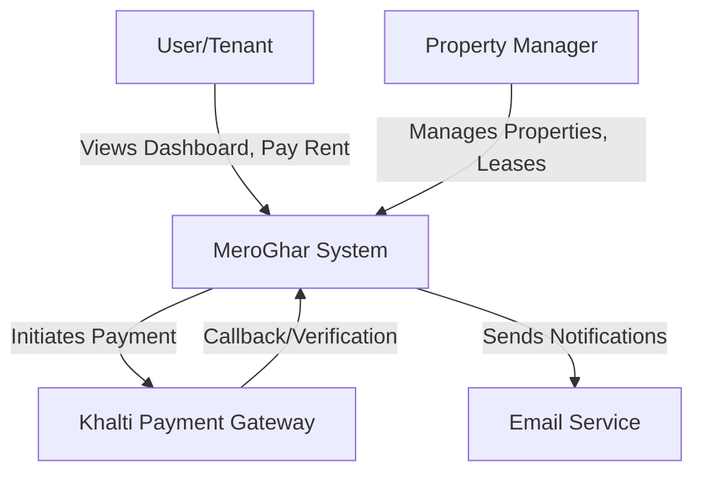

# Architecture & Design

## Overview

MeroGhar is built as a **Modular Monolith** using Django. The codebase is organized into distinct functional domains (Django apps) that reside within the `apps/` directory.

## C4 Context Diagram



## Multi-tenancy Strategy

MeroGhar uses a **Shared Database, Shared Schema** multi-tenancy model, where data is logically isolated by `Organization`.

- **Organization Context**: Users can belong to multiple organizations. The current context is maintained in the user session (`active_org_id`) and exposed via `request.active_organization` by middleware.
- **Data Isolation**: All domain models (Property, Tenant, Invoice, etc.) have a `ForeignKey` to `Organization`. Views explicitly filter querysets by the active organization.
- **Access Control**: Users are assigned to `OrganizationGroup` which grants permissions across linked organizations.

For detailed implementation, see [IAM Module](modules/iam.md).

## Tech Stack

| Component | Technology |
|-----------|------------|
| **Backend** | Python 3.14, Django 5.x, DRF |
| **Frontend** | Django Templates, Tailwind CSS v4 |
| **Database** | PostgreSQL |
| **Task Queue** | Redis + Celery |
| **Payments** | Khalti API v2 (ePayment) |

## Directory Structure

We use a split settings layout and a dedicated `apps/` folder:

```text
meroghar/
├── apps/                   # Business Logic Modules
│   ├── core/               # Shared dashboard, utilities, foundational services
│   ├── housing/            # Properties, Units, Tenants, Leases, inspections
│   ├── finance/            # Invoices, Payments, Expenses
│   ├── operations/         # Work orders, Vendors, Documents, Notifications
│   ├── crm/                # Leads, Showings, Applications
│   ├── iam/                # Users, Organizations, Groups, access control
│   └── reporting/          # Occupancy, financial, and maintenance reports
├── config/                 # Project Configuration
│   ├── settings/           # Split settings (base, dev, prod)
│   ├── urls.py             # Main web routing
│   ├── api_urls.py         # Main API routing
│   └── wsgi.py
├── docs/                   # Product and architecture documentation
├── templates/              # Base templates
├── static/                 # Static assets
└── manage.py
```

## Route Source of Truth

Route truth lives in:

- `config/urls.py` for top-level web URL namespaces.
- `config/api_urls.py` for top-level API URL namespaces.
- Each app's `urls.py` (for example, `apps/housing/urls.py`, `apps/finance/urls.py`) for app-local route definitions.
