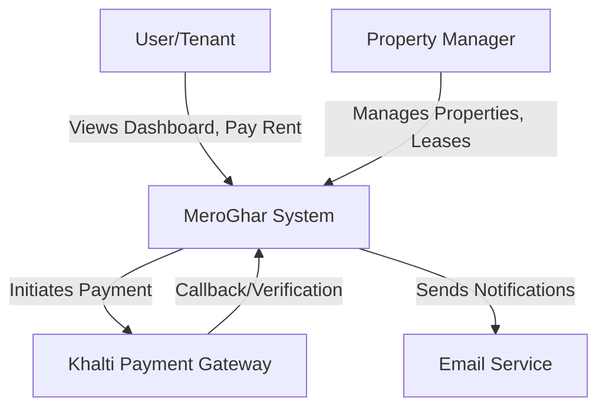

# Architecture & Design

## Overview

MeroGhar is built as a **Modular Monolith** using Django. The codebase is organized into distinct functional domains (Django apps) that reside within the `apps/` directory.

## C4 Context Diagram



## Multi-tenancy Strategy

MeroGhar uses a **Shared Database, Shared Schema** multi-tenancy model, where data is logically isolated by `Organization`.

- **Organization Context**: Users can belong to multiple organizations. The current context is maintained in the user session (`active_org_id`) and exposed via `request.active_organization` by middleware.
- **Data Isolation**: All domain models (Property, Tenant, Invoice, etc.) have a `ForeignKey` to `Organization`. Views explicitly filter querysets by the active organization.
- **Access Control**: Users are assigned to `OrganizationGroup` which grants permissions across linked organizations.

For detailed implementation, see [IAM Module](modules/iam.md).

## Tech Stack

| Component | Technology |
|-----------|------------|
| **Backend** | Python 3.14, Django 5.x, DRF |
| **Frontend** | Django Templates, Tailwind CSS v4 |
| **Database** | PostgreSQL |
| **Task Queue** | Redis + Celery |
| **Payments** | Khalti API v2 (ePayment) |

## Directory Structure

We use a split settings layout and a dedicated `apps/` folder:

```text
meroghar/
├── apps/               # Business Logic Modules
│   ├── core/           # Middleware, dashboard, shared utilities
│   ├── iam/            # Users, organizations, groups, memberships
│   ├── housing/        # Properties, units, tenants, leases, inspections, inventory
│   ├── finance/        # Invoices, payments, expenses
│   ├── operations/     # Work orders, vendors, documents, notifications
│   ├── crm/            # Leads, showings, applications
│   ├── reporting/      # Financial, occupancy, maintenance reports
│   └── theme/          # Frontend theme assets and dev command helpers
├── config/             # Project Configuration
│   ├── settings/       # Split settings (base, dev, prod)
│   ├── urls.py         # Main routing
│   └── wsgi.py
├── templates/          # Base templates
├── static/             # Static assets
└── manage.py
```

## Documentation Source of Truth

Routing and endpoint authority should always be verified against:

- `config/urls.py`
- `config/api_urls.py`
- `apps/*/urls.py`
