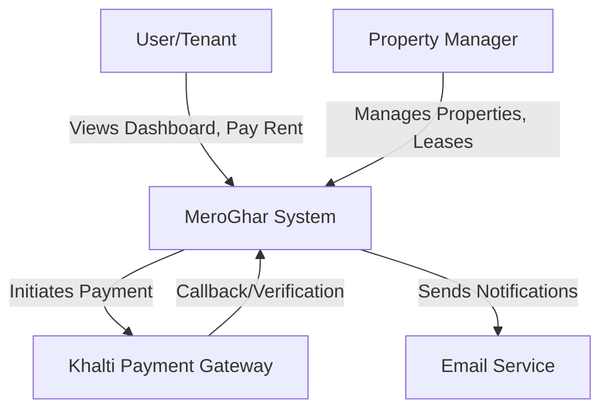

# Architecture & Design

## Overview

MeroGhar is built as a **Modular Monolith** using Django. The codebase is organized into distinct functional domains (Django apps) that reside within the `apps/` directory.

## C4 Context Diagram



## Tech Stack

| Component | Technology |
|-----------|------------|
| **Backend** | Python 3.14, Django 5.x, DRF |
| **Frontend** | Django Templates, Tailwind CSS v4 |
| **Database** | PostgreSQL |
| **Task Queue** | Redis + Celery |
| **Payments** | Khalti API v2 (ePayment) |

## Directory Structure

We use a split settings layout and a dedicated `apps/` folder:

```text
meroghar/
├── apps/               # Business Logic Modules
│   ├── core/           # Base models, utils
│   ├── iam/            # Users, Organizations (Multi-tenancy)
│   ├── properties/     # Properties, Units
│   ├── tenants/        # Tenant profiles
│   ├── leases/         # Lease contracts
│   ├── billing/        # Invoices
│   ├── payments/       # Payment records & Gateway integration
│   └── maintenance/    # Work orders
├── config/             # Project Configuration
│   ├── settings/       # Split settings (base, dev, prod)
│   ├── urls.py         # Main routing
│   └── wsgi.py
├── templates/          # Base templates
├── static/             # Static assets
└── manage.py
```
