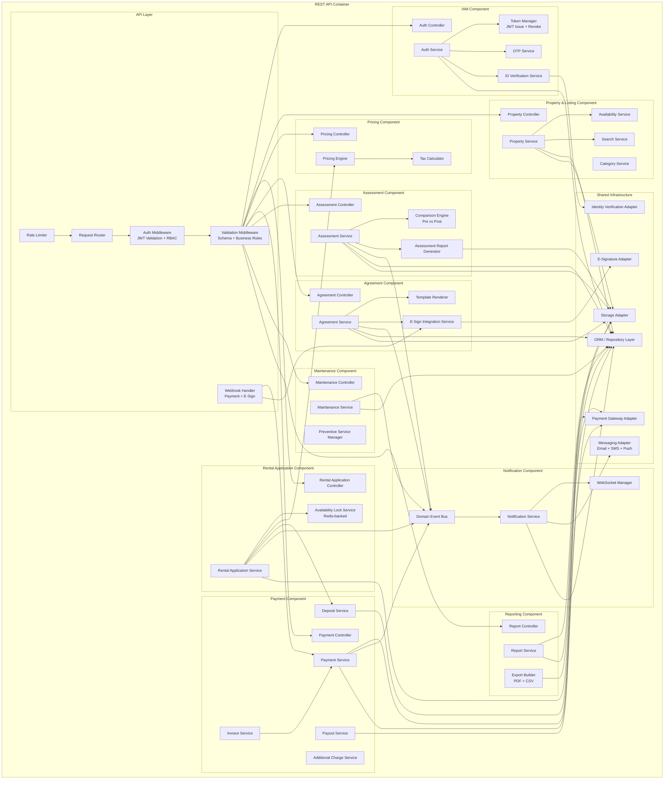

# C4 Component Diagram

## Overview
C4 Level 3 — Component diagram showing the internal components of the REST API container in MeroGhar.

---

## REST API Components

---

## Component Responsibilities Summary

| Component | Key Responsibility |
|-----------|-------------------|
| Auth Middleware | Validates JWT; enforces RBAC per route |
| Auth Service | Register, login, OTP, token lifecycle |
| Property Service | Property CRUD, availability management, search |
| Availability Lock Service | Redis-backed transactional availability reservation |
| Pricing Engine | Multi-tier rate calculation, peak pricing, tax |
| Rental Application Service | Rental Application creation, confirmation, modification, cancellation, return |
| Agreement Service | Template rendering, e-sign dispatch, webhook handling, PDF storage |
| Invoice Service | Invoice generation, line items, receipt generation |
| Payment Service | Gateway integration, webhook processing, refunds |
| Deposit Service | Deposit hold, deduction, settlement, refund |
| Charge Service | Post-rental additional charge lifecycle |
| Assessment Service | Pre/post checklist, photo storage, comparison, report generation |
| Maintenance Service | Request lifecycle, staff assignment, cost tracking |
| Notification Service | Event-driven notifications; WebSocket push; email/SMS dispatch |
| Report Service | Revenue, utilisation, tax summary report generation and export |
