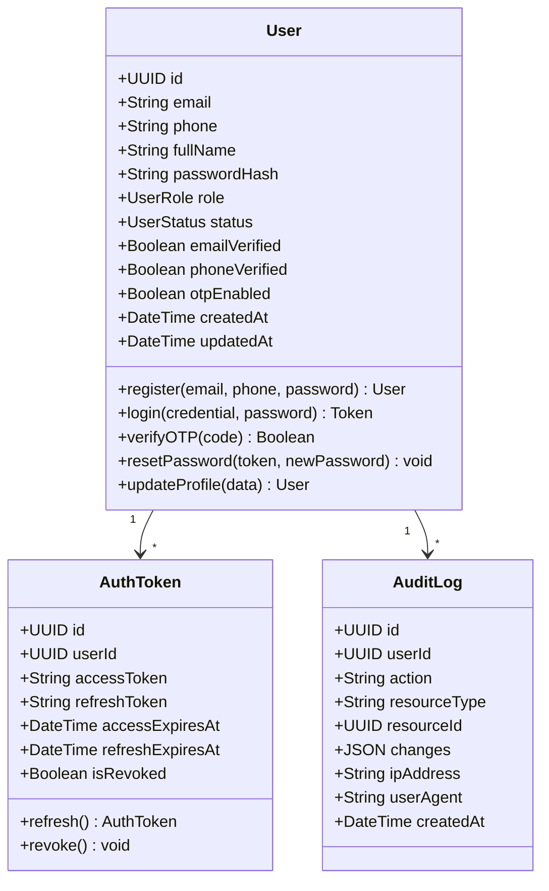
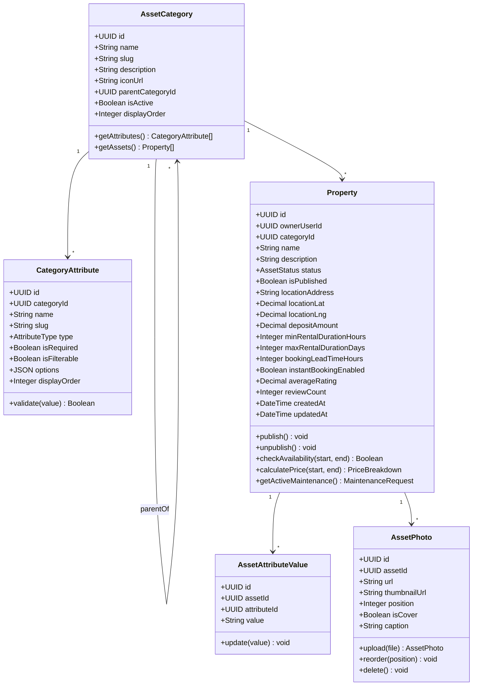
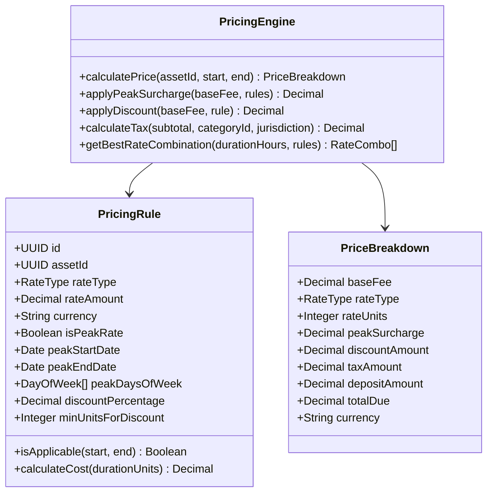
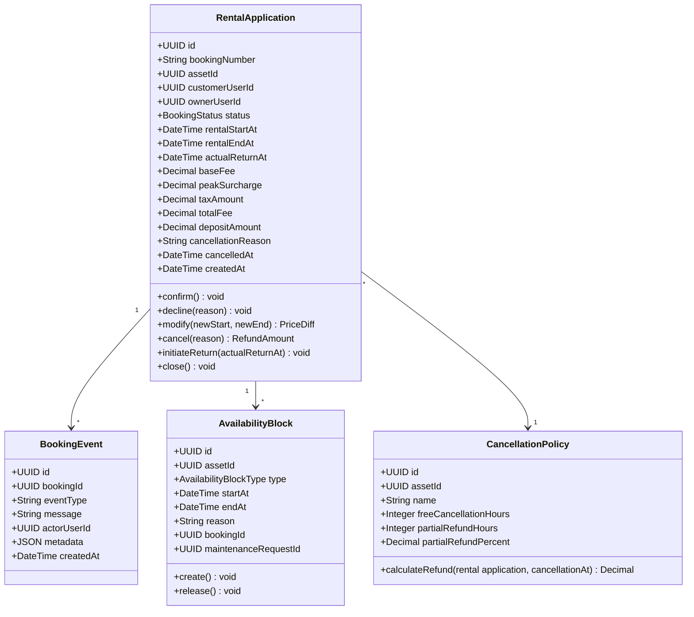
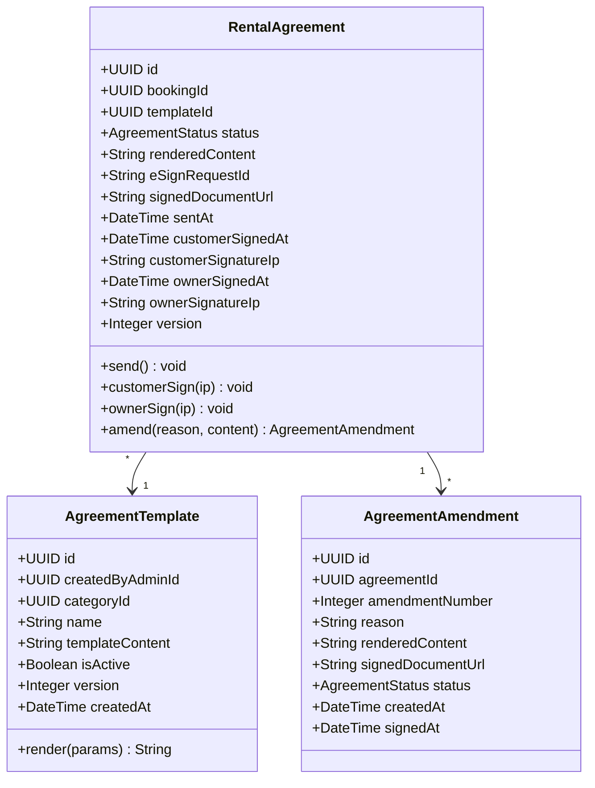
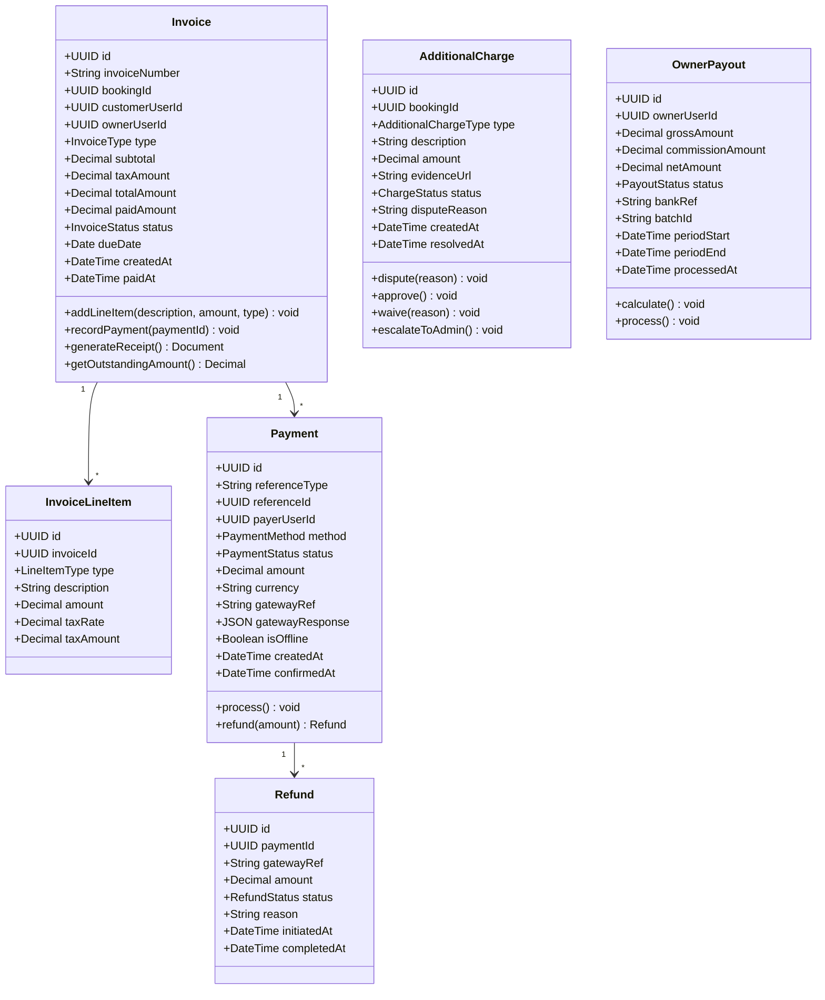
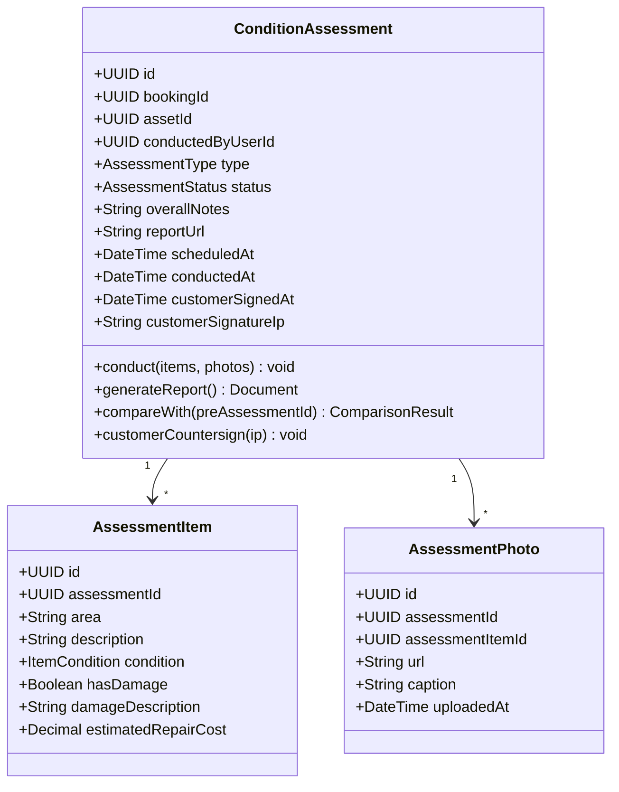
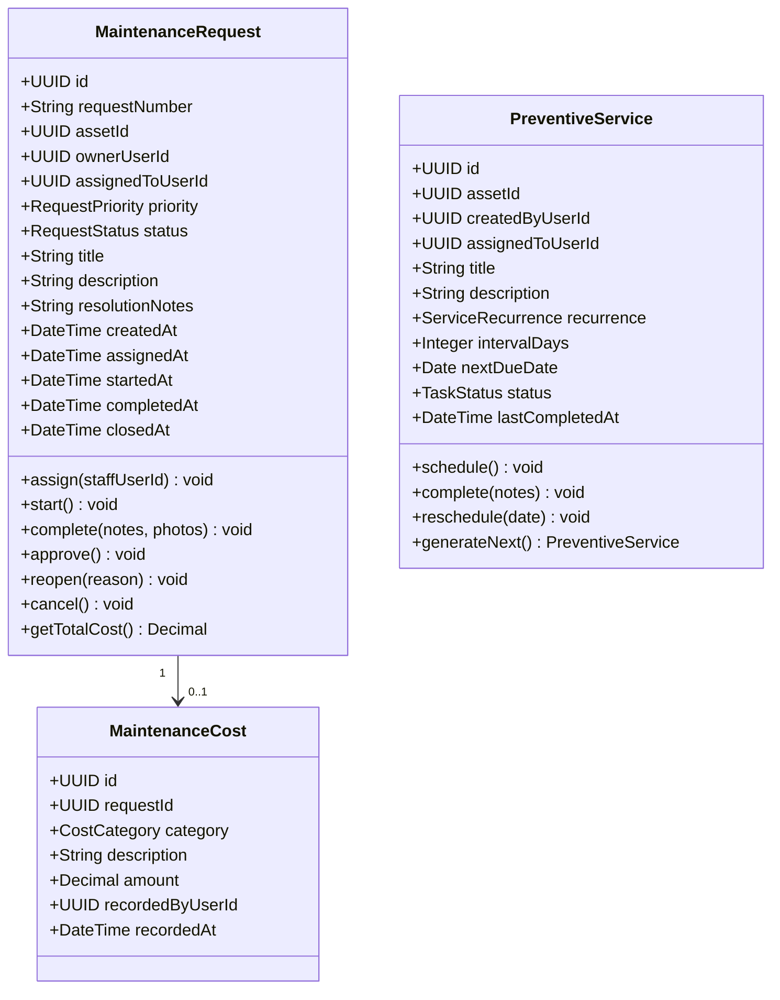

# Class Diagrams

## Overview
Detailed class diagrams with attributes, methods, and relationships for each major domain in the rental management system.

---

## User & Auth Domain

---

## Property & Category Domain

---

## Pricing Domain

---

## Rental Application Domain

---

## Agreement Domain

---

## Invoice & Payment Domain

---

## Property Inspection Domain

---

## Maintenance Domain

