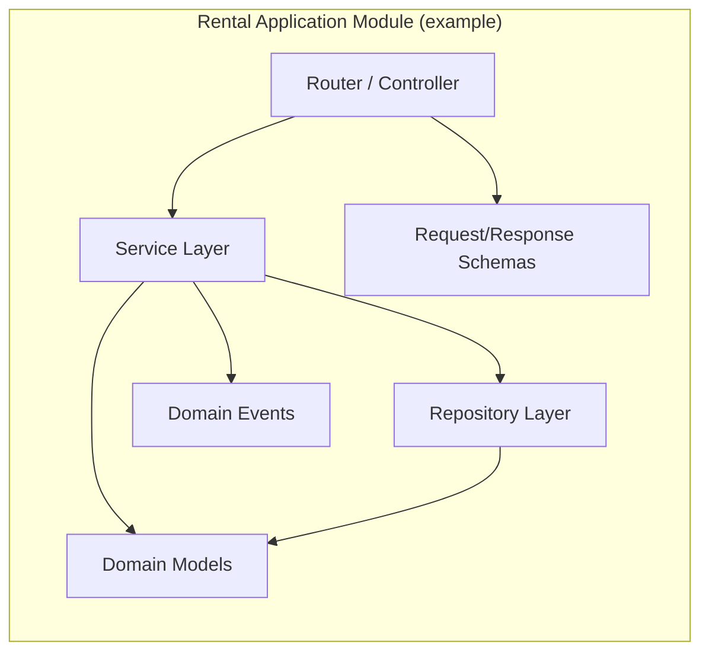
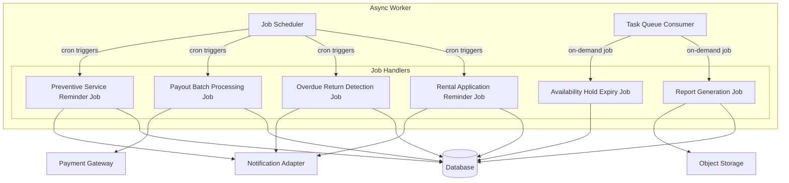

# Component Diagrams

## Overview
Software component diagrams showing the internal module structure of the rental management system backend.

---

## Backend Module Components

```mermaid
graph TB
    subgraph "API Layer"
        Router[API Router / Controllers]
        Auth[Auth Middleware]
        Validation[Request Validation]
        RateLimit[Rate Limiter]
    end

    subgraph "Domain Modules"
        IAMModule[IAM Module]
        AssetModule[Property & Listing Module]
        BookingModule[Rental Application Module]
        PricingModule[Pricing Engine Module]
        AgreementModule[Agreement Module]
        PaymentModule[Payment Module]
        DepositModule[Deposit & Charges Module]
        AssessmentModule[Property Inspection Module]
        MaintenanceModule[Maintenance Module]
        ReportModule[Reporting Module]
        NotifyModule[Notification Module]
    end

    subgraph "Shared Infrastructure"
        EventBus[Domain Event Bus]
        StorageAdapter[Storage Adapter]
        EmailAdapter[Email Adapter]
        SMSAdapter[SMS Adapter]
        PushAdapter[Push Adapter]
        ESignAdapter[E-Signature Adapter]
        PayGWAdapter[Payment Gateway Adapter]
        IDVerifyAdapter[Identity Verification Adapter]
    end

    subgraph "Data Layer"
        ORM[ORM / Query Builder]
        MigrationTool[Schema Migration Tool]
        RedisClient[Redis Client]
    end

    Router --> Auth
    Auth --> Validation
    Validation --> IAMModule
    Validation --> AssetModule
    Validation --> BookingModule
    Validation --> AgreementModule
    Validation --> PaymentModule
    Validation --> DepositModule
    Validation --> AssessmentModule
    Validation --> MaintenanceModule
    Validation --> ReportModule

    BookingModule --> PricingModule
    BookingModule --> DepositModule
    AgreementModule --> ESignAdapter
    PaymentModule --> PayGWAdapter
    DepositModule --> PayGWAdapter
    IAMModule --> IDVerifyAdapter
    AssetModule --> StorageAdapter
    AgreementModule --> StorageAdapter
    AssessmentModule --> StorageAdapter
    ReportModule --> StorageAdapter

    IAMModule --> EventBus
    AssetModule --> EventBus
    BookingModule --> EventBus
    AgreementModule --> EventBus
    PaymentModule --> EventBus
    AssessmentModule --> EventBus
    MaintenanceModule --> EventBus

    EventBus --> NotifyModule
    NotifyModule --> EmailAdapter
    NotifyModule --> SMSAdapter
    NotifyModule --> PushAdapter

    IAMModule --> ORM
    AssetModule --> ORM
    BookingModule --> ORM
    AgreementModule --> ORM
    PaymentModule --> ORM
    DepositModule --> ORM
    AssessmentModule --> ORM
    MaintenanceModule --> ORM
    ReportModule --> ORM
    NotifyModule --> ORM

    IAMModule --> RedisClient
    BookingModule --> RedisClient
    PricingModule --> RedisClient
    RateLimit --> RedisClient
```

---

## Module Internal Structure

---

## Async Worker Components

---

## External Adapter Interfaces

| Adapter | Interface Methods | Supported Providers |
|---------|-------------------|---------------------|
| Payment Gateway | `charge`, `hold`, `capture`, `refund`, `payout` | Stripe, PayPal, Bank Transfer |
| E-Signature | `createRequest`, `getStatus`, `downloadSigned` | DocuSign, Adobe Sign |
| Identity Verification | `submitDocument`, `getResult` | Onfido, Jumio |
| Storage | `upload`, `download`, `delete`, `getSignedUrl` | AWS S3, GCS |
| Email | `send`, `sendBatch`, `getDeliveryStatus` | SendGrid, AWS SES |
| SMS | `send`, `getDeliveryStatus` | Twilio, AWS SNS |
| Push | `send`, `sendToTopic`, `updateToken` | FCM, APNs |
