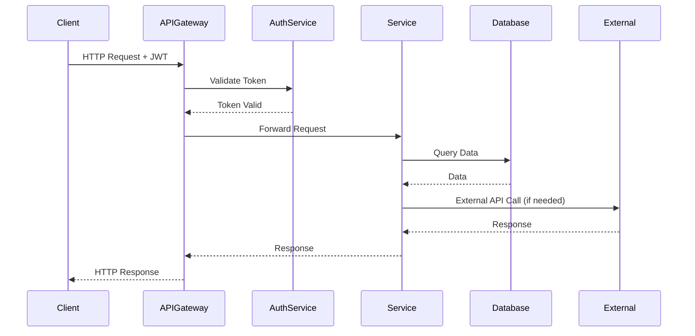
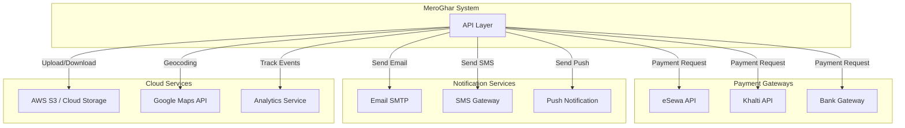

# API Design and Integration Diagram

## REST API Endpoints

### Authentication
```
POST   /api/v1/auth/register
POST   /api/v1/auth/login
POST   /api/v1/auth/logout
POST   /api/v1/auth/refresh-token
POST   /api/v1/auth/forgot-password
POST   /api/v1/auth/reset-password
GET    /api/v1/auth/verify-email/:token
```

### Users
```
GET    /api/v1/users/me
PUT    /api/v1/users/me
GET    /api/v1/users/:id
PUT    /api/v1/users/:id/profile
POST   /api/v1/users/:id/avatar
```

### Properties
```
GET    /api/v1/properties
POST   /api/v1/properties
GET    /api/v1/properties/:id
PUT    /api/v1/properties/:id
DELETE /api/v1/properties/:id
POST   /api/v1/properties/:id/photos
DELETE /api/v1/properties/:id/photos/:photoId
GET    /api/v1/properties/search
```

### Bookings
```
GET    /api/v1/bookings
POST   /api/v1/bookings
GET    /api/v1/bookings/:id
PUT    /api/v1/bookings/:id
DELETE /api/v1/bookings/:id
POST   /api/v1/bookings/:id/approve
POST   /api/v1/bookings/:id/reject
POST   /api/v1/bookings/:id/cancel
GET    /api/v1/properties/:id/availability
```

### Payments
```
GET    /api/v1/payments
POST   /api/v1/payments
GET    /api/v1/payments/:id
POST   /api/v1/payments/webhook
GET    /api/v1/payments/:id/receipt
```

### Reviews
```
GET    /api/v1/properties/:id/reviews
POST   /api/v1/properties/:id/reviews
PUT    /api/v1/reviews/:id
DELETE /api/v1/reviews/:id
```

### Maintenance
```
GET    /api/v1/maintenance-requests
POST   /api/v1/maintenance-requests
GET    /api/v1/maintenance-requests/:id
PUT    /api/v1/maintenance-requests/:id
POST   /api/v1/maintenance-requests/:id/acknowledge
POST   /api/v1/maintenance-requests/:id/complete
```

## API Integration Flow



## External API Integrations



## API Request/Response Examples

### Create Property Request
```json
POST /api/v1/properties
{
  "title": "Modern 2BHK Apartment",
  "description": "Spacious apartment in city center",
  "price_per_month": 25000,
  "property_type": "apartment",
  "bedrooms": 2,
  "bathrooms": 2,
  "area_sqft": 1200,
  "address": "Thamel, Kathmandu",
  "city": "Kathmandu",
  "amenities": ["wifi", "parking", "security"]
}
```

### Create Property Response
```json
{
  "status": "success",
  "data": {
    "id": "uuid-here",
    "title": "Modern 2BHK Apartment",
    "status": "draft",
    "created_at": "2026-01-21T08:00:00Z"
  }
}
```

### Search Properties Request
```
GET /api/v1/properties/search?city=Kathmandu&min_price=10000&max_price=30000&bedrooms=2
```

### Error Response Format
```json
{
  "status": "error",
  "error": {
    "code": "VALIDATION_ERROR",
    "message": "Invalid input data",
    "details": [
      {
        "field": "price_per_month",
        "message": "Must be a positive number"
      }
    ]
  }
}
```
