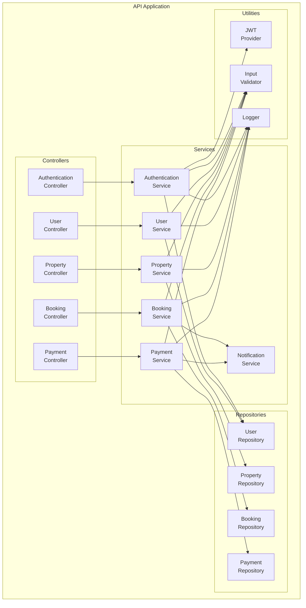
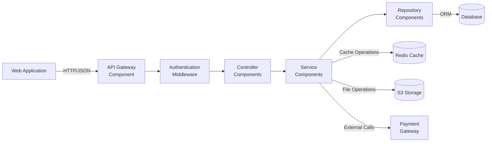

# C4 Component Diagram

## API Application Components

```mermaid
graph TB
    subgraph "API Application"
        subgraph "Controllers"
            AuthCtrl[Authentication<br/>Controller]
            UserCtrl[User<br/>Controller]
            PropCtrl[Property<br/>Controller]
            BookCtrl[Booking<br/>Controller]
            PayCtrl[Payment<br/>Controller]
        end
        
        subgraph "Services"
            AuthSvc[Authentication<br/>Service]
            UserSvc[User<br/>Service]
            PropSvc[Property<br/>Service]
            BookSvc[Booking<br/>Service]
            PaySvc[Payment<br/>Service]
            NotifSvc[Notification<br/>Service]
        end
        
        subgraph "Repositories"
            UserRepo[User<br/>Repository]
            PropRepo[Property<br/>Repository]
            BookRepo[Booking<br/>Repository]
            PayRepo[Payment<br/>Repository]
        end
        
        subgraph "Utilities"
            JWT[JWT<br/>Provider]
            Validator[Input<br/>Validator]
            Logger[Logger]
        end
    end
    
    AuthCtrl --> AuthSvc
    UserCtrl --> UserSvc
    PropCtrl --> PropSvc
    BookCtrl --> BookSvc
    PayCtrl --> PaySvc
    
    AuthSvc --> UserRepo
    UserSvc --> UserRepo
    PropSvc --> PropRepo
    BookSvc --> BookRepo
    PaySvc --> PayRepo
    
    AuthSvc --> JWT
    AuthSvc & UserSvc & PropSvc & BookSvc & PaySvc --> Validator
    AuthSvc & UserSvc & PropSvc & BookSvc & PaySvc --> Logger
    
    BookSvc --> NotifSvc
    PaySvc --> NotifSvc
```

## Component Interactions

```mermaid
graph LR
    WebApp[Web Application] -->|HTTP/JSON| APIGateway[API Gateway<br/>Component]
    
    APIGateway --> AuthMiddleware[Authentication<br/>Middleware]
    AuthMiddleware --> Controllers[Controller<br/>Components]
    
    Controllers --> Services[Service<br/>Components]
    Services --> Repositories[Repository<br/>Components]
    
    Repositories -->|ORM| Database[(Database)]
    Services -->|Cache Operations| Cache[(Redis Cache)]
    Services -->|File Operations| Storage[(S3 Storage)]
    Services -->|External Calls| PaymentGW[Payment<br/>Gateway]
```
