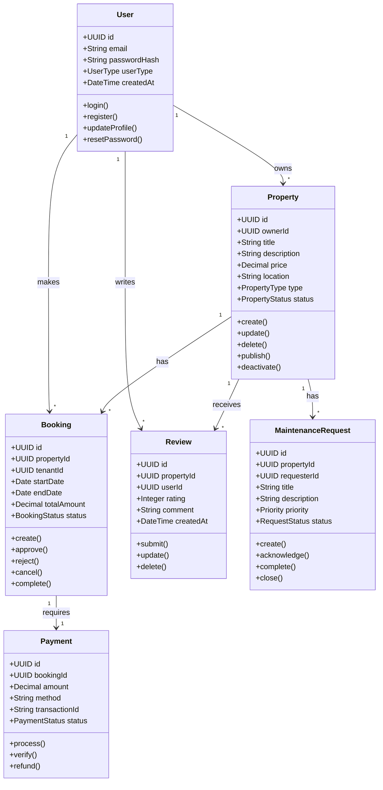
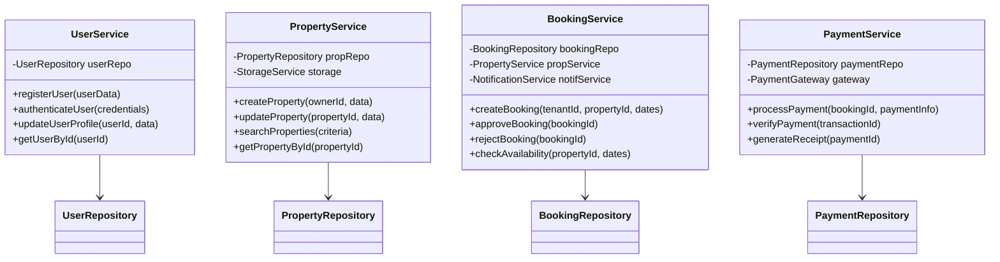
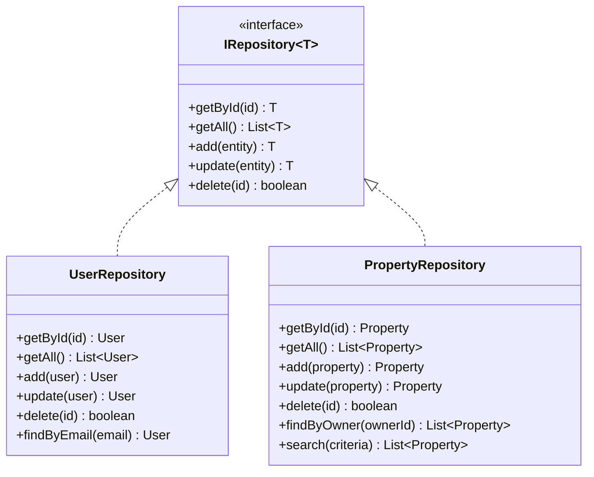

# Class Diagram

## Core Domain Classes

```mermaid
classDiagram
    class User {
        +UUID id
        +String email
        +String passwordHash
        +UserType userType
        +DateTime createdAt
        +login()
        +register()
        +updateProfile()
        +resetPassword()
    }
    
    class Property {
        +UUID id
        +UUID ownerId
        +String title
        +String description
        +Decimal price
        +String location
        +PropertyType type
        +PropertyStatus status
        +create()
        +update()
        +delete()
        +publish()
        +deactivate()
    }
    
    class Booking {
        +UUID id
        +UUID propertyId
        +UUID tenantId
        +Date startDate
        +Date endDate
        +Decimal totalAmount
        +BookingStatus status
        +create()
        +approve()
        +reject()
        +cancel()
        +complete()
    }
    
    class Payment {
        +UUID id
        +UUID bookingId
        +Decimal amount
        +String method
        +String transactionId
        +PaymentStatus status
        +process()
        +verify()
        +refund()
    }
    
    class Review {
        +UUID id
        +UUID propertyId
        +UUID userId
        +Integer rating
        +String comment
        +DateTime createdAt
        +submit()
        +update()
        +delete()
    }
    
    class MaintenanceRequest {
        +UUID id
        +UUID propertyId
        +UUID requesterId
        +String title
        +String description
        +Priority priority
        +RequestStatus status
        +create()
        +acknowledge()
        +complete()
        +close()
    }
    
    User "1" --> "*" Property : owns
    User "1" --> "*" Booking : makes
    User "1" --> "*" Review : writes
    Property "1" --> "*" Booking : has
    Property "1" --> "*" Review : receives
    Booking "1" --> "1" Payment : requires
    Property "1" --> "*" MaintenanceRequest : has
```

## Service Layer Classes

```mermaid
classDiagram
    class UserService {
        -UserRepository userRepo
        +registerUser(userData)
        +authenticateUser(credentials)
        +updateUserProfile(userId, data)
        +getUserById(userId)
    }
    
    class PropertyService {
        -PropertyRepository propRepo
        -StorageService storage
        +createProperty(ownerId, data)
        +updateProperty(propertyId, data)
        +searchProperties(criteria)
        +getPropertyById(propertyId)
    }
    
    class BookingService {
        -BookingRepository bookingRepo
        -PropertyService propService
        -NotificationService notifService
        +createBooking(tenantId, propertyId, dates)
        +approveBooking(bookingId)
        +rejectBooking(bookingId)
        +checkAvailability(propertyId, dates)
    }
    
    class PaymentService {
        -PaymentRepository paymentRepo
        -PaymentGateway gateway
        +processPayment(bookingId, paymentInfo)
        +verifyPayment(transactionId)
        +generateReceipt(paymentId)
    }
    
    UserService --> UserRepository
    PropertyService --> PropertyRepository
    BookingService --> BookingRepository
    PaymentService --> PaymentRepository
```

## Repository Pattern

```mermaid
classDiagram
    class IRepository~T~ {
        <<interface>>
        +getById(id) T
        +getAll() List~T~
        +add(entity) T
        +update(entity) T
        +delete(id) boolean
    }
    
    class UserRepository {
        +getById(id) User
        +getAll() List~User~
        +add(user) User
        +update(user) User
        +delete(id) boolean
        +findByEmail(email) User
    }
    
    class PropertyRepository {
        +getById(id) Property
        +getAll() List~Property~
        +add(property) Property
        +update(property) Property
        +delete(id) boolean
        +findByOwner(ownerId) List~Property~
        +search(criteria) List~Property~
    }
    
    IRepository~T~ <|.. UserRepository
    IRepository~T~ <|.. PropertyRepository
```
