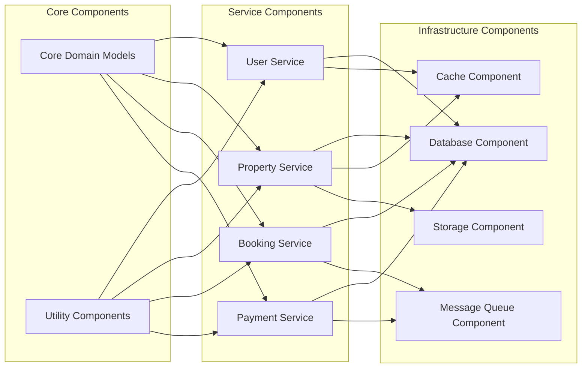

# Component Diagram

## System Components

```mermaid
graph TB
    subgraph "Frontend Components"
        WebUI[Web UI Component]
        MobileUI[Mobile UI Component]
        AdminUI[Admin UI Component]
    end
    
    subgraph "API Layer Components"
        APIGateway[API Gateway Component]
        AuthComponent[Authentication Component]
        RateLimiter[Rate Limiter Component]
    end
    
    subgraph "Business Logic Components"
        UserMgmt[User Management Component]
        PropertyMgmt[Property Management Component]
        BookingMgmt[Booking Management Component]
        PaymentMgmt[Payment Component]
        NotificationMgmt[Notification Component]
        SearchComponent[Search Component]
    end
    
    subgraph "Integration Components"
        PaymentGatewayAdapter[Payment Gateway Adapter]
        EmailAdapter[Email Service Adapter]
        SMSAdapter[SMS Service Adapter]
        StorageAdapter[Storage Adapter]
    end
    
    subgraph "Data Access Components"
        UserRepo[User Repository]
        PropertyRepo[Property Repository]
        BookingRepo[Booking Repository]
        PaymentRepo[Payment Repository]
        CacheManager[Cache Manager]
    end
    
    WebUI & MobileUI & AdminUI --> APIGateway
    APIGateway --> AuthComponent
    APIGateway --> RateLimiter
    
    APIGateway --> UserMgmt
    APIGateway --> PropertyMgmt
    APIGateway --> BookingMgmt
    APIGateway --> PaymentMgmt
    
    UserMgmt --> UserRepo
    PropertyMgmt --> PropertyRepo
    PropertyMgmt --> SearchComponent
    PropertyMgmt --> StorageAdapter
    BookingMgmt --> BookingRepo
    PaymentMgmt --> PaymentRepo
    
    PaymentMgmt --> PaymentGatewayAdapter
    NotificationMgmt --> EmailAdapter
    NotificationMgmt --> SMSAdapter
    
    UserRepo & PropertyRepo --> CacheManager
```

## Component Dependencies

```mermaid
graph LR
    subgraph "Core Components"
        Core[Core Domain Models]
        Utils[Utility Components]
    end
    
    subgraph "Service Components"
        UserSvc[User Service]
        PropSvc[Property Service]
        BookSvc[Booking Service]
        PaySvc[Payment Service]
    end
    
    subgraph "Infrastructure Components"
        DB[Database Component]
        Cache[Cache Component]
        Queue[Message Queue Component]
        Storage[Storage Component]
    end
    
    Core --> UserSvc & PropSvc & BookSvc & PaySvc
    Utils --> UserSvc & PropSvc & BookSvc & PaySvc
    
    UserSvc & PropSvc & BookSvc & PaySvc --> DB
    UserSvc & PropSvc --> Cache
    BookSvc & PaySvc --> Queue
    PropSvc --> Storage
```

## Module Structure

```mermaid
graph TB
    subgraph "Authentication Module"
        AuthController[Auth Controller]
        AuthService[Auth Service]
        JWTProvider[JWT Provider]
        PasswordHasher[Password Hasher]
        
        AuthController --> AuthService
        AuthService --> JWTProvider
        AuthService --> PasswordHasher
    end
    
    subgraph "Property Module"
        PropController[Property Controller]
        PropService[Property Service]
        PropValidator[Property Validator]
        ImageProcessor[Image Processor]
        
        PropController --> PropService
        PropService --> PropValidator
        PropService --> ImageProcessor
    end
    
    subgraph "Booking Module"
        BookController[Booking Controller]
        BookService[Booking Service]
        AvailabilityChecker[Availability Checker]
        PricingCalculator[Pricing Calculator]
        
        BookController --> BookService
        BookService --> AvailabilityChecker
        BookService --> PricingCalculator
    end
    
    subgraph "Payment Module"
        PayController[Payment Controller]
        PayService[Payment Service]
        GatewayInterface[Gateway Interface]
        ReceiptGenerator[Receipt Generator]
        
        PayController --> PayService
        PayService --> GatewayInterface
        PayService --> ReceiptGenerator
    end
```
