# Entity Relationship Diagram (ERD)

## Database Schema

```mermaid
erDiagram
    users ||--o{ properties : owns
    users ||--o{ bookings : "makes (tenant)"
    users ||--o{ reviews : writes
    users ||--o{ maintenance_requests : creates
    users ||--o{ notifications : receives
    users ||--o{ messages : sends
    
    properties ||--o{ bookings : "has bookings"
    properties ||--o{ property_photos : "has photos"
    properties ||--o{ property_amenities : "has amenities"
    properties ||--o{ reviews : receives
    properties ||--o{ maintenance_requests : "has requests"
    
    bookings ||--|| payments : "requires payment"
    bookings ||--o{ booking_timeline : "has timeline"
    
    payments ||--o{ payment_transactions : "has transactions"
    
    categories ||--o{ properties : categorizes
    amenities ||--o{ property_amenities : used_in
    
    users {
        uuid id PK
        varchar email UK
        varchar password_hash
        varchar first_name
        varchar last_name
        varchar phone
        enum user_type "owner, tenant, admin"
        boolean email_verified
        timestamp created_at
        timestamp updated_at
    }
    
    properties {
        uuid id PK
        uuid owner_id FK
        uuid category_id FK
        varchar title
        text description
        decimal price_per_month
        varchar address
        varchar city
        varchar state
        varchar postal_code
        decimal latitude
        decimal longitude
        enum property_type "apartment, house, room"
        int bedrooms
        int bathrooms
        decimal area_sqft
        enum status "draft, pending, published, inactive"
        timestamp created_at
        timestamp updated_at
    }
    
    property_photos {
        uuid id PK
        uuid property_id FK
        varchar url
        boolean is_primary
        int display_order
        timestamp uploaded_at
    }
    
    categories {
        uuid id PK
        varchar name
        varchar slug
        text description
    }
    
    amenities {
        uuid id PK
        varchar name
        varchar icon
        enum category "basic, comfort, safety"
    }
    
    property_amenities {
        uuid property_id FK
        uuid amenity_id FK
    }
    
    bookings {
        uuid id PK
        uuid property_id FK
        uuid tenant_id FK
        date start_date
        date end_date
        decimal total_amount
        decimal deposit_amount
        enum status "draft, submitted, approved, confirmed, active, completed, cancelled, rejected"
        text tenant_notes
        text owner_notes
        timestamp created_at
        timestamp updated_at
    }
    
    payments {
        uuid id PK
        uuid booking_id FK
        decimal amount
        enum payment_type "deposit, rent, refund"
        enum payment_method "esewa, khalti, bank, cash"
        varchar transaction_id
        enum status "pending, processing, completed, failed, refunded"
        timestamp paid_at
        timestamp created_at
    }
    
    payment_transactions {
        uuid id PK
        uuid payment_id FK
        varchar gateway_transaction_id
        text gateway_response
        timestamp processed_at
    }
    
    reviews {
        uuid id PK
        uuid property_id FK
        uuid user_id FK
        uuid booking_id FK
        int rating "1-5"
        text comment
        boolean is_verified
        timestamp created_at
        timestamp updated_at
    }
    
    maintenance_requests {
        uuid id PK
        uuid property_id FK
        uuid requester_id FK
        uuid assigned_to FK
        varchar title
        text description
        enum priority "low, medium, high, urgent"
        enum status "open, acknowledged, assigned, in_progress, completed, verified, closed, rejected"
        timestamp acknowledged_at
        timestamp completed_at
        timestamp verified_at
        timestamp created_at
    }
    
    notifications {
        uuid id PK
        uuid user_id FK
        varchar type
        varchar title
        text message
        json data
        boolean is_read
        timestamp read_at
        timestamp created_at
    }
    
    messages {
        uuid id PK
        uuid sender_id FK
        uuid receiver_id FK
        uuid property_id FK
        text content
        boolean is_read
        timestamp read_at
        timestamp created_at
    }
    
    booking_timeline {
        uuid id PK
        uuid booking_id FK
        enum event_type "created, submitted, approved, rejected, paid, confirmed, started, completed, cancelled"
        text description
        json metadata
        timestamp occurred_at
    }
```



## Indexes

```sql
-- Users Table
CREATE INDEX idx_users_email ON users(email);
CREATE INDEX idx_users_user_type ON users(user_type);

-- Properties Table
CREATE INDEX idx_properties_owner ON properties(owner_id);
CREATE INDEX idx_properties_status ON properties(status);
CREATE INDEX idx_properties_city ON properties(city);
CREATE INDEX idx_properties_price ON properties(price_per_month);
CREATE INDEX idx_properties_location ON properties(latitude, longitude);

-- Bookings Table
CREATE INDEX idx_bookings_property ON bookings(property_id);
CREATE INDEX idx_bookings_tenant ON bookings(tenant_id);
CREATE INDEX idx_bookings_status ON bookings(status);
CREATE INDEX idx_bookings_dates ON bookings(start_date, end_date);

-- Payments Table
CREATE INDEX idx_payments_booking ON payments(booking_id);
CREATE INDEX idx_payments_status ON payments(status);
CREATE INDEX idx_payments_transaction ON payments(transaction_id);
```
