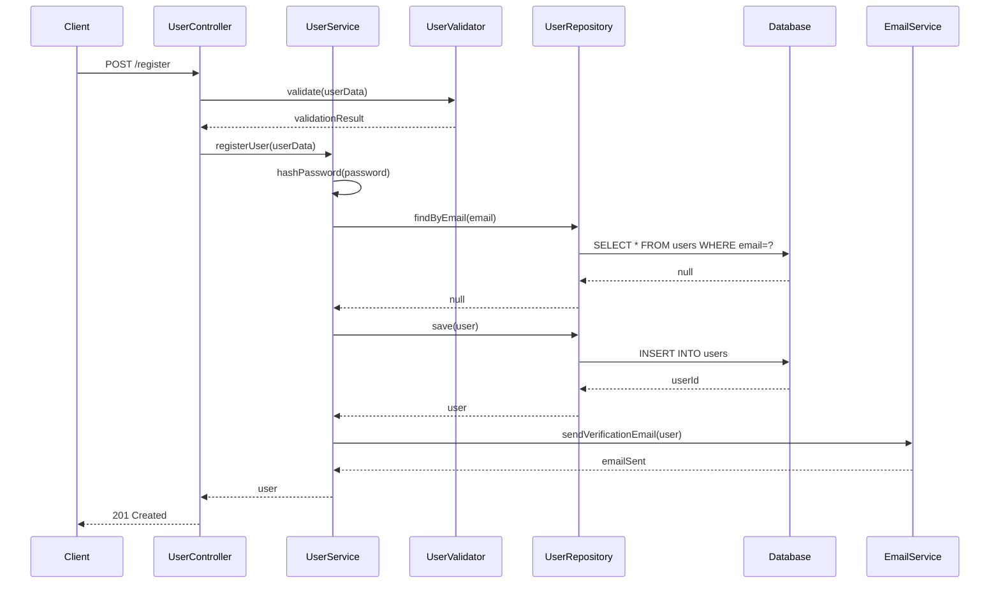
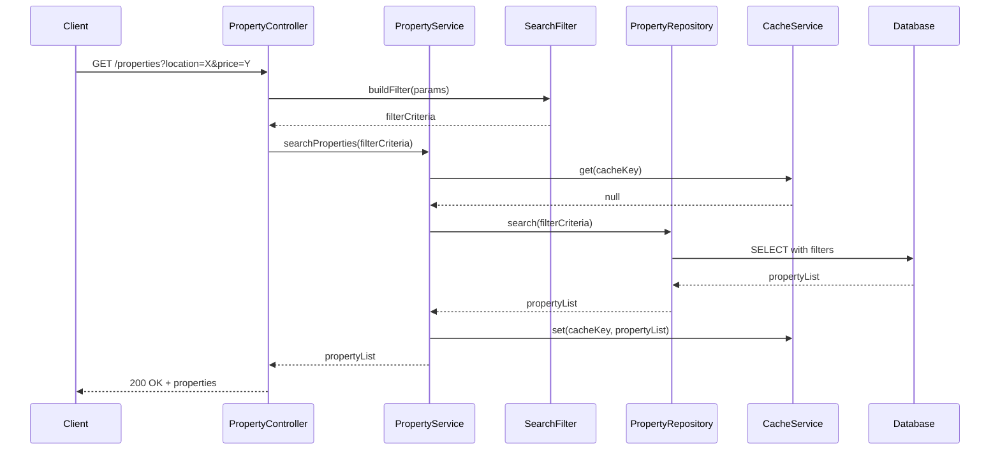
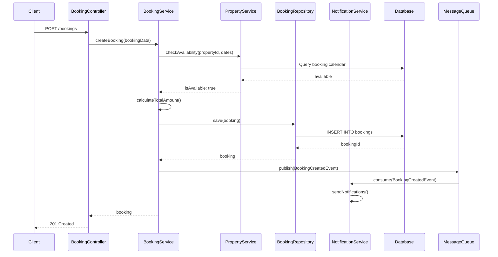
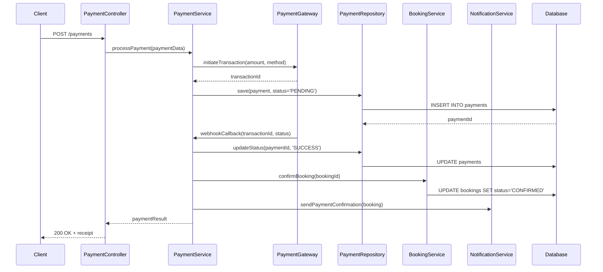

# Sequence Diagram - Internal Object Interactions

## User Registration Sequence

```mermaid
sequenceDiagram
    participant C as Client
    participant UC as UserController
    participant US as UserService
    participant UV as UserValidator
    participant UR as UserRepository
    participant DB as Database
    participant ES as EmailService
    
    C->>UC: POST /register
    UC->>UV: validate(userData)
    UV-->>UC: validationResult
    UC->>US: registerUser(userData)
    US->>US: hashPassword(password)
    US->>UR: findByEmail(email)
    UR->>DB: SELECT * FROM users WHERE email=?
    DB-->>UR: null
    UR-->>US: null
    US->>UR: save(user)
    UR->>DB: INSERT INTO users
    DB-->>UR: userId
    UR-->>US: user
    US->>ES: sendVerificationEmail(user)
    ES-->>US: emailSent
    US-->>UC: user
    UC-->>C: 201 Created
```

## Property Search Sequence

```mermaid
sequenceDiagram
    participant C as Client
    participant PC as PropertyController
    participant PS as PropertyService
    participant SF as SearchFilter
    participant PR as PropertyRepository
    participant Cache as CacheService
    participant DB as Database
    
    C->>PC: GET /properties?location=X&price=Y
    PC->>SF: buildFilter(params)
    SF-->>PC: filterCriteria
    PC->>PS: searchProperties(filterCriteria)
    PS->>Cache: get(cacheKey)
    Cache-->>PS: null
    PS->>PR: search(filterCriteria)
    PR->>DB: SELECT with filters
    DB-->>PR: propertyList
    PR-->>PS: propertyList
    PS->>Cache: set(cacheKey, propertyList)
    PS-->>PC: propertyList
    PC-->>C: 200 OK + properties
```

## Booking Creation Sequence

```mermaid
sequenceDiagram
    participant C as Client
    participant BC as BookingController
    participant BS as BookingService
    participant PS as PropertyService
    participant BR as BookingRepository
    participant NS as NotificationService
    participant DB as Database
    participant MQ as MessageQueue
    
    C->>BC: POST /bookings
    BC->>BS: createBooking(bookingData)
    BS->>PS: checkAvailability(propertyId, dates)
    PS->>DB: Query booking calendar
    DB-->>PS: available
    PS-->>BS: isAvailable: true
    BS->>BS: calculateTotalAmount()
    BS->>BR: save(booking)
    BR->>DB: INSERT INTO bookings
    DB-->>BR: bookingId
    BR-->>BS: booking
    BS->>MQ: publish(BookingCreatedEvent)
    MQ->>NS: consume(BookingCreatedEvent)
    NS->>NS: sendNotifications()
    BS-->>BC: booking
    BC-->>C: 201 Created
```

## Payment Processing Sequence

```mermaid
sequenceDiagram
    participant C as Client
    participant PC as PaymentController
    participant PS as PaymentService
    participant PG as PaymentGateway
    participant PR as PaymentRepository
    participant BS as BookingService
    participant NS as NotificationService
    participant DB as Database
    
    C->>PC: POST /payments
    PC->>PS: processPayment(paymentData)
    PS->>PG: initiateTransaction(amount, method)
    PG-->>PS: transactionId
    PS->>PR: save(payment, status='PENDING')
    PR->>DB: INSERT INTO payments
    DB-->>PR: paymentId
    
    PG->>PS: webhookCallback(transactionId, status)
    PS->>PR: updateStatus(paymentId, 'SUCCESS')
    PR->>DB: UPDATE payments
    PS->>BS: confirmBooking(bookingId)
    BS->>DB: UPDATE bookings SET status='CONFIRMED'
    PS->>NS: sendPaymentConfirmation(booking)
    PS-->>PC: paymentResult
    PC-->>C: 200 OK + receipt
```
