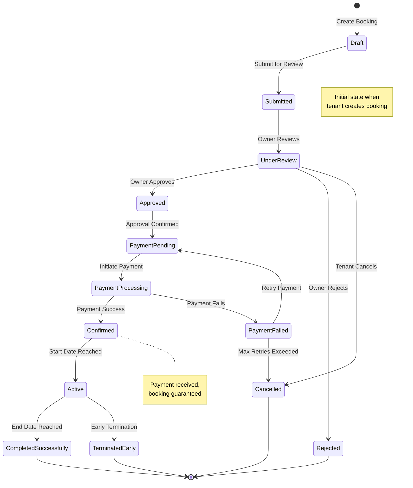
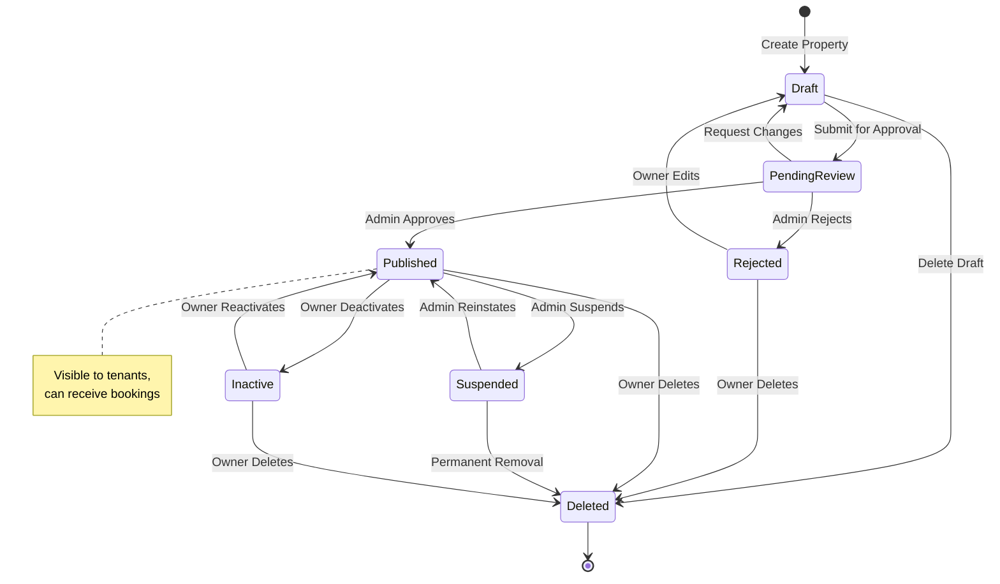
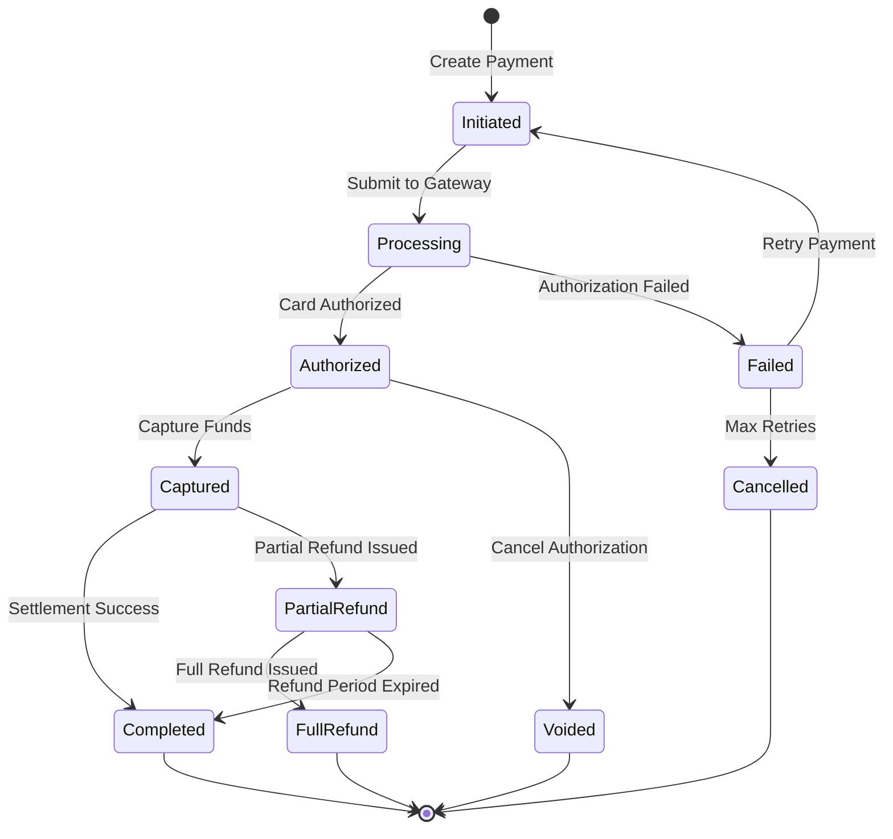
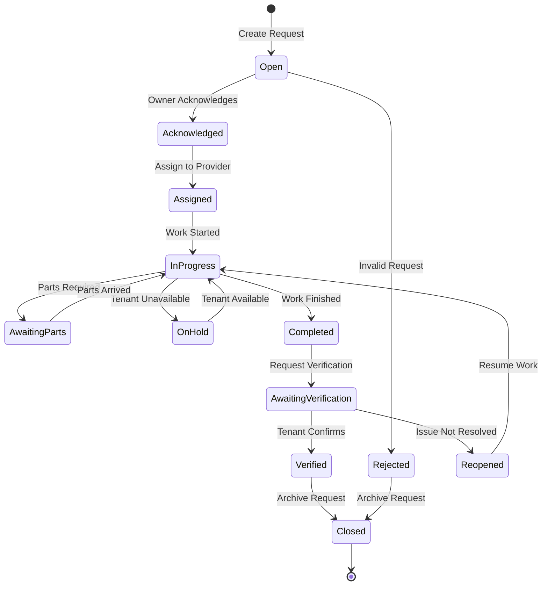
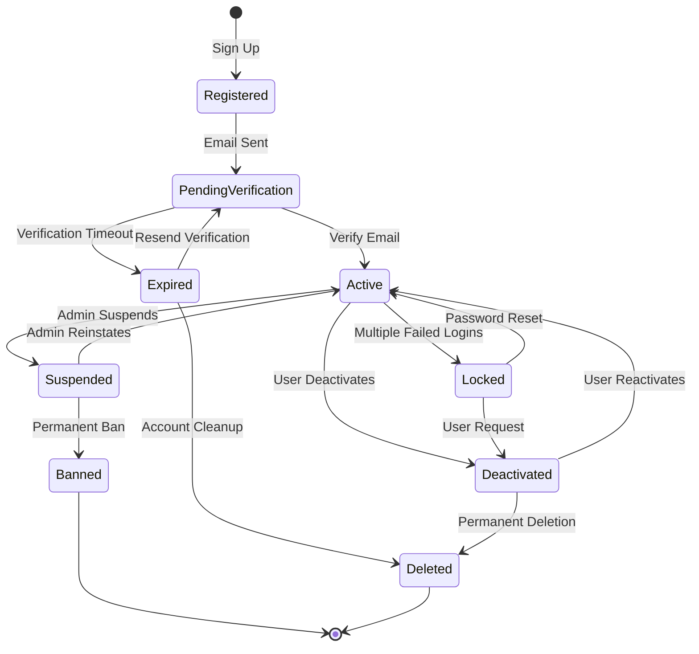

# State Machine Diagram

## Booking State Machine

```mermaid
stateDiagram-v2
    [*] --> Draft: Create Booking
    Draft --> Submitted: Submit for Review
    Submitted --> UnderReview: Owner Reviews
    
    UnderReview --> Approved: Owner Approves
    UnderReview --> Rejected: Owner Rejects
    UnderReview --> Cancelled: Tenant Cancels
    
    Approved --> PaymentPending: Approval Confirmed
    PaymentPending --> PaymentProcessing: Initiate Payment
    
    PaymentProcessing --> Confirmed: Payment Success
    PaymentProcessing --> PaymentFailed: Payment Fails
    
    PaymentFailed --> PaymentPending: Retry Payment
    PaymentFailed --> Cancelled: Max Retries Exceeded
    
    Confirmed --> Active: Start Date Reached
    Active --> CompletedSuccessfully: End Date Reached
    Active --> TerminatedEarly: Early Termination
    
    CompletedSuccessfully --> [*]
    Rejected --> [*]
    Cancelled --> [*]
    TerminatedEarly --> [*]
    
    note right of Draft
        Initial state when
        tenant creates booking
    end note
    
    note right of Confirmed
        Payment received,
        booking guaranteed
    end note
```

## Property Listing State Machine

```mermaid
stateDiagram-v2
    [*] --> Draft: Create Property
    Draft --> PendingReview: Submit for Approval
    Draft --> Deleted: Delete Draft
    
    PendingReview --> Published: Admin Approves
    PendingReview --> Rejected: Admin Rejects
    PendingReview --> Draft: Request Changes
    
    Rejected --> Draft: Owner Edits
    Rejected --> Deleted: Owner Deletes
    
    Published --> Suspended: Admin Suspends
    Published --> Inactive: Owner Deactivates
    Published --> Deleted: Owner Deletes
    
    Suspended --> Published: Admin Reinstates
    Suspended --> Deleted: Permanent Removal
    
    Inactive --> Published: Owner Reactivates
    Inactive --> Deleted: Owner Deletes
    
    Deleted --> [*]
    
    note right of Published
        Visible to tenants,
        can receive bookings
    end note
```

## Payment State Machine

```mermaid
stateDiagram-v2
    [*] --> Initiated: Create Payment
    Initiated --> Processing: Submit to Gateway
    
    Processing --> Authorized: Card Authorized
    Processing --> Failed: Authorization Failed
    
    Authorized --> Captured: Capture Funds
    Authorized --> Voided: Cancel Authorization
    
    Captured --> Completed: Settlement Success
    Captured --> PartialRefund: Partial Refund Issued
    
    PartialRefund --> FullRefund: Full Refund Issued
    PartialRefund --> Completed: Refund Period Expired
    
    Failed --> Initiated: Retry Payment
    Failed --> Cancelled: Max Retries
    
    FullRefund --> [*]
    Completed --> [*]
    Cancelled --> [*]
    Voided --> [*]
```

## Maintenance Request State Machine

```mermaid
stateDiagram-v2
    [*] --> Open: Create Request
    Open --> Acknowledged: Owner Acknowledges
    Open --> Rejected: Invalid Request
    
    Acknowledged --> Assigned: Assign to Provider
    Assigned --> InProgress: Work Started
    
    InProgress --> AwaitingParts: Parts Required
    InProgress --> OnHold: Tenant Unavailable
    InProgress --> Completed: Work Finished
    
    AwaitingParts --> InProgress: Parts Arrived
    OnHold --> InProgress: Tenant Available
    
    Completed --> AwaitingVerification: Request Verification
    AwaitingVerification --> Verified: Tenant Confirms
    AwaitingVerification --> Reopened: Issue Not Resolved
    
    Reopened --> InProgress: Resume Work
    
    Verified --> Closed: Archive Request
    Rejected --> Closed: Archive Request
    
    Closed --> [*]
```

## User Account State Machine

```mermaid
stateDiagram-v2
    [*] --> Registered: Sign Up
    Registered --> PendingVerification: Email Sent
    
    PendingVerification --> Active: Verify Email
    PendingVerification --> Expired: Verification Timeout
    
    Expired --> PendingVerification: Resend Verification
    Expired --> Deleted: Account Cleanup
    
    Active --> Suspended: Admin Suspends
    Active --> Deactivated: User Deactivates
    Active --> Locked: Multiple Failed Logins
    
    Suspended --> Active: Admin Reinstates
    Suspended --> Banned: Permanent Ban
    
    Deactivated --> Active: User Reactivates
    Deactivated --> Deleted: Permanent Deletion
    
    Locked --> Active: Password Reset
    Locked --> Deactivated: User Request
    
    Banned --> [*]
    Deleted --> [*]
```
