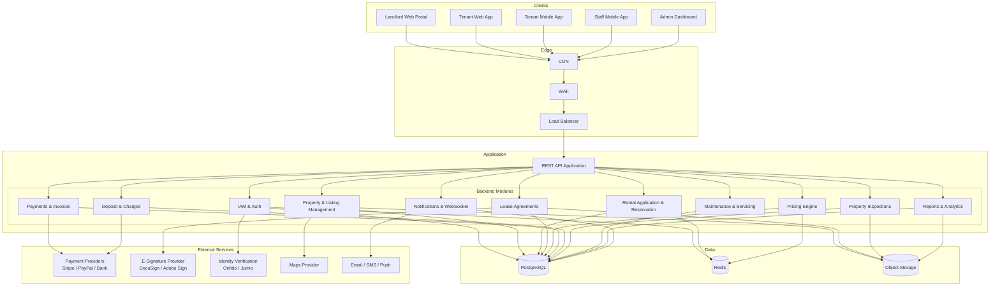
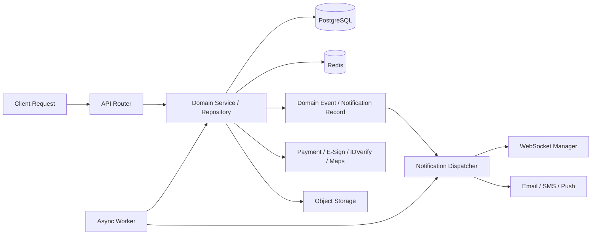

# High-Level Architecture Diagram

## Overview
The MeroGhar platform is designed as a modular API application. Each domain module (properties, rental applications, lease agreements, payments, maintenance) is independently testable and can be extracted to a separate service if scale demands it.

---

## System Architecture Overview

---

## Runtime Interaction Model

---

## Key Backend Responsibilities

| Module | Main Responsibilities |
|--------|-----------------------|
| IAM | JWT auth, OTP, RBAC, ID verification integration, audit log |
| Property & Listing | Property CRUD, custom property type features, photo storage, availability calendar, publish/unpublish |
| Rental Application & Reservation | Application creation, availability locking, instant vs manual confirmation, modification, cancellation |
| Lease Agreements | Template rendering, e-signature dispatch, signing webhooks, PDF storage, versioning |
| Pricing Engine | Monthly rent calculation, short-term daily/weekly rates, peak pricing, discounts, tax rules |
| Payments & Invoices | Invoice generation, payment gateway integration, receipt generation, late fees, payout processing |
| Deposit & Charges | Security deposit hold/release, damage deductions, dispute handling, settlement |
| Property Inspections | Move-in/move-out checklists, photo capture, comparison reports, tenant countersignature |
| Maintenance | Request lifecycle, staff assignment, cost logging, preventive scheduling, calendar blocking |
| Reports & Analytics | Revenue reports, occupancy reports, tax summaries, payout history |
| Notifications | Persisted notifications, WebSocket fanout, email/SMS/push dispatch |

---

## Async Worker Responsibilities

| Job | Trigger | Action |
|-----|---------|--------|
| Rental application reminder | 24h before move-in date | Send reminder to tenant and landlord |
| Overdue move-out detection | Polling every 15 min | Detect overdue vacations; apply fees; notify parties |
| Payout batch processing | Scheduled (daily/weekly) | Aggregate closed tenancies; process bank transfers |
| Availability expiry | On application timeout | Release availability hold if deposit not paid |
| Preventive service reminders | Scheduled | Alert landlord of upcoming scheduled property service |
| Report generation | On-demand or scheduled | Build and store report exports |
