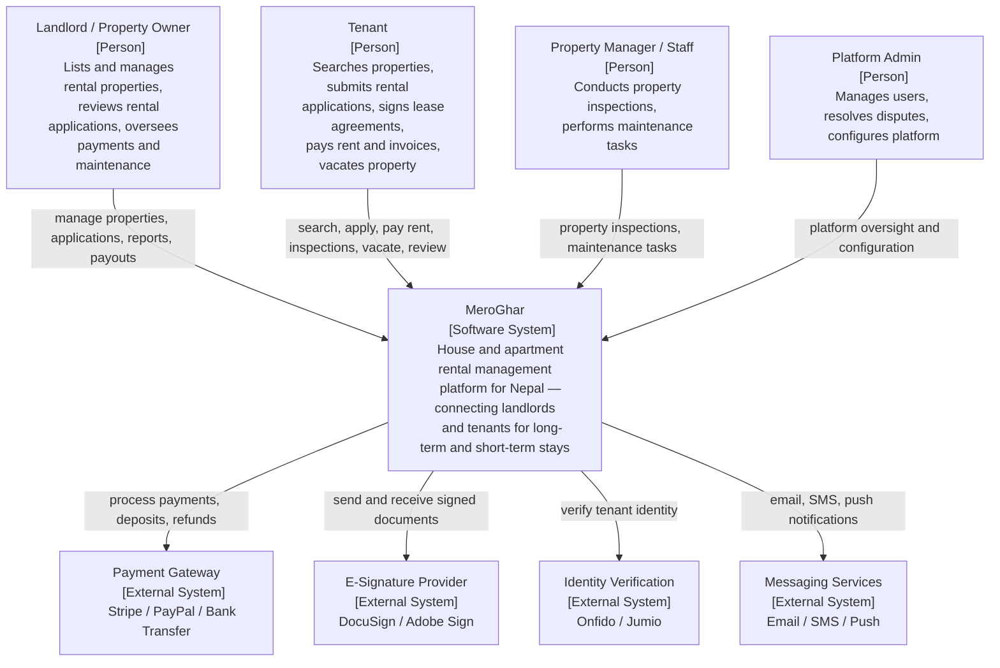
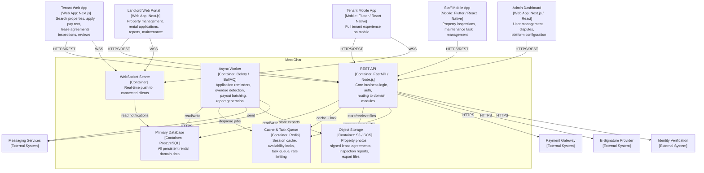

# C4 Diagrams

## Overview
C4 model diagrams for MeroGhar: Context (Level 1) and Container (Level 2). The platform is a house and apartment rental system for Nepal, supporting property types including Apartments, Houses, Rooms, Studios, Villas, and Commercial Spaces.

---

## Level 1 – System Context Diagram

---

## Level 2 – Container Diagram

---

## Level 2 – Container Responsibilities

| Container | Technology | Role |
|-----------|------------|------|
| REST API | FastAPI / Node.js | Core request handler; all domain modules exposed as REST endpoints |
| Async Worker | Celery / BullMQ | Application reminders, overdue move-out detection, payout batching, report generation |
| WebSocket Server | FastAPI WS / Socket.io | Real-time notifications to browser and mobile app clients |
| Primary Database | PostgreSQL | Source of truth for all rental entities; JSONB for flexible property features and amenities |
| Cache & Queue | Redis | JWT block list, availability locks, rate-limit counters, task queue |
| Object Storage | AWS S3 / GCS | Property photos, signed lease agreement PDFs, inspection reports, financial export files |
