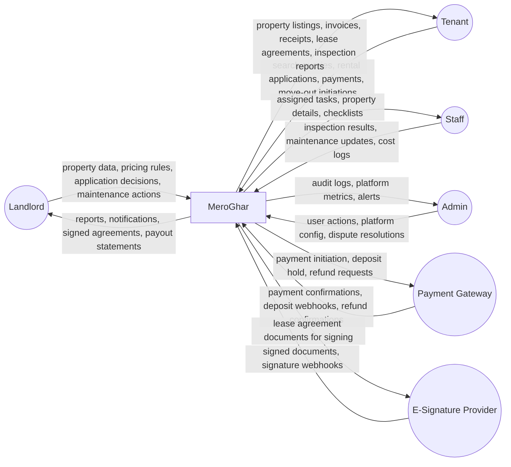
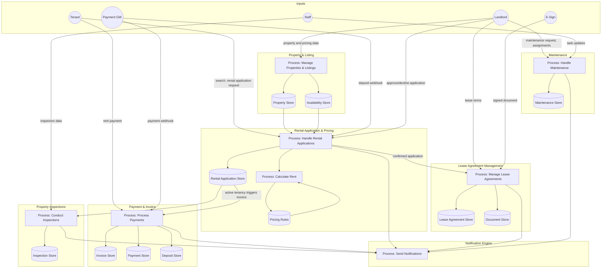
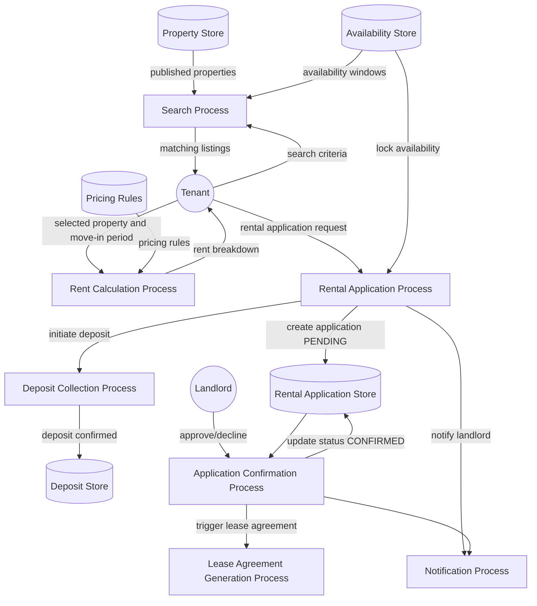
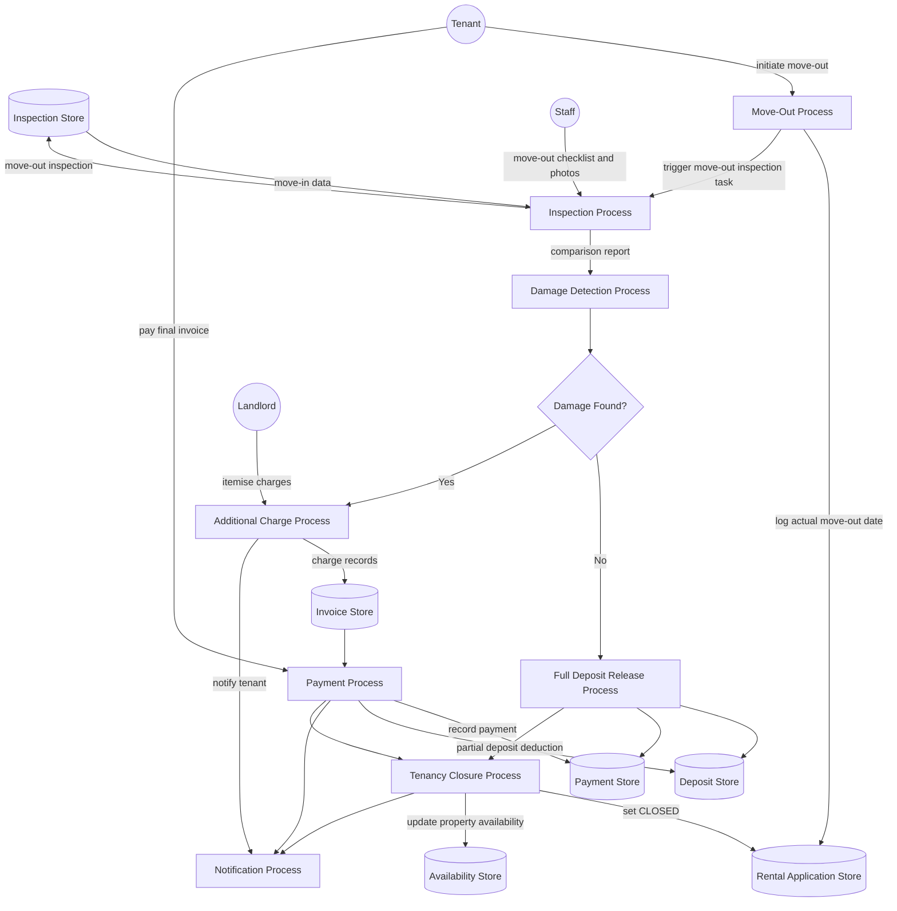

# Data Flow Diagrams

## Overview
Data flow diagrams (DFDs) showing how data moves through MeroGhar for house and apartment rentals.

---

## Level 0 DFD – Context Diagram

---

## Level 1 DFD – Key Subsystems

---

## Level 2 DFD – Rental Application and Pricing Process

---

## Level 2 DFD – Move-Out and Security Deposit Settlement Process

