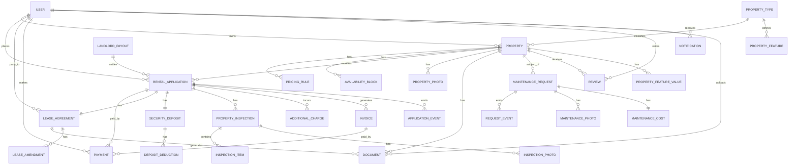
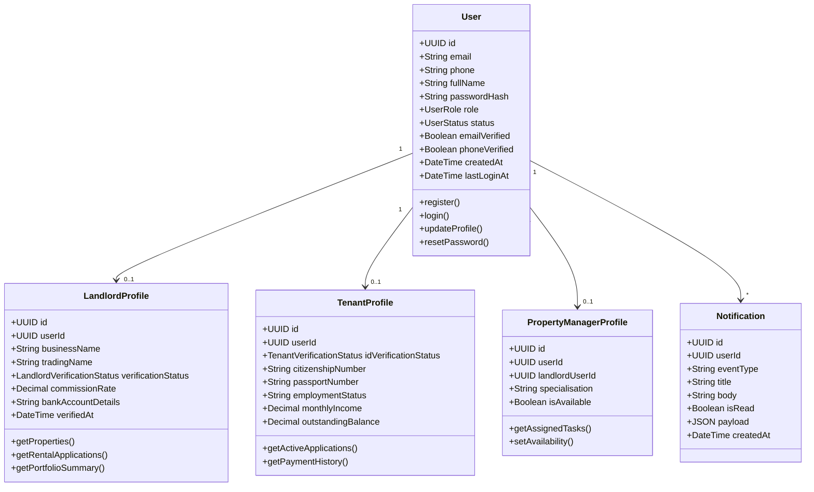
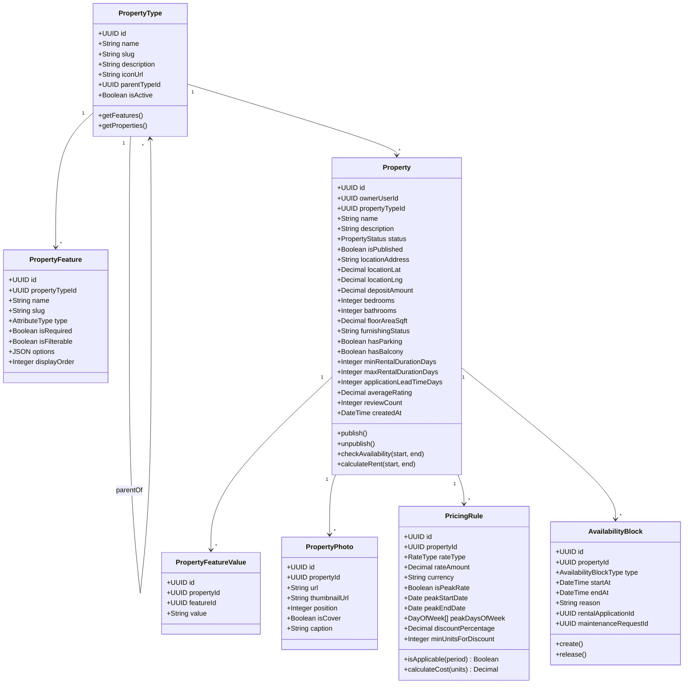
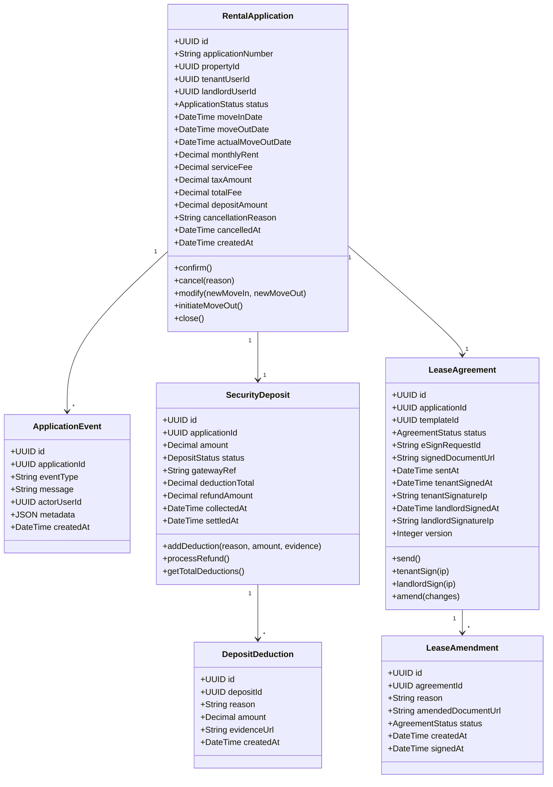
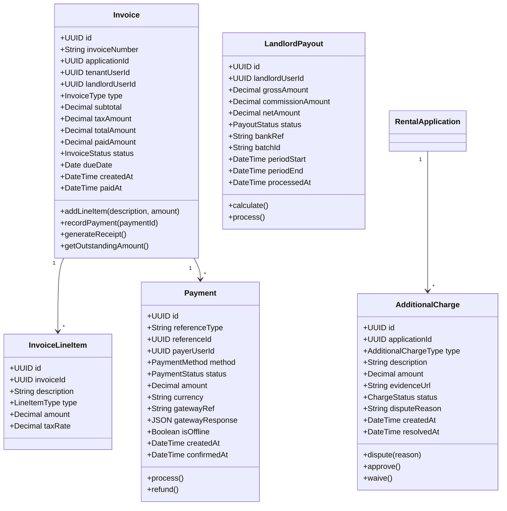
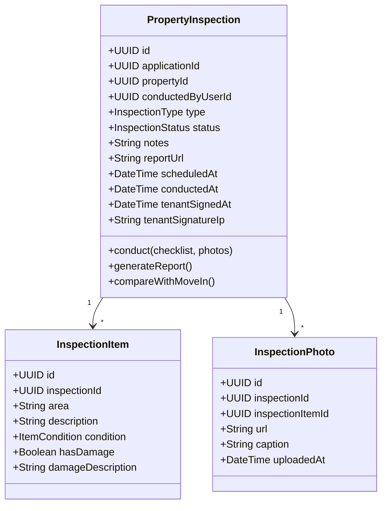
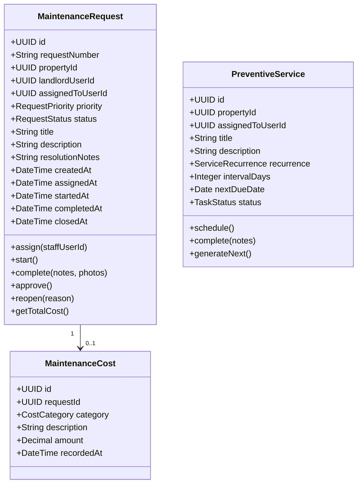

# Domain Model

## Overview
The domain model shows the key business entities and their relationships in MeroGhar. The model covers house, flat, and apartment rentals — including long-term tenancies and short-term stays — for property types such as Apartments, Houses, Rooms, Studios, Villas, and Commercial Spaces.

---

## Complete Domain Model

---

## User Domain

---

## Property Domain

---

## Rental Application Domain

---

## Invoice & Payment Domain

---

## Property Inspection Domain

---

## Maintenance Domain

---

## Enumeration Types

```mermaid
classDiagram
    class UserRole {
        <<enumeration>>
        LANDLORD
        TENANT
        PROPERTY_MANAGER
        ADMIN
    }

    class PropertyStatus {
        <<enumeration>>
        DRAFT
        AVAILABLE
        RENTED
        UNDER_MAINTENANCE
        RETIRED
    }

    class ApplicationStatus {
        <<enumeration>>
        PENDING
        CONFIRMED
        ACTIVE
        PENDING_CLOSURE
        CLOSED
        CANCELLED
        DECLINED
    }

    class AgreementStatus {
        <<enumeration>>
        DRAFT
        PENDING_TENANT_SIGNATURE
        PENDING_LANDLORD_SIGNATURE
        SIGNED
        AMENDED
        TERMINATED
    }

    class InvoiceStatus {
        <<enumeration>>
        DRAFT
        SENT
        PARTIALLY_PAID
        PAID
        OVERDUE
        WAIVED
    }

    class RequestStatus {
        <<enumeration>>
        OPEN
        ASSIGNED
        IN_PROGRESS
        COMPLETED
        CLOSED
        REOPENED
        CANCELLED
    }

    class RateType {
        <<enumeration>>
        DAILY
        WEEKLY
        MONTHLY
    }

    class InspectionType {
        <<enumeration>>
        MOVE_IN
        MOVE_OUT
        ROUTINE
    }

    class AdditionalChargeType {
        <<enumeration>>
        DAMAGE
        LATE_VACATION
        CLEANING_FEE
        UNPAID_UTILITIES
        OTHER
    }
```

