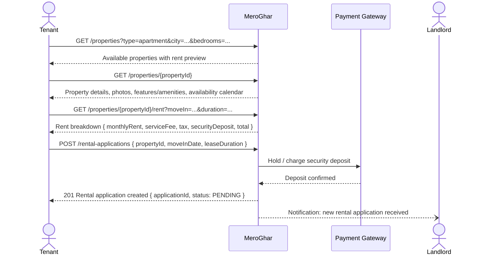
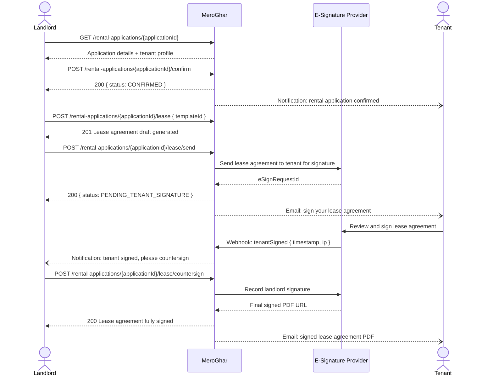
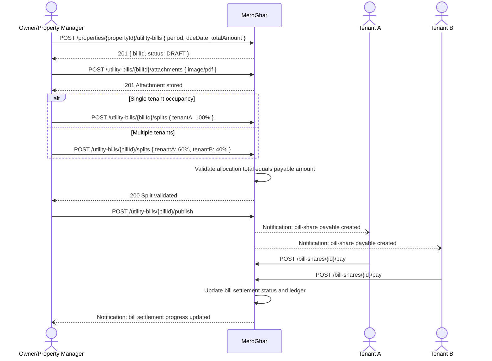
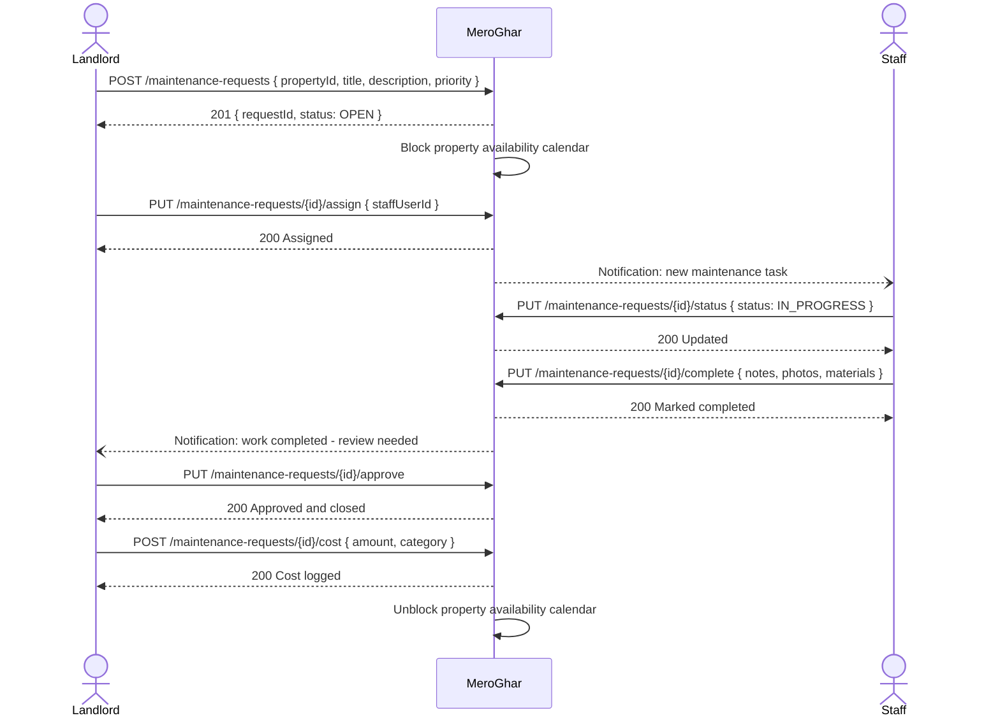

# System Sequence Diagrams

## Overview
Black-box system sequence diagrams showing interactions between actors and MeroGhar for the primary use cases of the house and apartment rental platform.

---

## Tenant Searches and Applies for a Property



---

## Landlord Reviews Application and Sends Lease Agreement



---

## Move-In Property Inspection

```mermaid
sequenceDiagram
    actor Staff
    participant Platform as MeroGhar
    actor Tenant

    Platform--)Staff: Task assigned: move-in inspection for application {applicationId}

    Staff->>Platform: GET /inspections/{inspectionId}
    Platform-->>Staff: Inspection task with property checklist

    Staff->>Platform: POST /inspections/{inspectionId}/items { items[] }
    Platform-->>Staff: 200 Items saved

    Staff->>Platform: POST /inspections/{inspectionId}/photos { photos[] }
    Platform-->>Staff: 200 Photos uploaded

    Staff->>Platform: POST /inspections/{inspectionId}/submit
    Platform-->>Staff: 200 Inspection submitted
    Platform--)Tenant: Notification: review and sign move-in inspection report

    Tenant->>Platform: GET /inspections/{inspectionId}
    Platform-->>Tenant: Inspection report with photos

    Tenant->>Platform: POST /inspections/{inspectionId}/countersign
    Platform-->>Tenant: 200 Countersigned; move-in complete
    Platform--)Staff: Notification: move-in confirmed
```

---

## Tenant Pays Invoice

```mermaid
sequenceDiagram
    actor Tenant
    participant Platform as MeroGhar
    participant PG as Payment Gateway
    actor Landlord

    Platform--)Tenant: Notification: invoice due { amount, dueDate }

    Tenant->>Platform: GET /invoices/{invoiceId}
    Platform-->>Tenant: Invoice details { lineItems, total, dueDate }

    Tenant->>Platform: POST /invoices/{invoiceId}/pay { paymentMethod }
    Platform->>PG: Initiate payment { amount, method }
    PG-->>Platform: Payment session / redirect URL
    Platform-->>Tenant: 200 { paymentUrl }

    Tenant->>PG: Complete payment
    PG->>Platform: Webhook: paymentConfirmed { gatewayRef, amount }
    Platform-->>Platform: Mark invoice PAID; update ledger
    Platform--)Tenant: Email: payment receipt
    Platform--)Landlord: Notification: rent payment received
```

---

## Owner Uploads Utility Bill and Publishes Tenant Splits



---

## Move-Out and Security Deposit Settlement

```mermaid
sequenceDiagram
    actor Tenant
    participant Platform as MeroGhar
    actor Staff
    participant PG as Payment Gateway
    actor Landlord

    Tenant->>Platform: POST /rental-applications/{applicationId}/move-out { actualMoveOutDate }
    Platform-->>Tenant: 200 Move-out initiated
    Platform--)Staff: Notification: perform move-out inspection

    Staff->>Platform: POST /inspections { applicationId, type: MOVE_OUT }
    Staff->>Platform: PUT /inspections/{id}/submit { items[], photos[] }
    Platform-->>Staff: 200 Inspection submitted

    Platform->>Platform: Compare move-in vs move-out inspection

    alt No Damage
        Platform->>PG: Initiate full deposit refund
        PG-->>Platform: Refund confirmed
        Platform--)Tenant: Notification: security deposit refunded
    else Damage Found
        Platform--)Landlord: Notification: review move-out inspection
        Landlord->>Platform: POST /rental-applications/{applicationId}/additional-charges { charges[] }
        Platform-->>Landlord: 200 Charges recorded
        Platform--)Tenant: Notification: additional charges applied
        Tenant->>Platform: POST /invoices/{finalInvoiceId}/pay
        Platform->>PG: Charge additional fees
        PG-->>Platform: Confirmed
    end

    Platform->>Platform: Close tenancy; update property availability
    Platform--)Landlord: Notification: tenancy closed
```

---

## Maintenance Request Lifecycle


