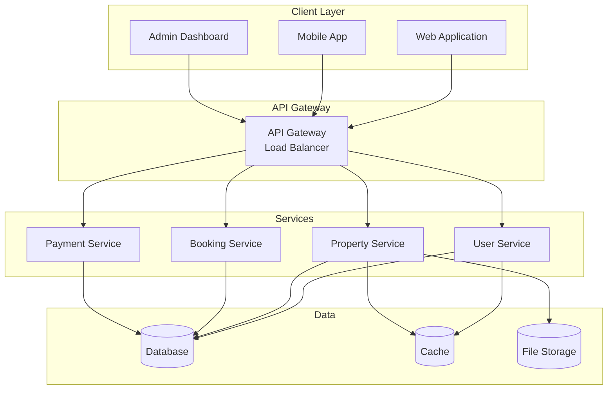
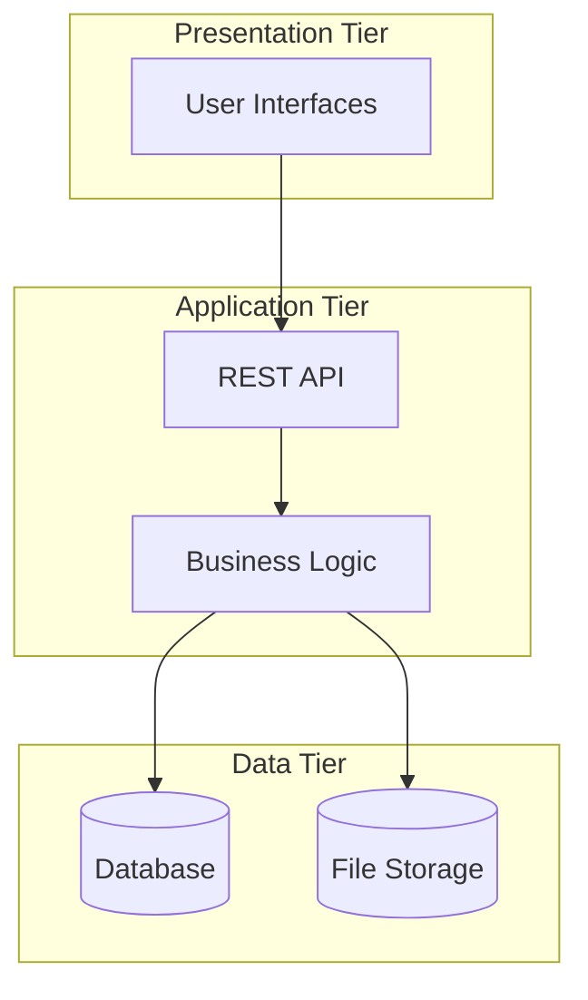

# High-Level Architecture Diagram

## System Architecture Overview

```mermaid
graph TB
    subgraph "Client Layer"
        Web[Web Application]
        Mobile[Mobile App]
        Admin[Admin Dashboard]
    end
    
    subgraph "API Gateway"
        Gateway[API Gateway<br/>Load Balancer]
    end
    
    subgraph "Services"
        UserSvc[User Service]
        PropertySvc[Property Service]
        BookingSvc[Booking Service]
        PaymentSvc[Payment Service]
    end
    
    subgraph "Data"
        DB[(Database)]
        Cache[(Cache)]
        Storage[(File Storage)]
    end
    
    Web & Mobile & Admin --> Gateway
    Gateway --> UserSvc & PropertySvc & BookingSvc & PaymentSvc
    UserSvc & PropertySvc & BookingSvc & PaymentSvc --> DB
    PropertySvc --> Storage
    UserSvc & PropertySvc --> Cache
```

## Three-Tier Architecture

```mermaid
graph TB
    subgraph "Presentation Tier"
        UI[User Interfaces]
    end
    
    subgraph "Application Tier"
        API[REST API]
        Business[Business Logic]
    end
    
    subgraph "Data Tier"
        DB[(Database)]
        Files[(File Storage)]
    end
    
    UI --> API
    API --> Business
    Business --> DB & Files
```
