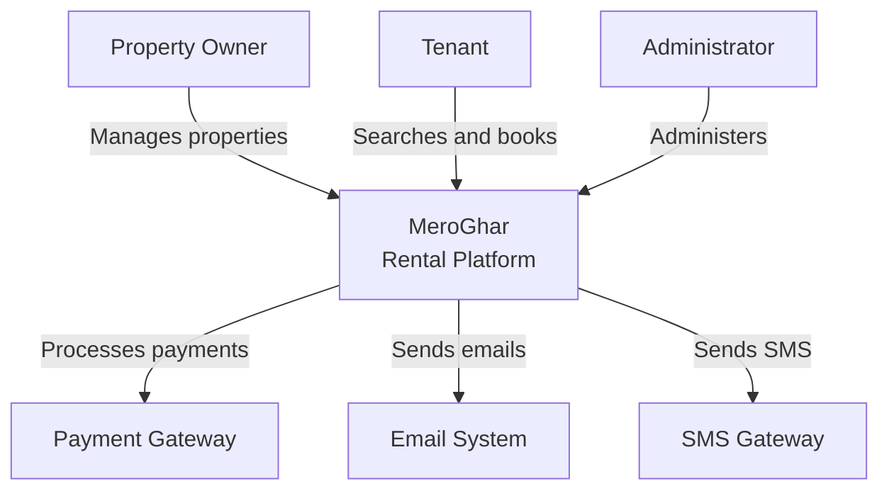
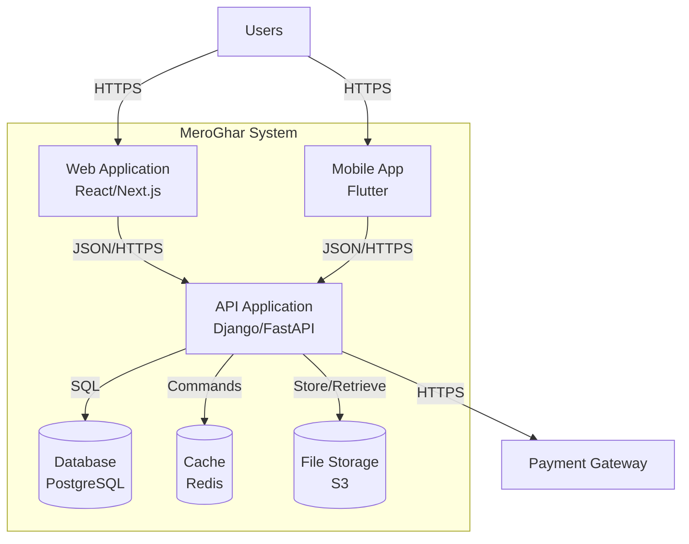

# C4 Model - Context and Container Diagrams

## C4 Context Diagram

```mermaid
graph TB
    Owner[Property Owner]
    Tenant[Tenant]
    Admin[Administrator]
    
    System[MeroGhar<br/>Rental Platform]
    
    PayGW[Payment Gateway]
    Email[Email System]
    SMS[SMS Gateway]
    
    Owner -->|Manages properties| System
    Tenant -->|Searches and books| System
    Admin -->|Administers| System
    
    System -->|Processes payments| PayGW
    System -->|Sends emails| Email
    System -->|Sends SMS| SMS
```

## C4 Container Diagram

```mermaid
graph TB
    subgraph "MeroGhar System"
        WebApp[Web Application<br/>React/Next.js]
        MobileApp[Mobile App<br/>Flutter]
        API[API Application<br/>Django/FastAPI]
        DB[(Database<br/>PostgreSQL)]
        Cache[(Cache<br/>Redis)]
        Storage[(File Storage<br/>S3)]
    end
    
    User[Users]
    PayGW[Payment Gateway]
    
    User -->|HTTPS| WebApp
    User -->|HTTPS| MobileApp
    WebApp -->|JSON/HTTPS| API
    MobileApp -->|JSON/HTTPS| API
    API -->|SQL| DB
    API -->|Commands| Cache
    API -->|Store/Retrieve| Storage
    API -->|HTTPS| PayGW
```
