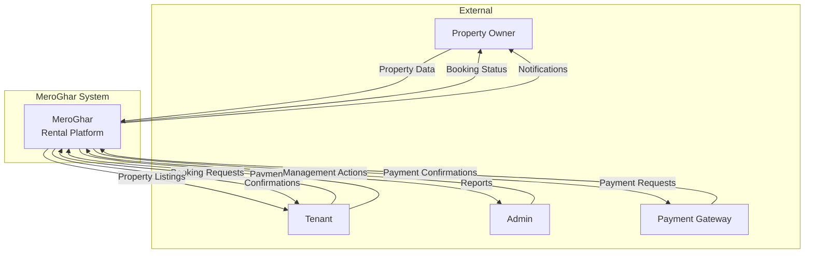
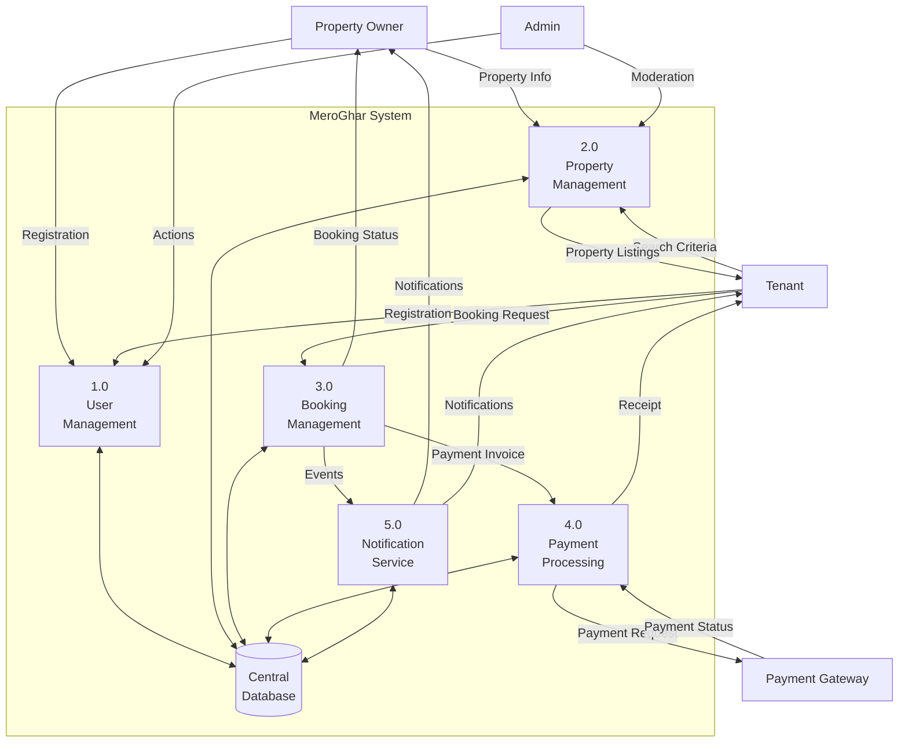
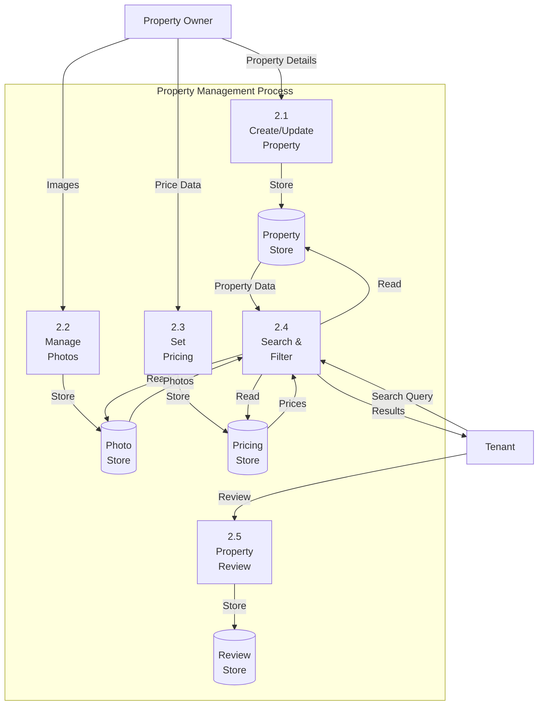
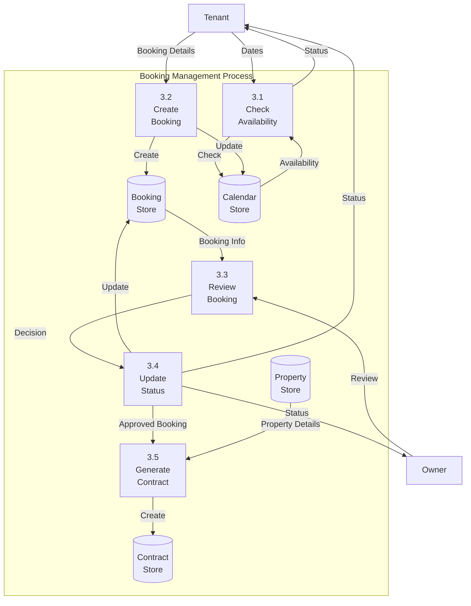
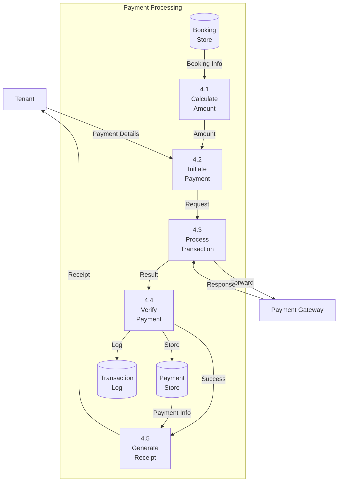
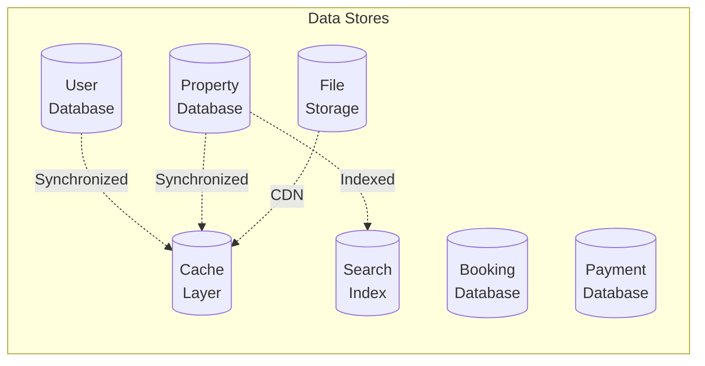

# Data Flow Diagram

## Level 0 - Context Diagram

## Level 1 - Major Processes

## Level 2 - Detailed Property Management

## Level 2 - Detailed Booking Management

## Level 2 - Payment Processing Flow

## Data Stores

