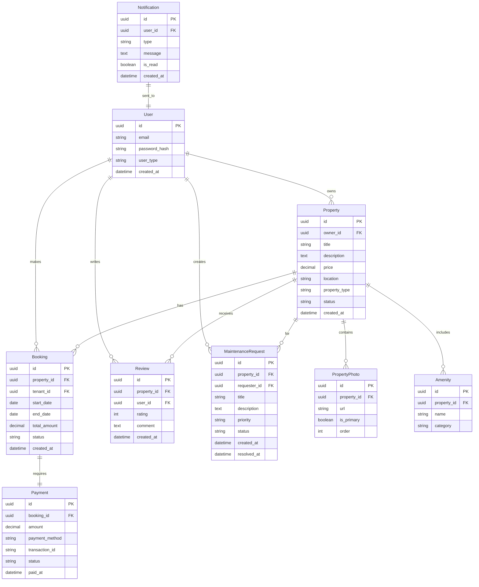
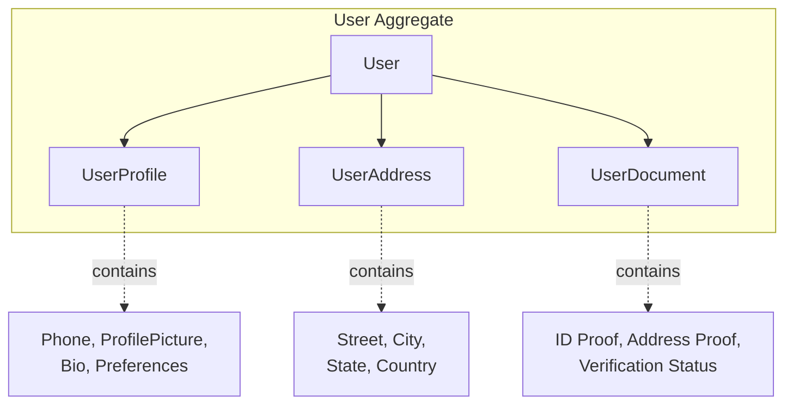
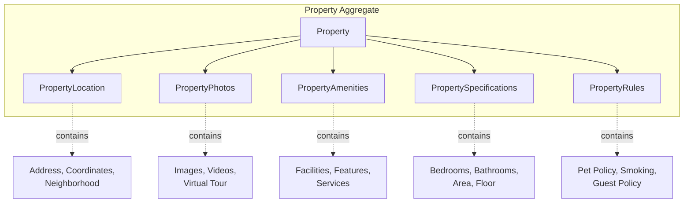
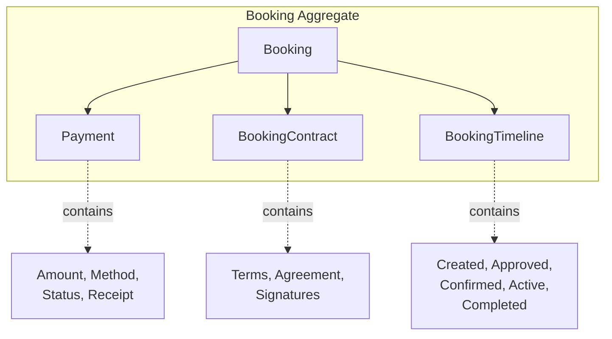
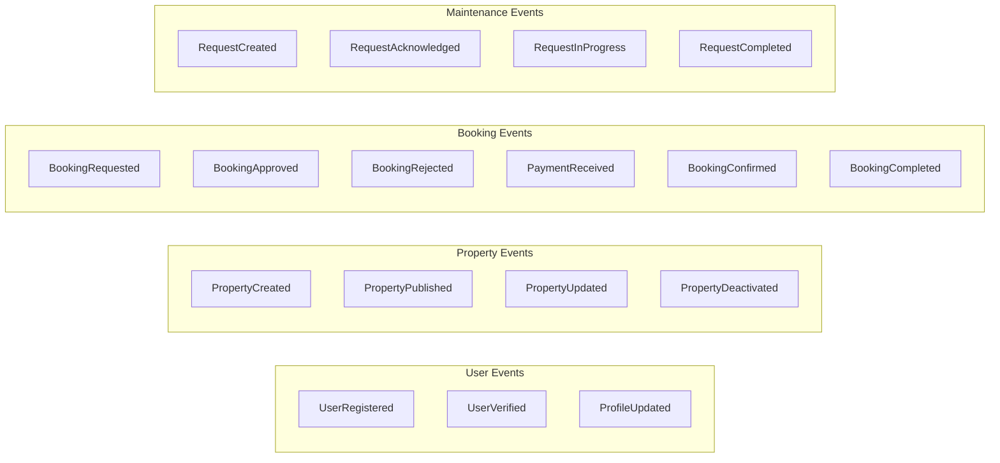
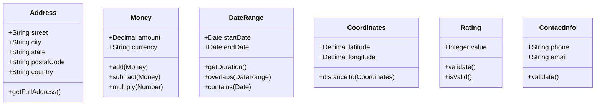

# Domain Model

## Core Entities and Relationships

```mermaid
erDiagram
    User ||--o{ Property : owns
    User ||--o{ Booking : makes
    User ||--o{ Review : writes
    User ||--o{ MaintenanceRequest : creates
    User {
        uuid id PK
        string email
        string password_hash
        string user_type
        datetime created_at
    }
    
    Property ||--o{ Booking : has
    Property ||--o{ PropertyPhoto : contains
    Property ||--o{ Amenity : includes
    Property ||--o{ Review : receives
    Property ||--o{ MaintenanceRequest : for
    Property {
        uuid id PK
        uuid owner_id FK
        string title
        text description
        decimal price
        string location
        string property_type
        string status
        datetime created_at
    }
    
    Booking ||--|| Payment : requires
    Booking {
        uuid id PK
        uuid property_id FK
        uuid tenant_id FK
        date start_date
        date end_date
        decimal total_amount
        string status
        datetime created_at
    }
    
    Payment {
        uuid id PK
        uuid booking_id FK
        decimal amount
        string payment_method
        string transaction_id
        string status
        datetime paid_at
    }
    
    Review {
        uuid id PK
        uuid property_id FK
        uuid user_id FK
        int rating
        text comment
        datetime created_at
    }
    
    PropertyPhoto {
        uuid id PK
        uuid property_id FK
        string url
        boolean is_primary
        int order
    }
    
    Amenity {
        uuid id PK
        uuid property_id FK
        string name
        string category
    }
    
    MaintenanceRequest {
        uuid id PK
        uuid property_id FK
        uuid requester_id FK
        string title
        text description
        string priority
        string status
        datetime created_at
        datetime resolved_at
    }
    
    Notification ||--|| User : sent_to
    Notification {
        uuid id PK
        uuid user_id FK
        string type
        text message
        boolean is_read
        datetime created_at
    }
```

## Domain Concepts

### User Aggregate

```mermaid
graph TB
    subgraph "User Aggregate"
        U[User]
        UP[UserProfile]
        UA[UserAddress]
        UD[UserDocument]
        
        U --> UP
        U --> UA
        U --> UD
    end
    
    UP -.->|contains| UPD[Phone, ProfilePicture,<br/>Bio, Preferences]
    UA -.->|contains| UAD[Street, City,<br/>State, Country]
    UD -.->|contains| UDD[ID Proof, Address Proof,<br/>Verification Status]
```

### Property Aggregate

```mermaid
graph TB
    subgraph "Property Aggregate"
        P[Property]
        PL[PropertyLocation]
        PP[PropertyPhotos]
        PA[PropertyAmenities]
        PS[PropertySpecifications]
        PR[PropertyRules]
        
        P --> PL
        P --> PP
        P --> PA
        P --> PS
        P --> PR
    end
    
    PL -.->|contains| PLD[Address, Coordinates,<br/>Neighborhood]
    PP -.->|contains| PPD[Images, Videos,<br/>Virtual Tour]
    PA -.->|contains| PAD[Facilities, Features,<br/>Services]
    PS -.->|contains| PSD[Bedrooms, Bathrooms,<br/>Area, Floor]
    PR -.->|contains| PRD[Pet Policy, Smoking,<br/>Guest Policy]
```

### Booking Aggregate

```mermaid
graph TB
    subgraph "Booking Aggregate"
        B[Booking]
        BP[Payment]
        BC[BookingContract]
        BT[BookingTimeline]
        
        B --> BP
        B --> BC
        B --> BT
    end
    
    BP -.->|contains| BPD[Amount, Method,<br/>Status, Receipt]
    BC -.->|contains| BCD[Terms, Agreement,<br/>Signatures]
    BT -.->|contains| BTD[Created, Approved,<br/>Confirmed, Active,<br/>Completed]
```

## Domain Events

```mermaid
graph LR
    subgraph "User Events"
        UE1[UserRegistered]
        UE2[UserVerified]
        UE3[ProfileUpdated]
    end
    
    subgraph "Property Events"
        PE1[PropertyCreated]
        PE2[PropertyPublished]
        PE3[PropertyUpdated]
        PE4[PropertyDeactivated]
    end
    
    subgraph "Booking Events"
        BE1[BookingRequested]
        BE2[BookingApproved]
        BE3[BookingRejected]
        BE4[PaymentReceived]
        BE5[BookingConfirmed]
        BE6[BookingCompleted]
    end
    
    subgraph "Maintenance Events"
        ME1[RequestCreated]
        ME2[RequestAcknowledged]
        ME3[RequestInProgress]
        ME4[RequestCompleted]
    end
```

## Value Objects

```mermaid
classDiagram
    class Address {
        +String street
        +String city
        +String state
        +String postalCode
        +String country
        +getFullAddress()
    }
    
    class Money {
        +Decimal amount
        +String currency
        +add(Money)
        +subtract(Money)
        +multiply(Number)
    }
    
    class DateRange {
        +Date startDate
        +Date endDate
        +getDuration()
        +overlaps(DateRange)
        +contains(Date)
    }
    
    class Coordinates {
        +Decimal latitude
        +Decimal longitude
        +distanceTo(Coordinates)
    }
    
    class Rating {
        +Integer value
        +validate()
        +isValid()
    }
    
    class ContactInfo {
        +String phone
        +String email
        +validate()
    }
```
