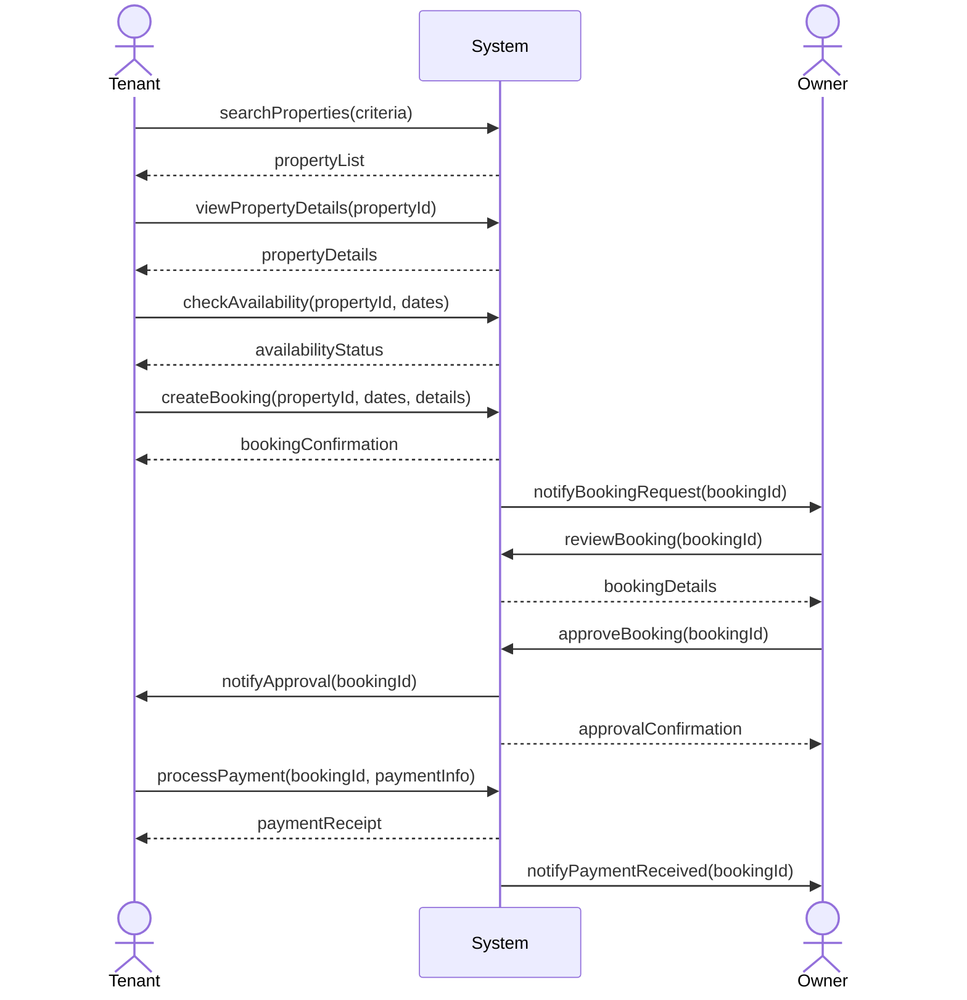
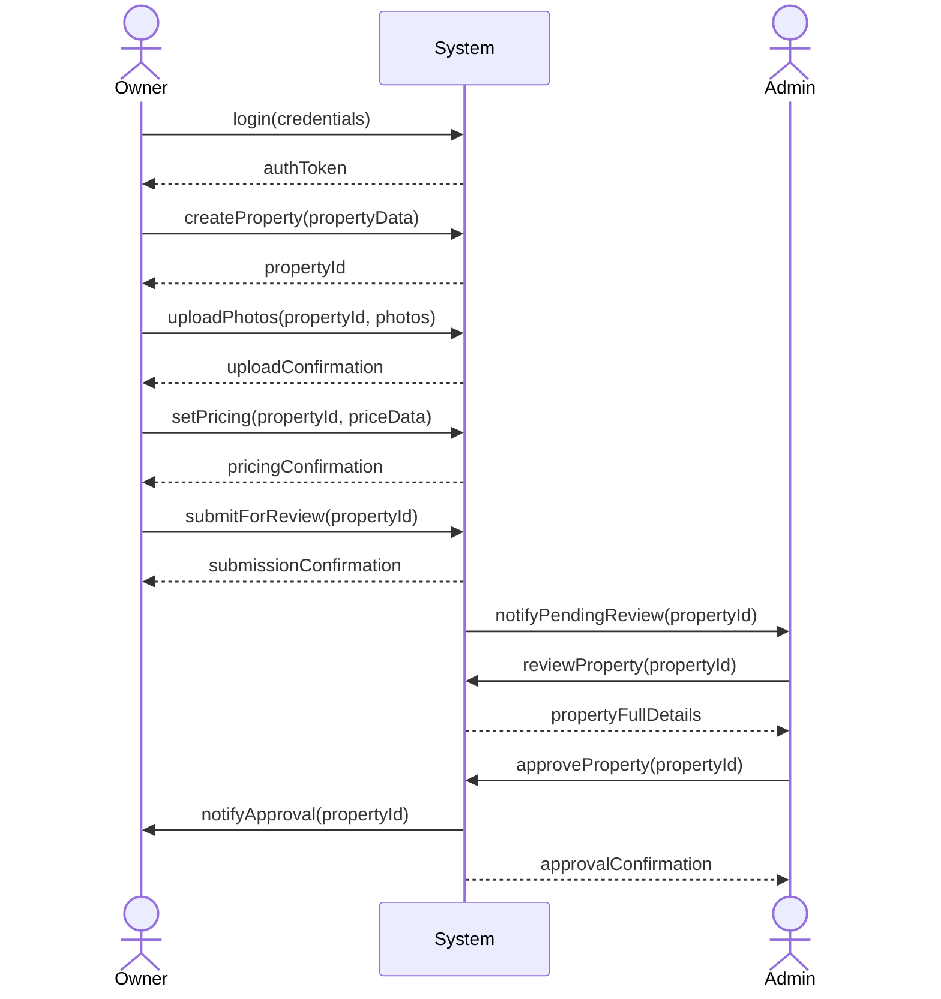
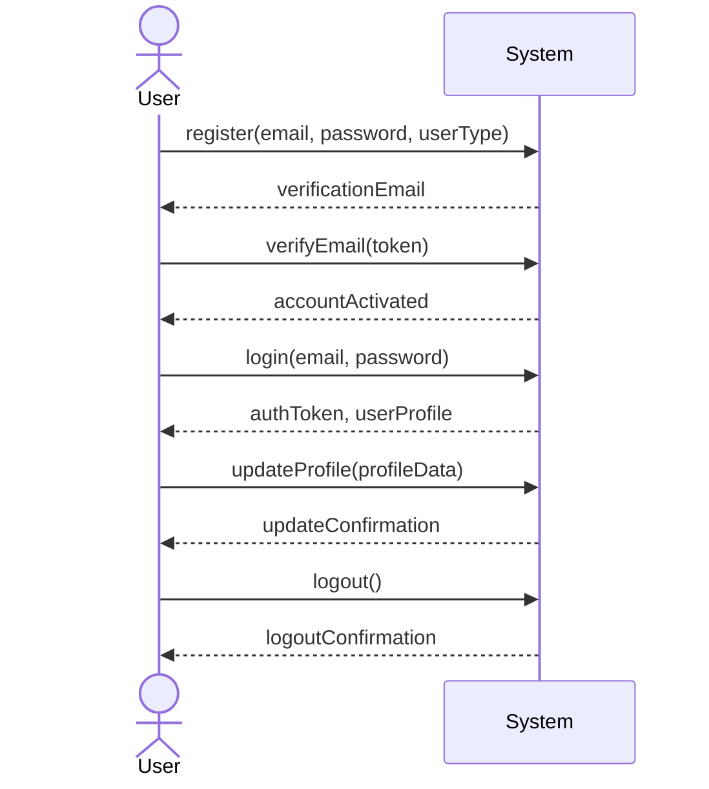
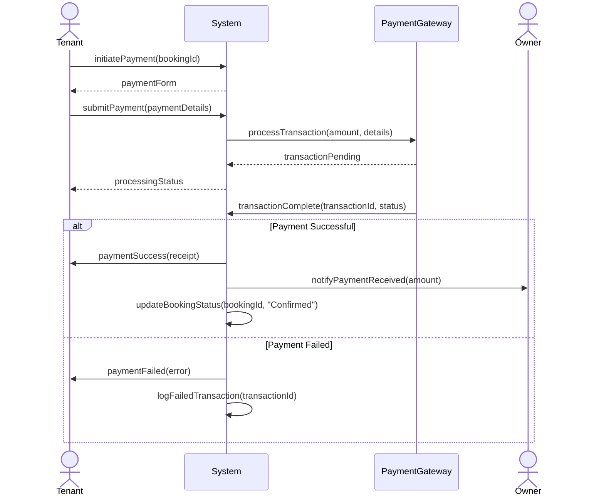
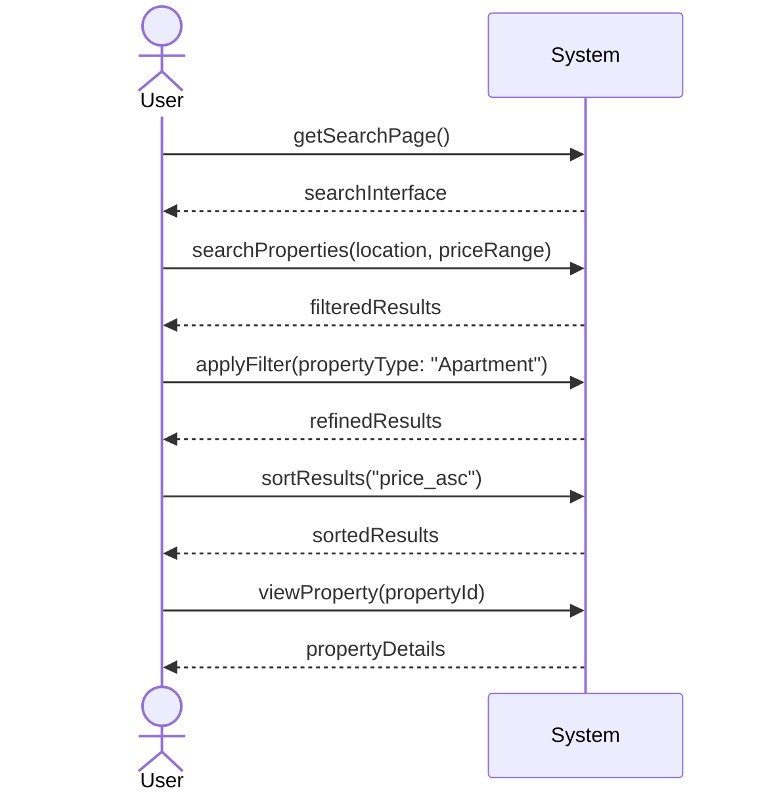
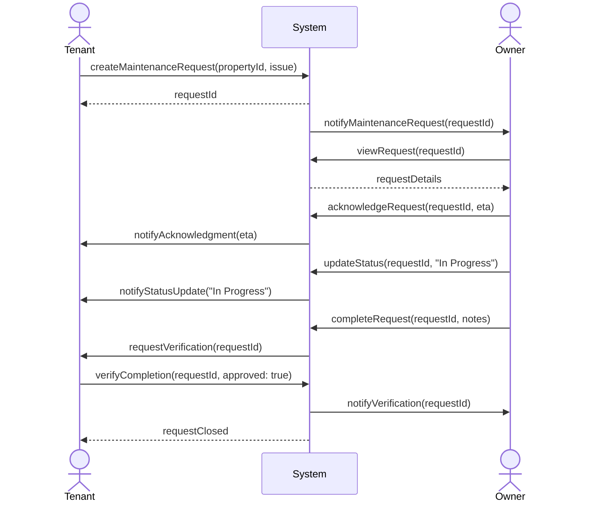

# System Sequence Diagram

## Book Property - Black Box Interaction

## Property Listing Creation

## User Authentication Flow

## Payment Processing Flow

## Search and Filter Interaction

## Maintenance Request Sequence

