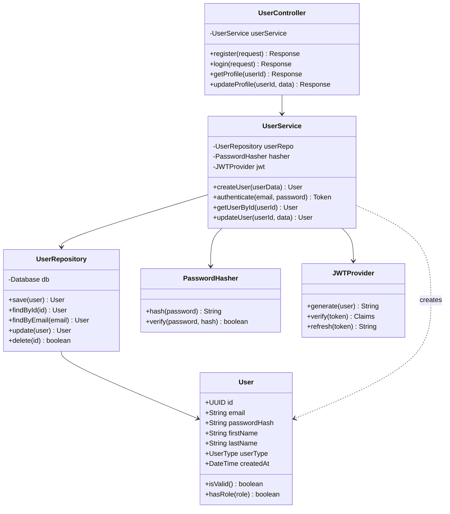
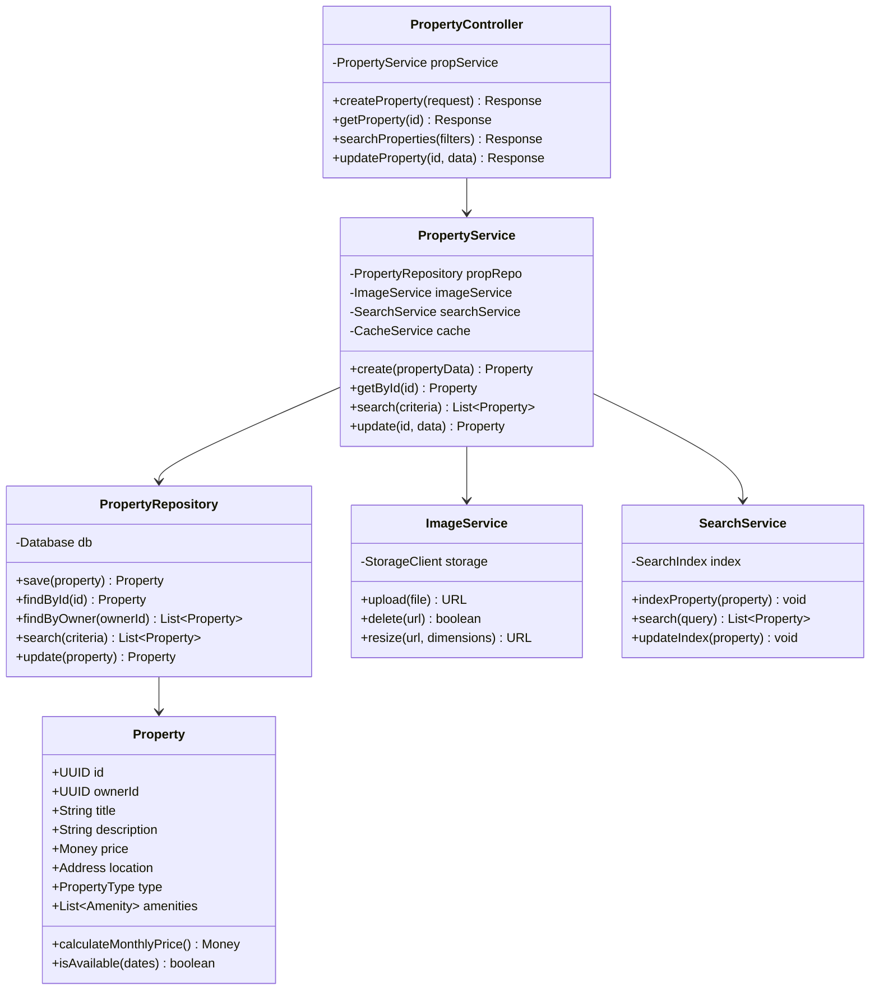
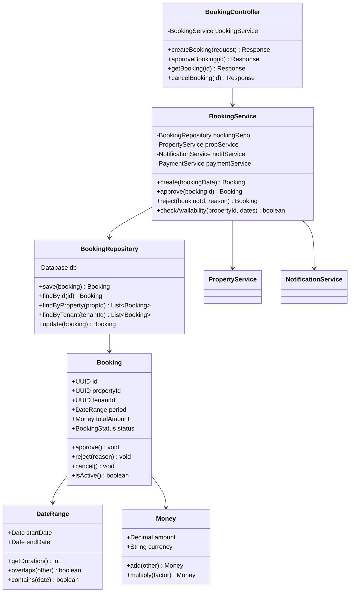

# C4 Code Diagram

## User Service Code Structure

```mermaid
classDiagram
    class UserController {
        -UserService userService
        +register(request) Response
        +login(request) Response
        +getProfile(userId) Response
        +updateProfile(userId, data) Response
    }
    
    class UserService {
        -UserRepository userRepo
        -PasswordHasher hasher
        -JWTProvider jwt
        +createUser(userData) User
        +authenticate(email, password) Token
        +getUserById(userId) User
        +updateUser(userId, data) User
    }
    
    class UserRepository {
        -Database db
        +save(user) User
        +findById(id) User
        +findByEmail(email) User
        +update(user) User
        +delete(id) boolean
    }
    
    class User {
        +UUID id
        +String email
        +String passwordHash
        +String firstName
        +String lastName
        +UserType userType
        +DateTime createdAt
        +isValid() boolean
        +hasRole(role) boolean
    }
    
    class PasswordHasher {
        +hash(password) String
        +verify(password, hash) boolean
    }
    
    class JWTProvider {
        +generate(user) String
        +verify(token) Claims
        +refresh(token) String
    }
    
    UserController --> UserService
    UserService --> UserRepository
    UserService --> PasswordHasher
    UserService --> JWTProvider
    UserRepository --> User
    UserService ..> User : creates
```

## Property Service Code Structure

```mermaid
classDiagram
    class PropertyController {
        -PropertyService propService
        +createProperty(request) Response
        +getProperty(id) Response
        +searchProperties(filters) Response
        +updateProperty(id, data) Response
    }
    
    class PropertyService {
        -PropertyRepository propRepo
        -ImageService imageService
        -SearchService searchService
        -CacheService cache
        +create(propertyData) Property
        +getById(id) Property
        +search(criteria) List~Property~
        +update(id, data) Property
    }
    
    class PropertyRepository {
        -Database db
        +save(property) Property
        +findById(id) Property
        +findByOwner(ownerId) List~Property~
        +search(criteria) List~Property~
        +update(property) Property
    }
    
    class Property {
        +UUID id
        +UUID ownerId
        +String title
        +String description
        +Money price
        +Address location
        +PropertyType type
        +List~Amenity~ amenities
        +calculateMonthlyPrice() Money
        +isAvailable(dates) boolean
    }
    
    class ImageService {
        -StorageClient storage
        +upload(file) URL
        +delete(url) boolean
        +resize(url, dimensions) URL
    }
    
    class SearchService {
        -SearchIndex index
        +indexProperty(property) void
        +search(query) List~Property~
        +updateIndex(property) void
    }
    
    PropertyController --> PropertyService
    PropertyService --> PropertyRepository
    PropertyService --> ImageService
    PropertyService --> SearchService
    PropertyRepository --> Property
```

## Booking Service Code Structure

```mermaid
classDiagram
    class BookingController {
        -BookingService bookingService
        +createBooking(request) Response
        +approveBooking(id) Response
        +getBooking(id) Response
        +cancelBooking(id) Response
    }
    
    class BookingService {
        -BookingRepository bookingRepo
        -PropertyService propService
        -NotificationService notifService
        -PaymentService paymentService
        +create(bookingData) Booking
        +approve(bookingId) Booking
        +reject(bookingId, reason) Booking
        +checkAvailability(propertyId, dates) boolean
    }
    
    class BookingRepository {
        -Database db
        +save(booking) Booking
        +findById(id) Booking
        +findByProperty(propId) List~Booking~
        +findByTenant(tenantId) List~Booking~
        +update(booking) Booking
    }
    
    class Booking {
        +UUID id
        +UUID propertyId
        +UUID tenantId
        +DateRange period
        +Money totalAmount
        +BookingStatus status
        +approve() void
        +reject(reason) void
        +cancel() void
        +isActive() boolean
    }
    
    class DateRange {
        +Date startDate
        +Date endDate
        +getDuration() int
        +overlaps(other) boolean
        +contains(date) boolean
    }
    
    class Money {
        +Decimal amount
        +String currency
        +add(other) Money
        +multiply(factor) Money
    }
    
    BookingController --> BookingService
    BookingService --> BookingRepository
    BookingService --> PropertyService
    BookingService --> NotificationService
    BookingRepository --> Booking
    Booking --> DateRange
    Booking --> Money
```
