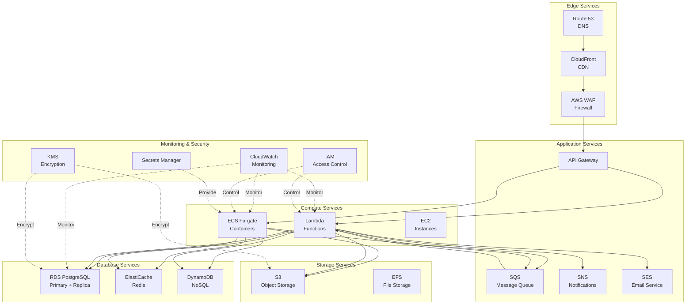
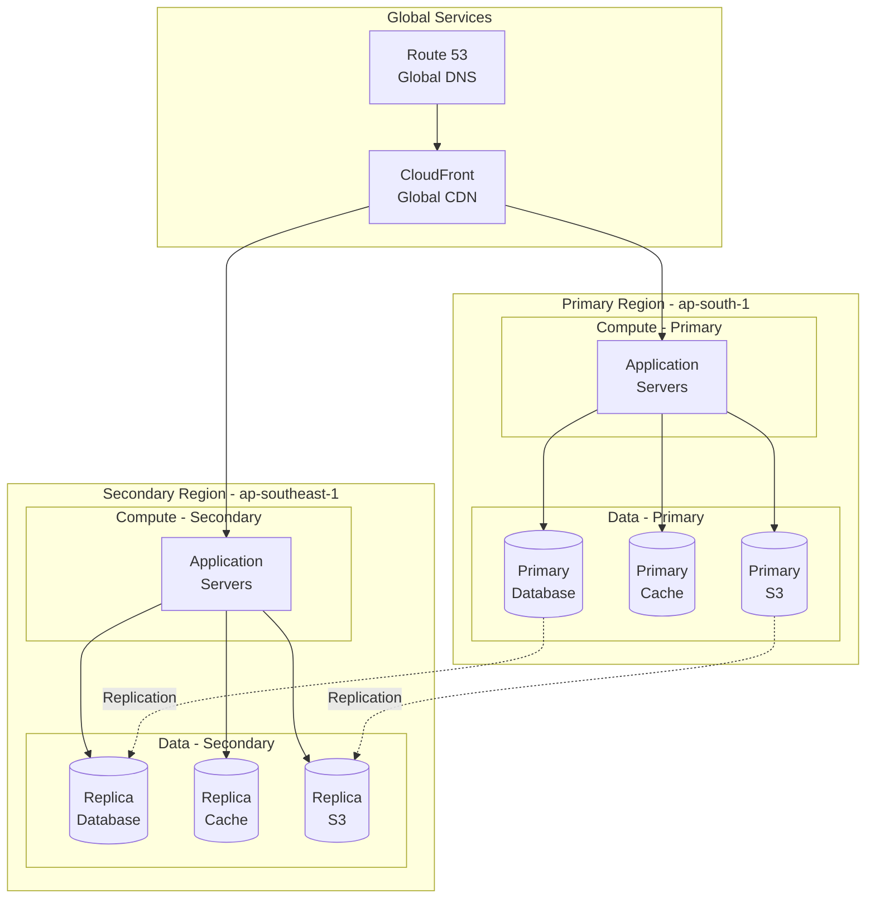
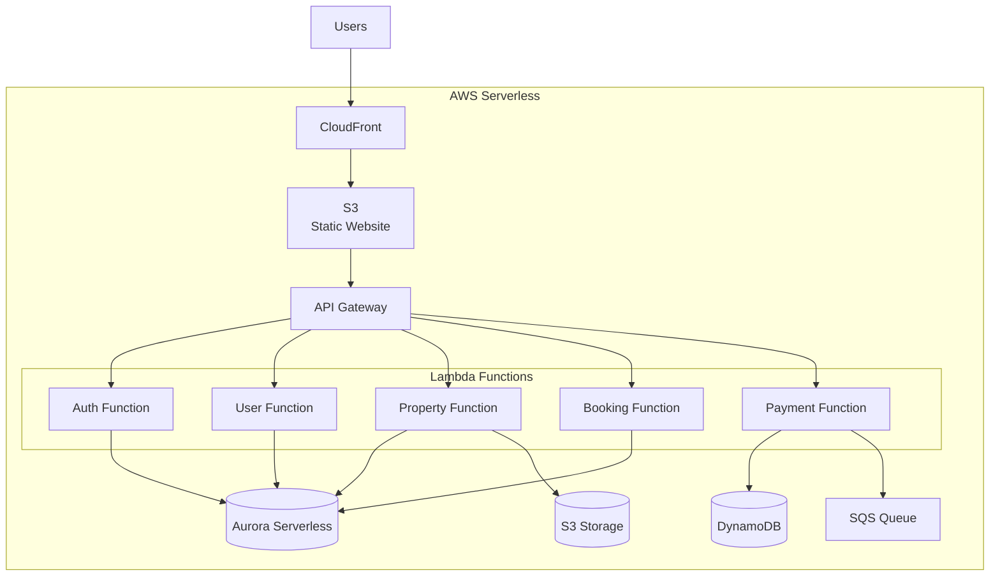

# Cloud Architecture Diagram

## AWS Cloud Architecture

```mermaid
graph TB
    subgraph "Edge Services"
        Route53[Route 53<br/>DNS]
        CloudFront[CloudFront<br/>CDN]
        WAF[AWS WAF<br/>Firewall]
    end
    
    subgraph "Compute Services"
        ECS[ECS Fargate<br/>Containers]
        Lambda[Lambda<br/>Functions]
        EC2[EC2<br/>Instances]
    end
    
    subgraph "Storage Services"
        S3[S3<br/>Object Storage]
        EFS[EFS<br/>File Storage]
    end
    
    subgraph "Database Services"
        RDS[RDS PostgreSQL<br/>Primary + Replica]
        ElastiCache[ElastiCache<br/>Redis]
        DynamoDB[DynamoDB<br/>NoSQL]
    end
    
    subgraph "Application Services"
        APIGateway[API Gateway]
        SQS[SQS<br/>Message Queue]
        SNS[SNS<br/>Notifications]
        SES[SES<br/>Email Service]
    end
    
    subgraph "Monitoring & Security"
        CloudWatch[CloudWatch<br/>Monitoring]
        IAM[IAM<br/>Access Control]
        Secrets[Secrets Manager]
        KMS[KMS<br/>Encryption]
    end
    
    Route53 --> CloudFront
    CloudFront --> WAF
    WAF --> APIGateway
    APIGateway --> Lambda
    APIGateway --> ECS
    
    ECS & Lambda --> RDS
    ECS & Lambda --> ElastiCache
    ECS & Lambda --> DynamoDB
    ECS & Lambda --> S3
    ECS & Lambda --> SQS
    
    SQS --> Lambda
    Lambda --> SNS
    Lambda --> SES
    
    CloudWatch -.Monitor.-> ECS
    CloudWatch -.Monitor.-> Lambda
    CloudWatch -.Monitor.-> RDS
    
    IAM -.Control.-> ECS
    IAM -.Control.-> Lambda
    Secrets -.Provide.-> ECS
    KMS -.Encrypt.-> S3
    KMS -.Encrypt.-> RDS
```

## Multi-Region Architecture

```mermaid
graph TB
    subgraph "Global Services"
        R53[Route 53<br/>Global DNS]
        CF[CloudFront<br/>Global CDN]
    end
    
    subgraph "Primary Region - ap-south-1"
        subgraph "Compute - Primary"
            App1[Application<br/>Servers]
        end
        
        subgraph "Data - Primary"
            DB1[(Primary<br/>Database)]
            Cache1[(Primary<br/>Cache)]
            S31[(Primary<br/>S3)]
        end
    end
    
    subgraph "Secondary Region - ap-southeast-1"
        subgraph "Compute - Secondary"
            App2[Application<br/>Servers]
        end
        
        subgraph "Data - Secondary"
            DB2[(Replica<br/>Database)]
            Cache2[(Replica<br/>Cache)]
            S32[(Replica<br/>S3)]
        end
    end
    
    R53 --> CF
    CF --> App1 & App2
    
    App1 --> DB1
    App1 --> Cache1
    App1 --> S31
    
    App2 --> DB2
    App2 --> Cache2
    App2 --> S32
    
    DB1 -.Replication.-> DB2
    S31 -.Replication.-> S32
```

## Serverless Architecture Option

```mermaid
graph TB
    Users[Users]
    
    subgraph "AWS Serverless"
        CloudFront[CloudFront]
        S3Web[S3<br/>Static Website]
        APIGateway[API Gateway]
        
        subgraph "Lambda Functions"
            AuthLambda[Auth Function]
            UserLambda[User Function]
            PropLambda[Property Function]
            BookLambda[Booking Function]
            PayLambda[Payment Function]
        end
        
        DynamoDB[(DynamoDB)]
        Aurora[(Aurora Serverless)]
        S3Storage[(S3 Storage)]
        SQS[SQS Queue]
    end
    
    Users --> CloudFront
    CloudFront --> S3Web
    S3Web --> APIGateway
    
    APIGateway --> AuthLambda
    APIGateway --> UserLambda
    APIGateway --> PropLambda
    APIGateway --> BookLambda
    APIGateway --> PayLambda
    
    AuthLambda & UserLambda --> Aurora
    PropLambda & BookLambda --> Aurora
    PropLambda --> S3Storage
    PayLambda --> DynamoDB
    PayLambda --> SQS
```
