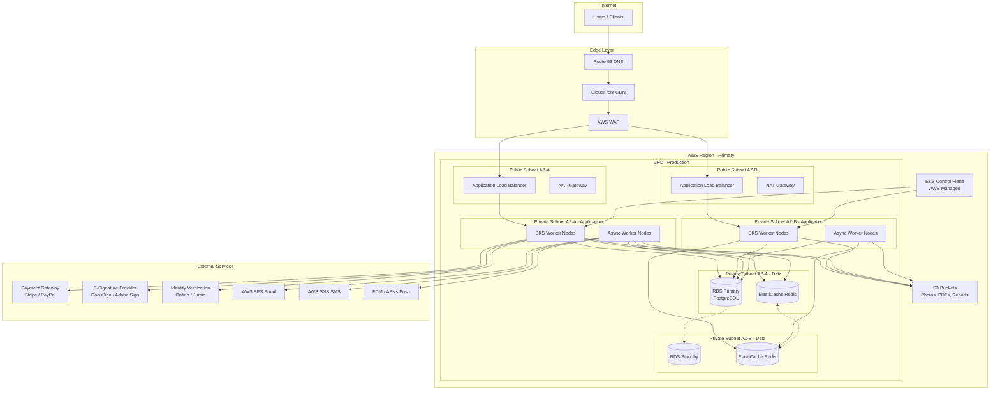
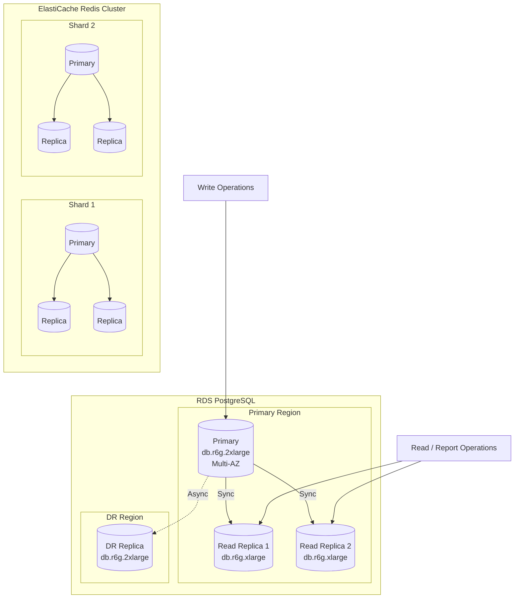
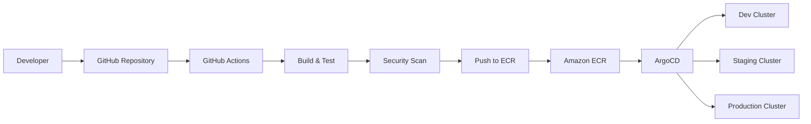

# Deployment Diagram

## Overview
Deployment diagrams showing the mapping of the rental management system's software components to cloud infrastructure. The architecture targets a scaled production environment on AWS, but the design is cloud-agnostic.

---

## Production Deployment Architecture



---

## Kubernetes Deployment

```mermaid
graph TB
    subgraph "EKS Cluster"
        subgraph "Ingress"
            Ingress[NGINX Ingress Controller]
        end

        subgraph "API Namespace"
            Gateway[API Gateway<br>Kong - 3 replicas]
        end

        subgraph "Services Namespace"
            subgraph "Auth Domain"
                AuthSvc[Auth Service<br>2 replicas]
            end

            subgraph "Property Domain"
                AssetSvc[Property Service<br>3 replicas]
                SearchSvc[Search Service<br>2 replicas]
            end

            subgraph "Rental Application Domain"
                BookingSvc[Rental Application Service<br>5 replicas]
                PricingSvc[Pricing Service<br>3 replicas]
            end

            subgraph "Agreement Domain"
                AgreeSvc[Agreement Service<br>2 replicas]
            end

            subgraph "Payment Domain"
                PaymentSvc[Payment Service<br>3 replicas]
                PayoutSvc[Payout Service<br>2 replicas]
            end

            subgraph "Operations Domain"
                AssessSvc[Assessment Service<br>2 replicas]
                MaintSvc[Maintenance Service<br>2 replicas]
            end

            subgraph "Notification Domain"
                NotifySvc[Notification Service<br>3 replicas]
                WSSvc[WebSocket Service<br>3 replicas]
            end
        end

        subgraph "Workers Namespace"
            BookingWorker[Rental Application Reminder Worker<br>2 replicas]
            OverdueWorker[Overdue Detection Worker<br>2 replicas]
            PayoutWorker[Payout Batch Worker<br>1 replica]
            ReportWorker[Report Generation Worker<br>2 replicas]
        end

        subgraph "Monitoring Namespace"
            Prometheus[Prometheus]
            Grafana[Grafana]
            Jaeger[Jaeger Tracing]
        end
    end

    Ingress --> Gateway
    Gateway --> AuthSvc
    Gateway --> AssetSvc
    Gateway --> BookingSvc
    Gateway --> AgreeSvc
    Gateway --> PaymentSvc
    Gateway --> AssessSvc
    Gateway --> MaintSvc
    Gateway --> NotifySvc
    Gateway --> WSSvc
```

---

## Deployment Environment Matrix

| Service | Dev | Staging | Production |
|---------|-----|---------|------------|
| Auth Service | 1 replica | 2 replicas | 2 replicas |
| Property Service | 1 replica | 2 replicas | 3 replicas |
| Rental Application Service | 1 replica | 3 replicas | 5 replicas |
| Pricing Service | 1 replica | 2 replicas | 3 replicas |
| Agreement Service | 1 replica | 2 replicas | 2 replicas |
| Payment Service | 1 replica | 2 replicas | 3 replicas |
| Assessment Service | 1 replica | 2 replicas | 2 replicas |
| Notification Service | 1 replica | 2 replicas | 3 replicas |
| WebSocket Service | 1 replica | 2 replicas | 3 replicas |

---

## Database & Cache Deployment



---

## CI/CD Pipeline



---

## Resource Allocation

| Component | Instance Type | vCPU | Memory | Storage |
|-----------|---------------|------|--------|---------|
| EKS Worker (API) | m6i.xlarge | 4 | 16 GB | 100 GB |
| EKS Worker (Workers) | m6i.large | 2 | 8 GB | 50 GB |
| RDS Primary | db.r6g.2xlarge | 8 | 64 GB | 1 TB |
| RDS Replica | db.r6g.xlarge | 4 | 32 GB | 1 TB |
| ElastiCache | cache.r6g.xlarge | 4 | 26 GB | — |
| S3 (object storage) | — | — | — | Unlimited |
