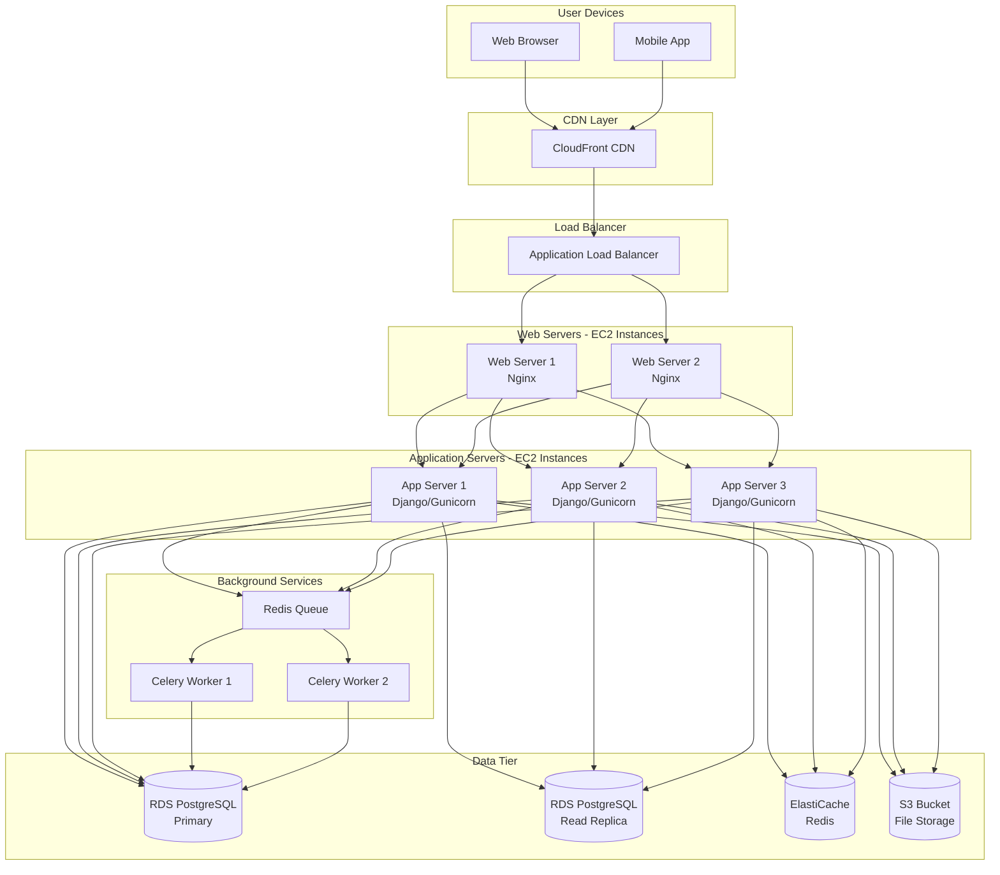
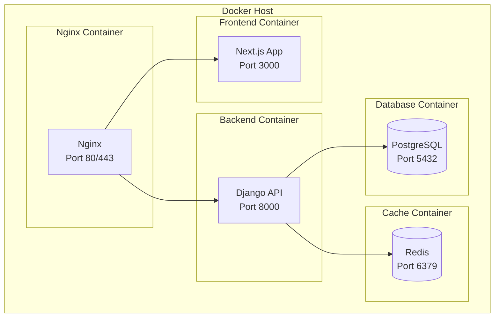

# Deployment Diagram

## Production Deployment Architecture



## Container Deployment (Docker)



## Kubernetes Deployment

```mermaid
graph TB
    subgraph "Kubernetes Cluster"
        subgraph "Ingress"
            Ingress[Ingress Controller<br/>nginx-ingress]
        end
        
        subgraph "Frontend Deployment"
            FrontPod1[Frontend Pod 1]
            FrontPod2[Frontend Pod 2]
            FrontSvc[Frontend Service]
        end
        
        subgraph "Backend Deployment"
            BackPod1[Backend Pod 1]
            BackPod2[Backend Pod 2]
            BackPod3[Backend Pod 3]
            BackSvc[Backend Service]
        end
        
        subgraph "Worker Deployment"
            WorkerPod1[Worker Pod 1]
            WorkerPod2[Worker Pod 2]
        end
        
        subgraph "StatefulSet"
            DB[(Database<br/>StatefulSet)]
            RedisSet[(Redis<br/>StatefulSet)]
        end
        
        subgraph "External"
            RDSPG[(RDS PostgreSQL)]
            ElastiCache[(ElastiCache)]
            S3Storage[(S3)]
        end
    end
    
    Ingress --> FrontSvc
    Ingress --> BackSvc
    FrontSvc --> FrontPod1 & FrontPod2
    BackSvc --> BackPod1 & BackPod2 & BackPod3
    
    BackPod1 & BackPod2 & BackPod3 --> RDSPG
    BackPod1 & BackPod2 & BackPod3 --> ElastiCache
    BackPod1 & BackPod2 & BackPod3 --> S3Storage
    WorkerPod1 & WorkerPod2 --> ElastiCache
```
