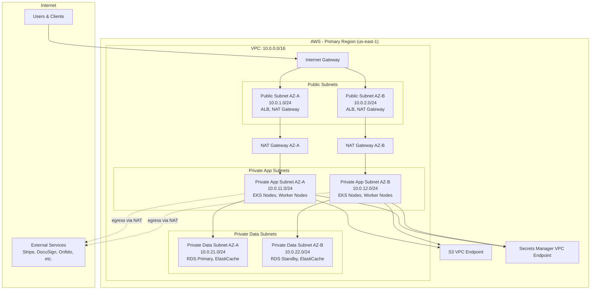
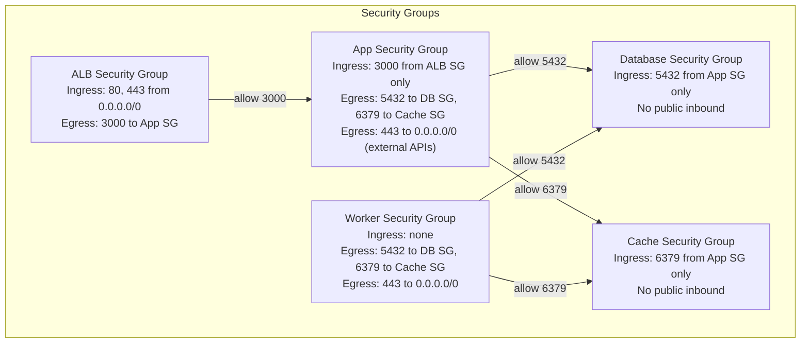
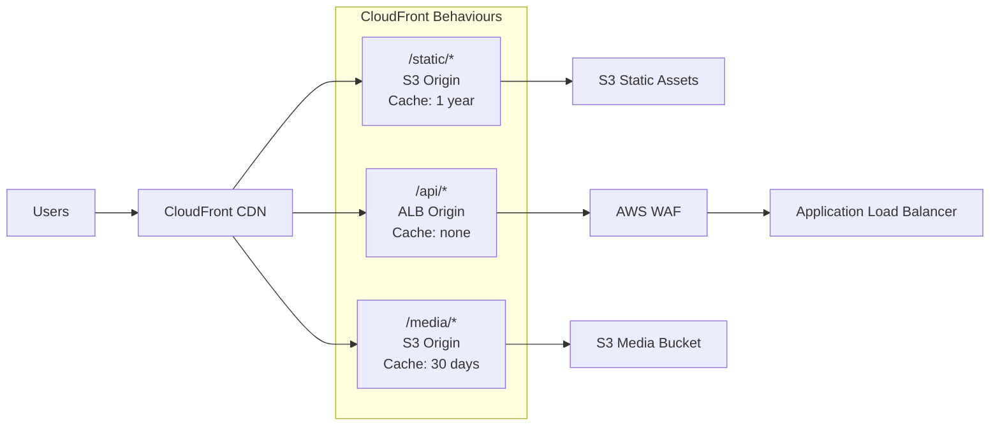
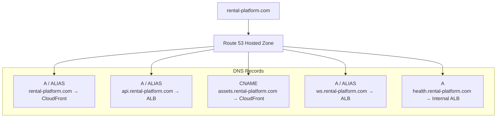

# Network Infrastructure

## Overview
Network topology and security architecture for MeroGhar running on AWS.

---

## VPC Network Topology

---

## Security Group Configuration

---

## CDN and Edge Configuration

---

## WAF Rules Configuration

| Rule Group | Rules | Action |
|------------|-------|--------|
| AWS Managed Core Rules | SQL injection, XSS, known bad inputs | Block |
| Rate Limiting | > 1000 req/min per IP to `/api/*` | Block |
| Geographic Restriction | Block specific country codes if required | Block |
| Bot Control | Automated bot traffic detection | Count / Block |
| Custom: Auth Brute Force | > 10 failed `/auth/login` per IP per minute | Block for 10 min |
| Custom: Webhook Allowlist | `/webhooks/*` allowed only from known provider IPs | Allow / Block others |

---

## DNS Architecture

---

## Certificate Management

| Domain | Certificate | Renewal |
|--------|-------------|---------|
| `rental-platform.com` | AWS ACM (wildcard `*.rental-platform.com`) | Auto-renew |
| `api.rental-platform.com` | AWS ACM | Auto-renew |
| `assets.rental-platform.com` | AWS ACM | Auto-renew |
| Internal services | Cert-Manager (Let's Encrypt) in EKS | Auto-renew |

---

## Port Reference

| Service | Port | Protocol | Accessible From |
|---------|------|----------|-----------------|
| ALB HTTPS | 443 | TCP | Internet (via WAF) |
| ALB HTTP | 80 | TCP | Internet (redirect to 443) |
| API App | 3000 | TCP | ALB SG only |
| WebSocket | 3001 | TCP | ALB SG only |
| PostgreSQL | 5432 | TCP | App SG, Worker SG only |
| Redis | 6379 | TCP | App SG, Worker SG only |
